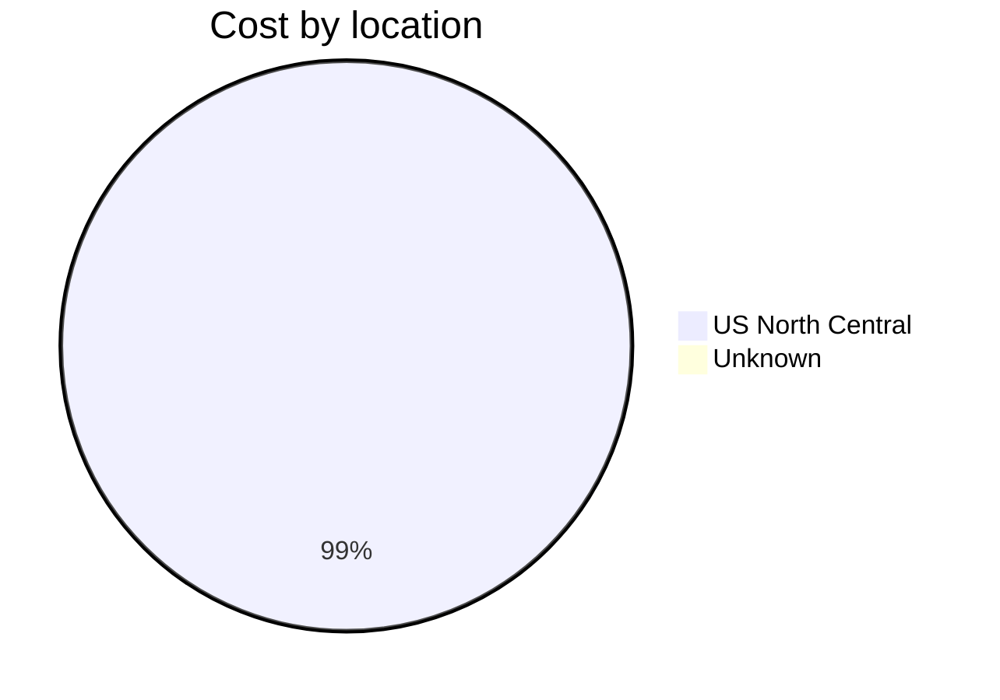
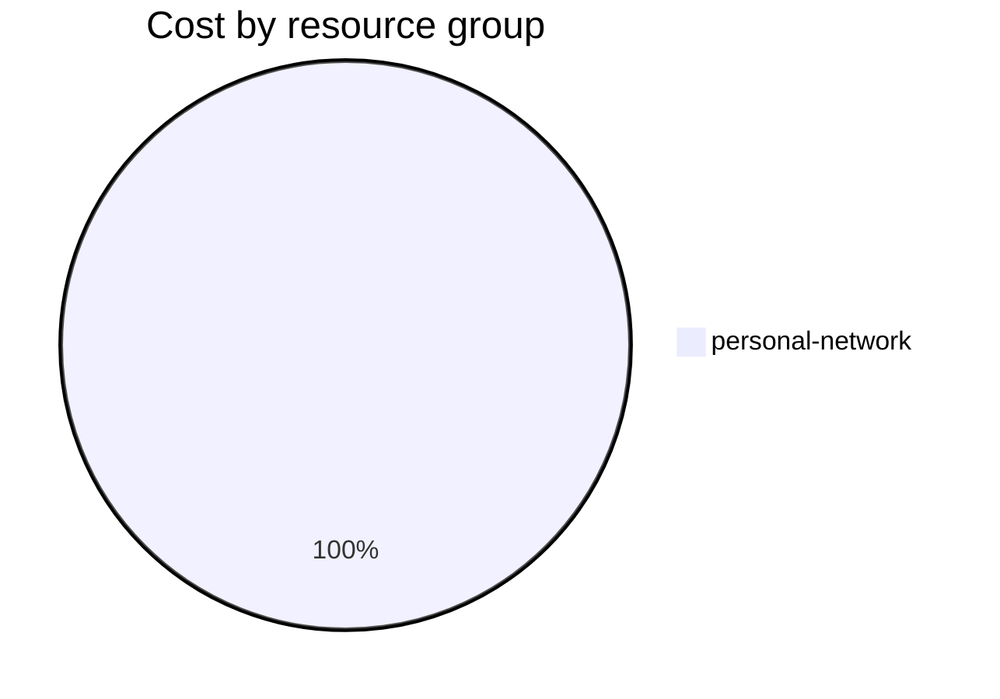

Fetching subscription details...
Fetching cost data...
Fetching forecasted cost data...
Fetching cost data by service name...
Fetching cost data by location...
Fetching cost data by resource group...
# Azure Cost Overview

> Accumulated cost for subscription id `JPF Pay-As-You-Go` from **01/01/2024** to **01/27/2024**

## Totals

|Period|Amount|
|---|---:|
|Today|0.09 USD|
|Yesterday|1.98 USD|
|Last 7 days|13.68 USD|
|Last 30 days|51.42 USD|

```mermaid
gantt
   title Accumulated cost
   dateFormat  X
   axisFormat %s
   section 01 Jan
   USD 2.01 :0, 201
   section 02 Jan
   USD 4.48 :0, 448
   section 03 Jan
   USD 6.29 :0, 629
   section 04 Jan
   USD 8.20 :0, 820
   section 05 Jan
   USD 10.14 :0, 1014
   section 06 Jan
   USD 12.40 :0, 1240
   section 07 Jan
   USD 14.14 :0, 1414
   section 08 Jan
   USD 16.56 :0, 1656
   section 09 Jan
   USD 18.51 :0, 1851
   section 10 Jan
   USD 20.14 :0, 2014
   section 11 Jan
   USD 22.00 :0, 2200
   section 12 Jan
   USD 23.87 :0, 2387
   section 13 Jan
   USD 26.16 :0, 2616
   section 14 Jan
   USD 27.68 :0, 2768
   section 15 Jan
   USD 29.31 :0, 2931
   section 16 Jan
   USD 31.87 :0, 3187
   section 17 Jan
   USD 33.87 :0, 3387
   section 18 Jan
   USD 35.79 :0, 3579
   section 19 Jan
   USD 37.74 :0, 3774
   section 20 Jan
   USD 40.07 :0, 4007
   section 21 Jan
   USD 42.01 :0, 4201
   section 22 Jan
   USD 43.97 :0, 4397
   section 23 Jan
   USD 45.87 :0, 4587
   section 24 Jan
   USD 47.59 :0, 4759
   section 25 Jan
   USD 49.36 :0, 4936
   section 26 Jan
   USD 51.33 :0, 5133
   section 27 Jan
   USD 51.42 :0, 5142
   section 28 Jan
   USD 53.18 : done, 0, 5318
   section 29 Jan
   USD 55.11 : done, 0, 5511
   section 30 Jan
   USD 57.27 : done, 0, 5727
   section 31 Jan
   USD 58.98 : done, 0, 5898
```

## By Service Name

|Service|Amount|
|---|---:|
|Storage|22.26 USD|
|Bandwidth|11.71 USD|
|Virtual Machines|10.81 USD|
|Virtual Network|6.22 USD|
|Azure DNS|0.42 USD|

## By Location

|Location|Amount|
|---|---:|
|US North Central|51.00 USD|
|Unknown|0.42 USD|

## By Resource Group

|Resource Group|Amount|
|---|---:|
|personal-network|51.42 USD|

Generated at 2024-01-27 11:11:06 for subscription with id `4913be3f-a345-4652-9bba-767418dd25e3`
