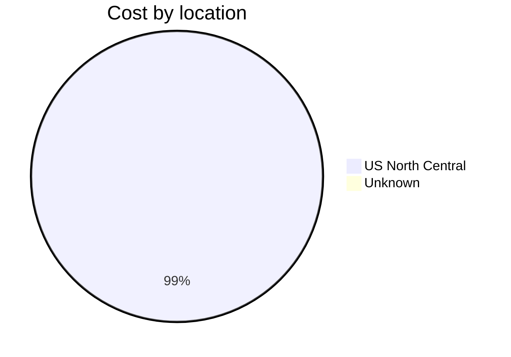
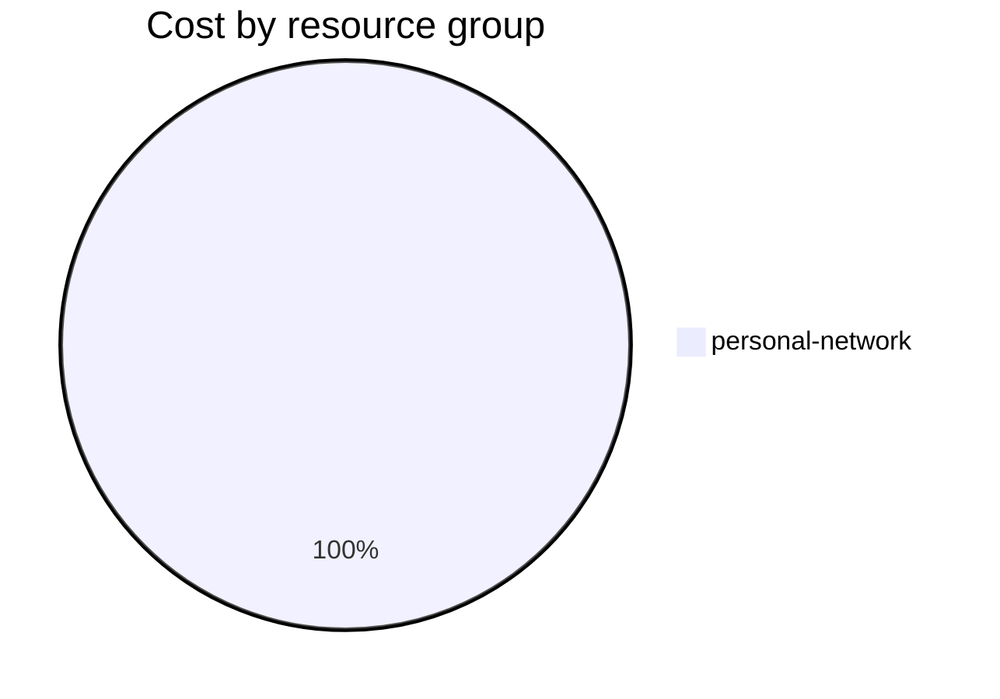

Fetching subscription details...
Fetching cost data...
Fetching forecasted cost data...
Fetching cost data by service name...
Fetching cost data by location...
Fetching cost data by resource group...
# Azure Cost Overview

> Accumulated cost for subscription id `JPF Pay-As-You-Go` from **01/01/2024** to **01/23/2024**

## Totals

|Period|Amount|
|---|---:|
|Today|0.10 USD|
|Yesterday|1.76 USD|
|Last 7 days|13.52 USD|
|Last 30 days|42.30 USD|

```mermaid
gantt
   title Accumulated cost
   dateFormat  X
   axisFormat %s
   section 01 Jan
   USD 2.01 :0, 201
   section 02 Jan
   USD 4.48 :0, 448
   section 03 Jan
   USD 6.29 :0, 629
   section 04 Jan
   USD 8.20 :0, 820
   section 05 Jan
   USD 10.14 :0, 1014
   section 06 Jan
   USD 12.40 :0, 1240
   section 07 Jan
   USD 14.14 :0, 1414
   section 08 Jan
   USD 16.56 :0, 1656
   section 09 Jan
   USD 18.50 :0, 1850
   section 10 Jan
   USD 20.10 :0, 2010
   section 11 Jan
   USD 21.85 :0, 2185
   section 12 Jan
   USD 23.61 :0, 2361
   section 13 Jan
   USD 25.67 :0, 2567
   section 14 Jan
   USD 27.19 :0, 2719
   section 15 Jan
   USD 28.78 :0, 2878
   section 16 Jan
   USD 31.03 :0, 3103
   section 17 Jan
   USD 32.90 :0, 3290
   section 18 Jan
   USD 34.70 :0, 3470
   section 19 Jan
   USD 36.52 :0, 3652
   section 20 Jan
   USD 38.61 :0, 3861
   section 21 Jan
   USD 40.43 :0, 4043
   section 22 Jan
   USD 42.20 :0, 4220
   section 23 Jan
   USD 42.30 :0, 4230
   section 24 Jan
   USD 44.07 : done, 0, 4407
   section 25 Jan
   USD 45.92 : done, 0, 4592
   section 26 Jan
   USD 47.87 : done, 0, 4787
   section 27 Jan
   USD 50.13 : done, 0, 5013
   section 28 Jan
   USD 51.96 : done, 0, 5196
   section 29 Jan
   USD 53.85 : done, 0, 5385
   section 30 Jan
   USD 56.05 : done, 0, 5605
   section 31 Jan
   USD 57.85 : done, 0, 5785
```

## By Service Name

|Service|Amount|
|---|---:|
|Storage|18.87 USD|
|Virtual Machines|9.18 USD|
|Bandwidth|8.63 USD|
|Virtual Network|5.27 USD|
|Azure DNS|0.35 USD|

## By Location

|Location|Amount|
|---|---:|
|US North Central|41.94 USD|
|Unknown|0.35 USD|

## By Resource Group

|Resource Group|Amount|
|---|---:|
|personal-network|42.30 USD|

Generated at 2024-01-23 11:08:02 for subscription with id `4913be3f-a345-4652-9bba-767418dd25e3`
