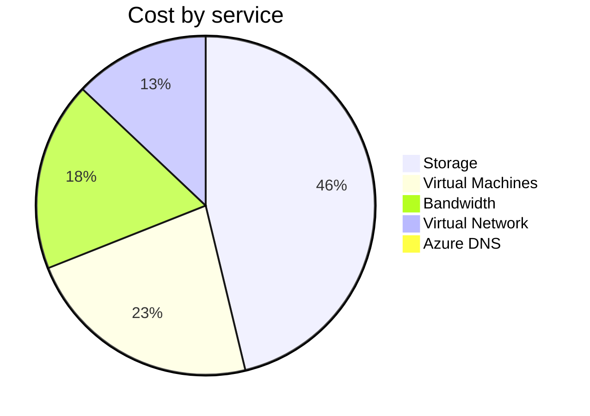
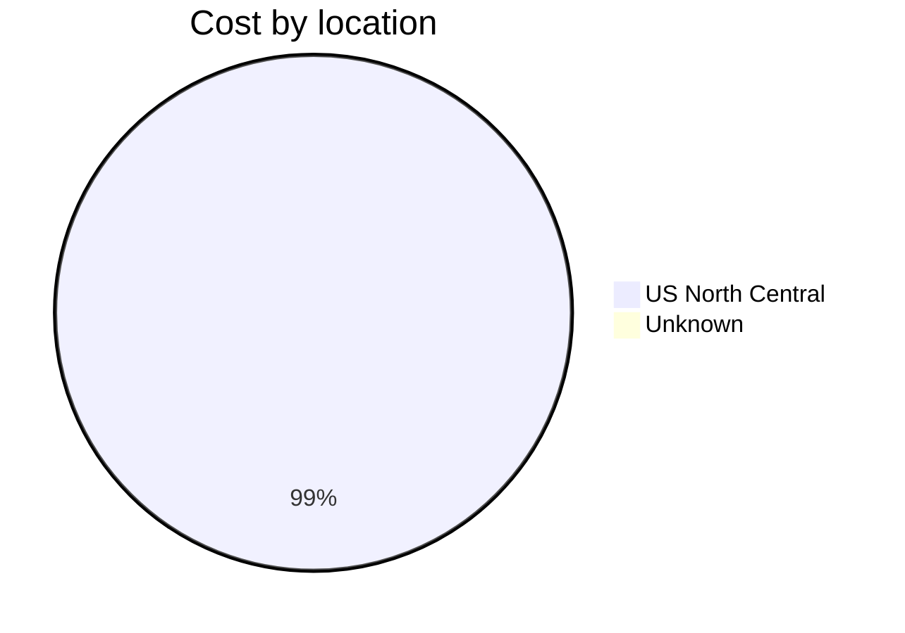
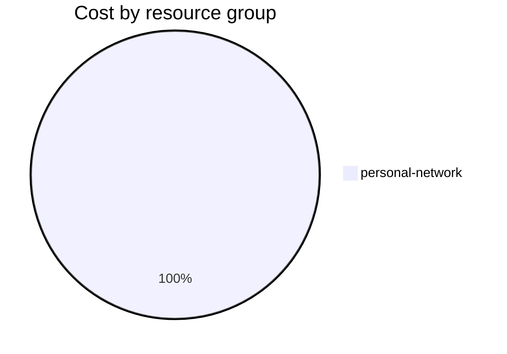

Fetching subscription details...
Fetching cost data...
Fetching forecasted cost data...
Fetching cost data by service name...
Fetching cost data by location...
Fetching cost data by resource group...
# Azure Cost Overview

> Accumulated cost for subscription id `JPF Pay-As-You-Go` from **01/01/2024** to **01/15/2024**

## Totals

|Period|Amount|
|---|---:|
|Today|0.12 USD|
|Yesterday|1.45 USD|
|Last 7 days|11.98 USD|
|Last 30 days|26.12 USD|

```mermaid
gantt
   title Accumulated cost
   dateFormat  X
   axisFormat %s
   section 01 Jan
   USD 2.01 :0, 201
   section 02 Jan
   USD 4.48 :0, 448
   section 03 Jan
   USD 6.29 :0, 629
   section 04 Jan
   USD 8.20 :0, 820
   section 05 Jan
   USD 10.14 :0, 1014
   section 06 Jan
   USD 12.40 :0, 1240
   section 07 Jan
   USD 14.14 :0, 1414
   section 08 Jan
   USD 16.56 :0, 1656
   section 09 Jan
   USD 18.46 :0, 1846
   section 10 Jan
   USD 19.98 :0, 1998
   section 11 Jan
   USD 21.50 :0, 2150
   section 12 Jan
   USD 23.01 :0, 2301
   section 13 Jan
   USD 24.54 :0, 2454
   section 14 Jan
   USD 26.00 :0, 2600
   section 15 Jan
   USD 26.12 :0, 2612
```

## By Service Name

|Service|Amount|
|---|---:|
|Storage|11.97 USD|
|Virtual Machines|5.89 USD|
|Bandwidth|4.68 USD|
|Virtual Network|3.35 USD|
|Azure DNS|0.23 USD|

## By Location

|Location|Amount|
|---|---:|
|US North Central|25.89 USD|
|Unknown|0.23 USD|

## By Resource Group

|Resource Group|Amount|
|---|---:|
|personal-network|26.12 USD|

Generated at 2024-01-15 11:10:03 for subscription with id `4913be3f-a345-4652-9bba-767418dd25e3`
