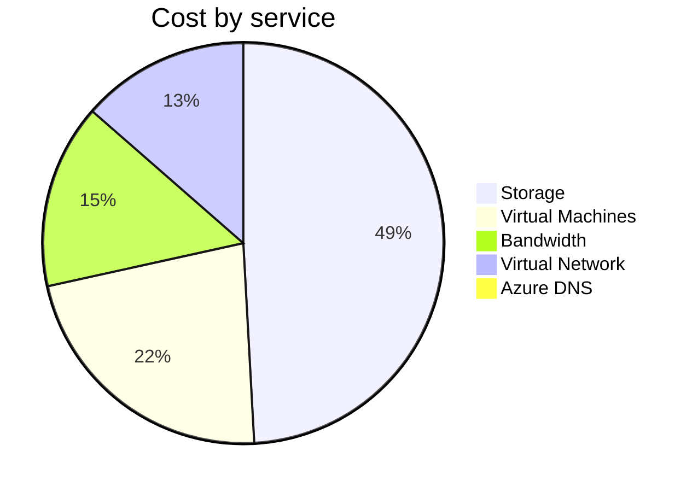
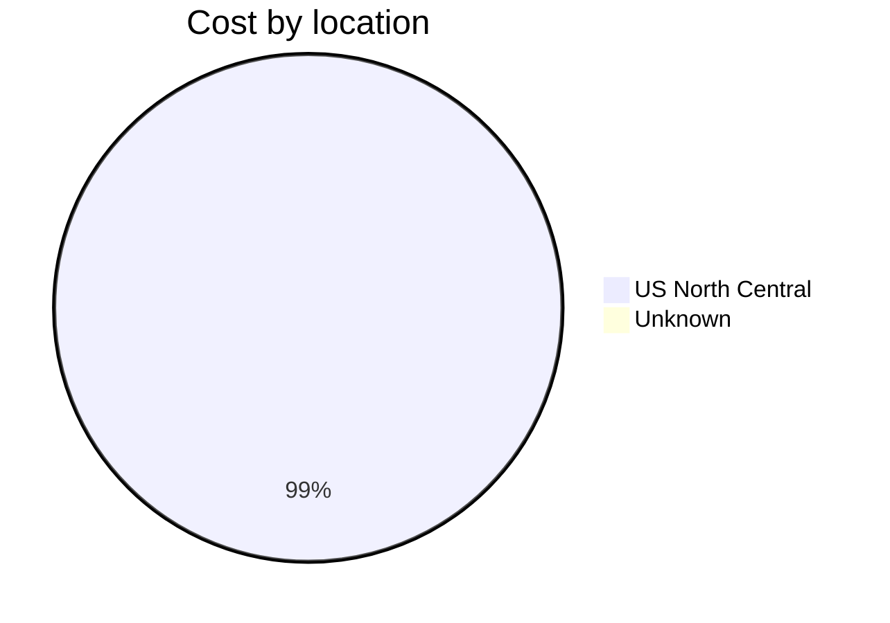
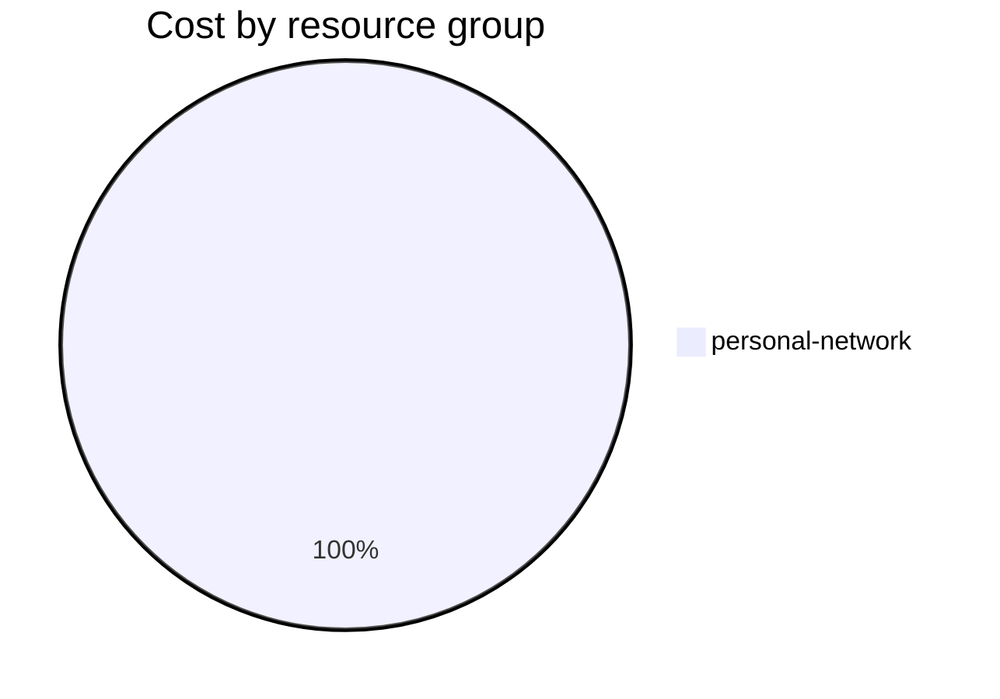

Fetching subscription details...
Fetching cost data...
Fetching forecasted cost data...
Fetching cost data by service name...
Fetching cost data by location...
Fetching cost data by resource group...
# Azure Cost Overview

> Accumulated cost for subscription id `JPF Pay-As-You-Go` from **11/01/2023** to **11/08/2023**

## Totals

|Period|Amount|
|---|---:|
|Today|0.09 USD|
|Yesterday|1.43 USD|
|Last 7 days|12.21 USD|
|Last 30 days|12.21 USD|

```mermaid
gantt
   title Accumulated cost
   dateFormat  X
   axisFormat %s
   section 01 Nov
   USD 1.81 :0, 181
   section 02 Nov
   USD 3.50 :0, 350
   section 03 Nov
   USD 5.44 :0, 544
   section 04 Nov
   USD 7.20 :0, 720
   section 05 Nov
   USD 8.91 :0, 891
   section 06 Nov
   USD 10.69 :0, 1069
   section 07 Nov
   USD 12.12 :0, 1212
   section 08 Nov
   USD 12.21 :0, 1221
   section 09 Nov
   USD 14.01 : done, 0, 1401
   section 10 Nov
   USD 15.90 : done, 0, 1590
   section 11 Nov
   USD 17.62 : done, 0, 1762
   section 12 Nov
   USD 19.20 : done, 0, 1920
   section 13 Nov
   USD 20.90 : done, 0, 2090
   section 14 Nov
   USD 22.70 : done, 0, 2270
   section 15 Nov
   USD 24.51 : done, 0, 2451
   section 16 Nov
   USD 26.31 : done, 0, 2631
   section 17 Nov
   USD 28.21 : done, 0, 2821
   section 18 Nov
   USD 29.93 : done, 0, 2993
   section 19 Nov
   USD 31.51 : done, 0, 3151
   section 20 Nov
   USD 33.21 : done, 0, 3321
   section 21 Nov
   USD 35.02 : done, 0, 3502
   section 22 Nov
   USD 36.83 : done, 0, 3683
   section 23 Nov
   USD 38.63 : done, 0, 3863
   section 24 Nov
   USD 40.53 : done, 0, 4053
   section 25 Nov
   USD 42.25 : done, 0, 4225
   section 26 Nov
   USD 43.84 : done, 0, 4384
   section 27 Nov
   USD 45.54 : done, 0, 4554
   section 28 Nov
   USD 47.35 : done, 0, 4735
   section 29 Nov
   USD 49.16 : done, 0, 4916
   section 30 Nov
   USD 50.97 : done, 0, 5097
```

## By Service Name

|Service|Amount|
|---|---:|
|Storage|5.94 USD|
|Virtual Machines|2.71 USD|
|Bandwidth|1.80 USD|
|Virtual Network|1.64 USD|
|Azure DNS|0.11 USD|

## By Location

|Location|Amount|
|---|---:|
|US North Central|12.10 USD|
|Unknown|0.11 USD|

## By Resource Group

|Resource Group|Amount|
|---|---:|
|personal-network|12.21 USD|

Generated at 2023-11-08 11:08:02 for subscription with id `4913be3f-a345-4652-9bba-767418dd25e3`
