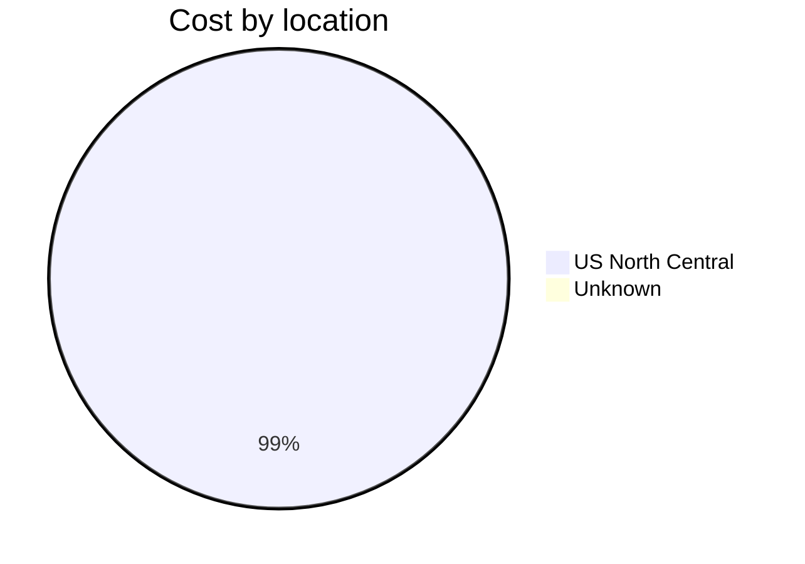
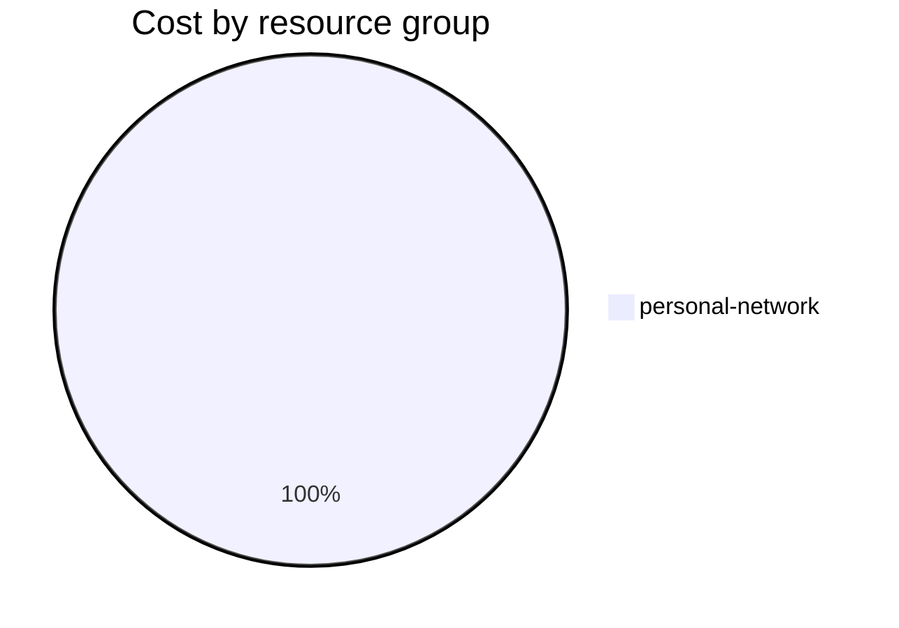

Fetching subscription details...
Fetching cost data...
Fetching forecasted cost data...
Fetching cost data by service name...
Fetching cost data by location...
Fetching cost data by resource group...
# Azure Cost Overview

> Accumulated cost for subscription id `JPF Pay-As-You-Go` from **11/01/2023** to **11/09/2023**

## Totals

|Period|Amount|
|---|---:|
|Today|0.10 USD|
|Yesterday|1.77 USD|
|Last 7 days|12.55 USD|
|Last 30 days|14.37 USD|

```mermaid
gantt
   title Accumulated cost
   dateFormat  X
   axisFormat %s
   section 01 Nov
   USD 1.82 :0, 182
   section 02 Nov
   USD 3.52 :0, 352
   section 03 Nov
   USD 5.48 :0, 548
   section 04 Nov
   USD 7.26 :0, 726
   section 05 Nov
   USD 8.97 :0, 897
   section 06 Nov
   USD 10.77 :0, 1077
   section 07 Nov
   USD 12.50 :0, 1250
   section 08 Nov
   USD 14.27 :0, 1427
   section 09 Nov
   USD 14.37 :0, 1437
   section 10 Nov
   USD 16.26 : done, 0, 1626
   section 11 Nov
   USD 17.95 : done, 0, 1795
   section 12 Nov
   USD 19.51 : done, 0, 1951
   section 13 Nov
   USD 21.26 : done, 0, 2126
   section 14 Nov
   USD 23.02 : done, 0, 2302
   section 15 Nov
   USD 24.80 : done, 0, 2480
   section 16 Nov
   USD 26.58 : done, 0, 2658
   section 17 Nov
   USD 28.46 : done, 0, 2846
   section 18 Nov
   USD 30.15 : done, 0, 3015
   section 19 Nov
   USD 31.69 : done, 0, 3169
   section 20 Nov
   USD 33.44 : done, 0, 3344
   section 21 Nov
   USD 35.19 : done, 0, 3519
   section 22 Nov
   USD 36.97 : done, 0, 3697
   section 23 Nov
   USD 38.74 : done, 0, 3874
   section 24 Nov
   USD 40.61 : done, 0, 4061
   section 25 Nov
   USD 42.30 : done, 0, 4230
   section 26 Nov
   USD 43.83 : done, 0, 4383
   section 27 Nov
   USD 45.57 : done, 0, 4557
   section 28 Nov
   USD 47.32 : done, 0, 4732
   section 29 Nov
   USD 49.09 : done, 0, 4909
   section 30 Nov
   USD 50.86 : done, 0, 5086
```

## By Service Name

|Service|Amount|
|---|---:|
|Storage|6.93 USD|
|Virtual Machines|3.10 USD|
|Bandwidth|2.31 USD|
|Virtual Network|1.91 USD|
|Azure DNS|0.13 USD|

## By Location

|Location|Amount|
|---|---:|
|US North Central|14.25 USD|
|Unknown|0.13 USD|

## By Resource Group

|Resource Group|Amount|
|---|---:|
|personal-network|14.37 USD|

Generated at 2023-11-09 11:09:01 for subscription with id `4913be3f-a345-4652-9bba-767418dd25e3`
