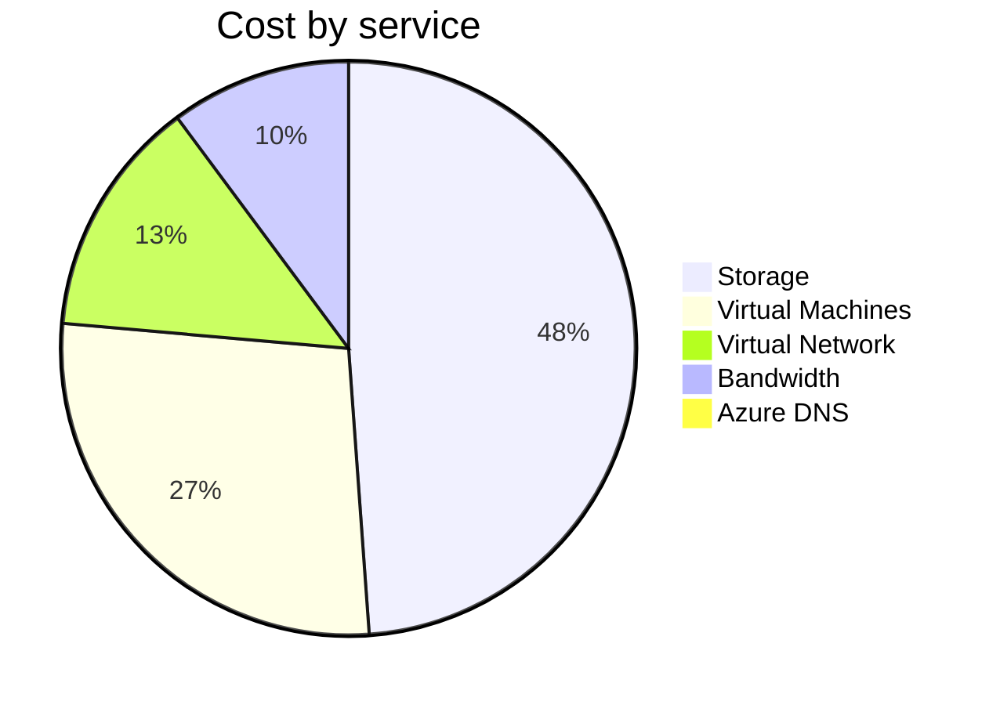
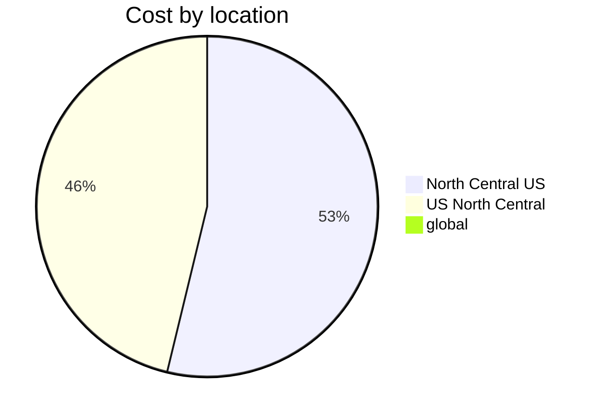
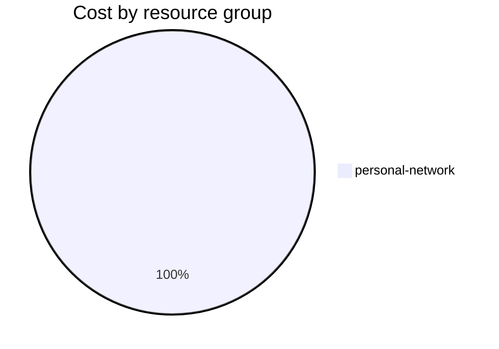

Fetching subscription details...
Fetching cost data...
Fetching forecasted cost data...
Fetching cost data by service name...
Fetching cost data by location...
Fetching cost data by resource group...
# Azure Cost Overview

> Accumulated cost for subscription id `JPF Pay-As-You-Go` from **11/01/2023** to **11/03/2023**

## Totals

|Period|Amount|
|---|---:|
|Today|0.09 USD|
|Yesterday|1.24 USD|
|Last 7 days|3.08 USD|
|Last 30 days|3.08 USD|

```mermaid
gantt
   title Accumulated cost
   dateFormat  X
   axisFormat %s
   section 01 Nov
   USD 1.74 :0, 174
   section 02 Nov
   USD 2.99 :0, 299
   section 03 Nov
   USD 3.08 :0, 308
   section 04 Nov
   USD 4.70 : done, 0, 470
   section 05 Nov
   USD 6.14 : done, 0, 614
   section 06 Nov
   USD 7.70 : done, 0, 770
   section 07 Nov
   USD 9.34 : done, 0, 934
   section 08 Nov
   USD 11.01 : done, 0, 1101
   section 09 Nov
   USD 12.68 : done, 0, 1268
   section 10 Nov
   USD 14.40 : done, 0, 1440
   section 11 Nov
   USD 15.99 : done, 0, 1599
   section 12 Nov
   USD 17.40 : done, 0, 1740
   section 13 Nov
   USD 18.94 : done, 0, 1894
   section 14 Nov
   USD 20.55 : done, 0, 2055
   section 15 Nov
   USD 22.20 : done, 0, 2220
   section 16 Nov
   USD 23.84 : done, 0, 2384
   section 17 Nov
   USD 25.53 : done, 0, 2553
   section 18 Nov
   USD 27.09 : done, 0, 2709
   section 19 Nov
   USD 28.48 : done, 0, 2848
   section 20 Nov
   USD 29.98 : done, 0, 2998
   section 21 Nov
   USD 31.57 : done, 0, 3157
   section 22 Nov
   USD 33.19 : done, 0, 3319
   section 23 Nov
   USD 34.80 : done, 0, 3480
   section 24 Nov
   USD 36.47 : done, 0, 3647
   section 25 Nov
   USD 38.01 : done, 0, 3801
   section 26 Nov
   USD 39.36 : done, 0, 3936
   section 27 Nov
   USD 40.84 : done, 0, 4084
   section 28 Nov
   USD 42.40 : done, 0, 4240
   section 29 Nov
   USD 44.00 : done, 0, 4400
   section 30 Nov
   USD 45.58 : done, 0, 4558
```

## By Service Name

|Service|Amount|
|---|---:|
|Storage|1.49 USD|
|Virtual Machines|0.84 USD|
|Virtual Network|0.41 USD|
|Bandwidth|0.31 USD|
|Azure DNS|0.03 USD|

## By Location

|Location|Amount|
|---|---:|
|North Central US|1.64 USD|
|US North Central|1.41 USD|
|global|0.03 USD|

## By Resource Group

|Resource Group|Amount|
|---|---:|
|personal-network|3.08 USD|

Generated at 2023-11-03 11:08:12 for subscription with id `4913be3f-a345-4652-9bba-767418dd25e3`
