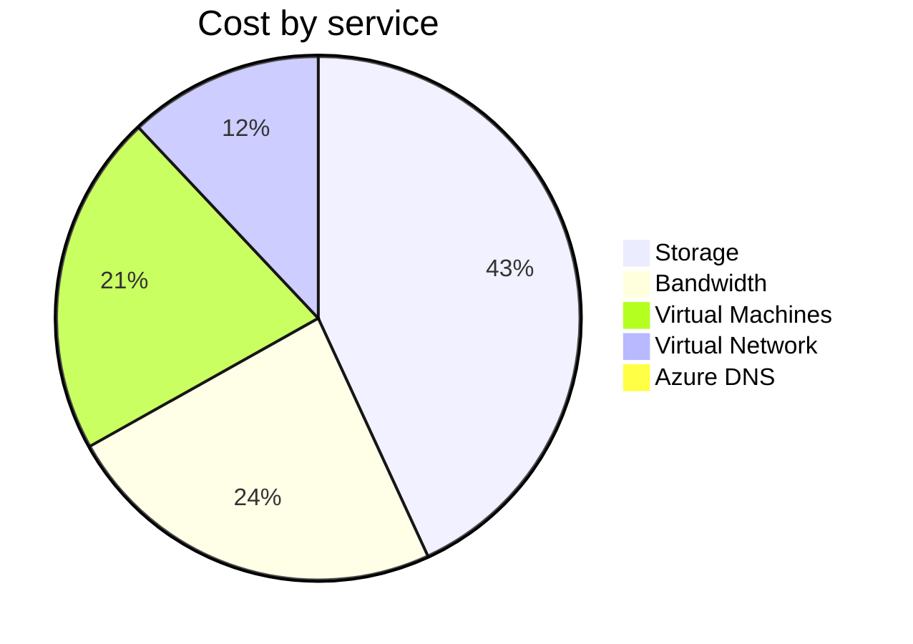
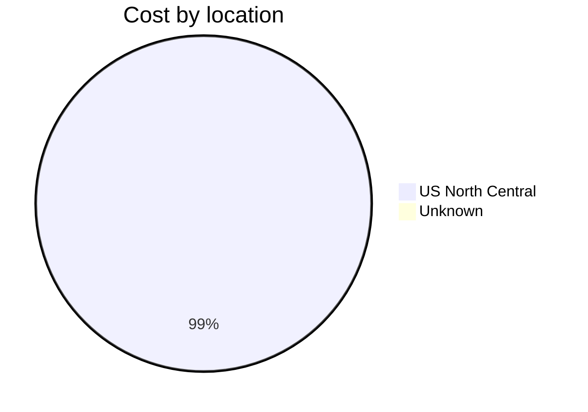
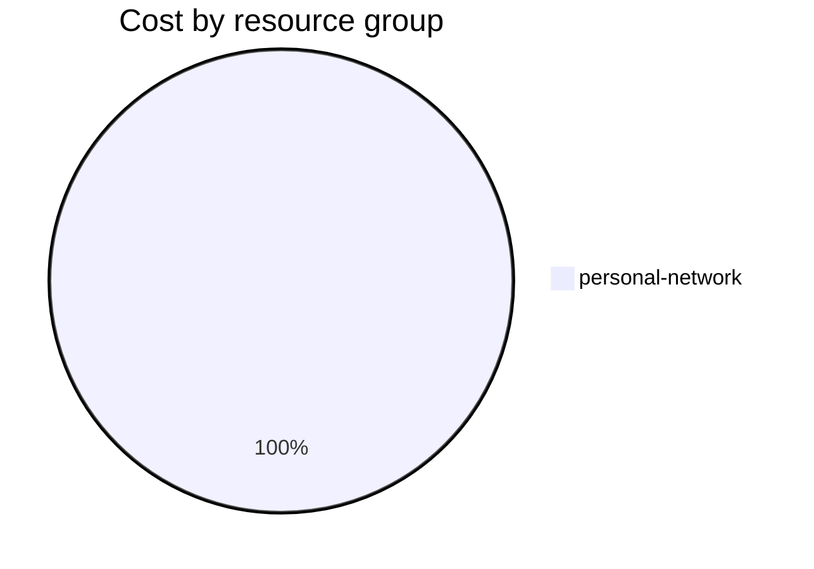

Fetching subscription details...
Fetching cost data...
Fetching forecasted cost data...
Fetching cost data by service name...
Fetching cost data by location...
Fetching cost data by resource group...
# Azure Cost Overview

> Accumulated cost for subscription id `JPF Pay-As-You-Go` from **01/01/2024** to **01/11/2024**

## Totals

|Period|Amount|
|---|---:|
|Today|0.03 USD|
|Yesterday|1.38 USD|
|Last 7 days|13.59 USD|
|Last 30 days|19.87 USD|

## By Service Name

|Service|Amount|
|---|---:|
|Storage|8.50 USD|
|Bandwidth|4.68 USD|
|Virtual Machines|4.16 USD|
|Virtual Network|2.37 USD|
|Azure DNS|0.16 USD|

## By Location

|Location|Amount|
|---|---:|
|US North Central|19.72 USD|
|Unknown|0.16 USD|

## By Resource Group

|Resource Group|Amount|
|---|---:|
|personal-network|19.87 USD|

Generated at 2024-01-11 11:08:00 for subscription with id `4913be3f-a345-4652-9bba-767418dd25e3`
