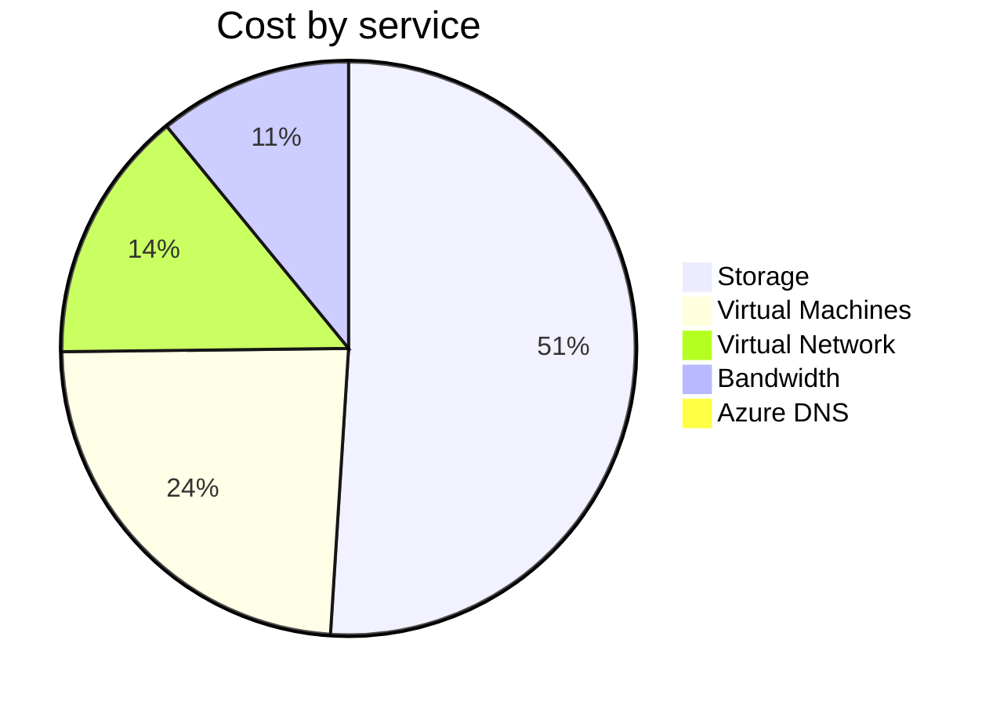
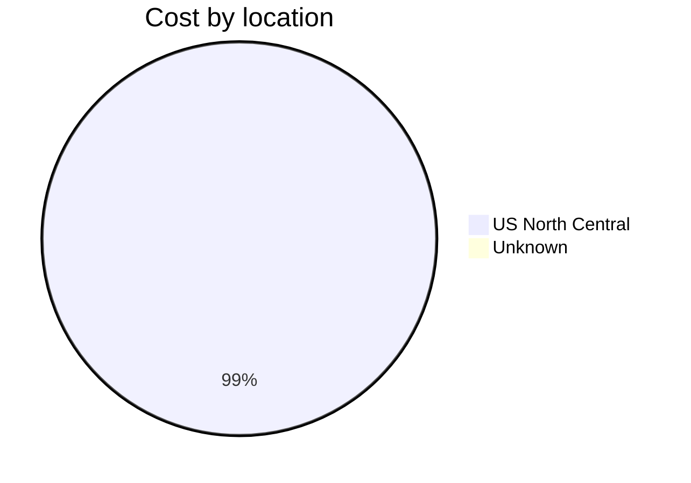
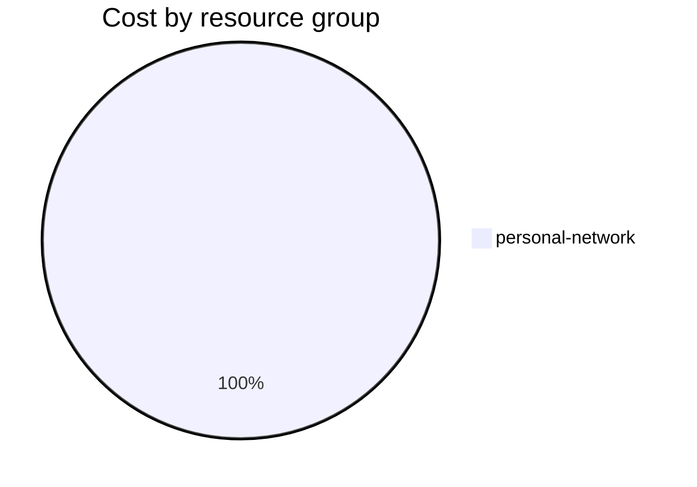

Fetching subscription details...
Fetching cost data...
Fetching forecasted cost data...
Fetching cost data by service name...
Fetching cost data by location...
Fetching cost data by resource group...
# Azure Cost Overview

> Accumulated cost for subscription id `JPF Pay-As-You-Go` from **12/01/2023** to **12/16/2023**

## Totals

|Period|Amount|
|---|---:|
|Today|0.02 USD|
|Yesterday|1.24 USD|
|Last 7 days|10.62 USD|
|Last 30 days|25.05 USD|

```mermaid
gantt
   title Accumulated cost
   dateFormat  X
   axisFormat %s
   section 01 Dec
   USD 1.75 :0, 175
   section 02 Dec
   USD 3.60 :0, 360
   section 03 Dec
   USD 5.81 :0, 581
   section 04 Dec
   USD 7.40 :0, 740
   section 05 Dec
   USD 8.97 :0, 897
   section 06 Dec
   USD 11.15 :0, 1115
   section 07 Dec
   USD 12.94 :0, 1294
   section 08 Dec
   USD 14.43 :0, 1443
   section 09 Dec
   USD 16.17 :0, 1617
   section 10 Dec
   USD 17.72 :0, 1772
   section 11 Dec
   USD 19.25 :0, 1925
   section 12 Dec
   USD 20.77 :0, 2077
   section 13 Dec
   USD 22.28 :0, 2228
   section 14 Dec
   USD 23.79 :0, 2379
   section 15 Dec
   USD 25.04 :0, 2504
   section 16 Dec
   USD 25.05 :0, 2505
   section 17 Dec
   USD 26.61 : done, 0, 2661
   section 18 Dec
   USD 28.06 : done, 0, 2806
   section 19 Dec
   USD 29.80 : done, 0, 2980
   section 20 Dec
   USD 31.31 : done, 0, 3131
   section 21 Dec
   USD 32.85 : done, 0, 3285
   section 22 Dec
   USD 34.44 : done, 0, 3444
   section 23 Dec
   USD 36.05 : done, 0, 3605
   section 24 Dec
   USD 37.54 : done, 0, 3754
   section 25 Dec
   USD 38.93 : done, 0, 3893
   section 26 Dec
   USD 40.60 : done, 0, 4060
   section 27 Dec
   USD 42.04 : done, 0, 4204
   section 28 Dec
   USD 43.51 : done, 0, 4351
   section 29 Dec
   USD 45.04 : done, 0, 4504
   section 30 Dec
   USD 46.58 : done, 0, 4658
   section 31 Dec
   USD 48.00 : done, 0, 4800
```

## By Service Name

|Service|Amount|
|---|---:|
|Storage|12.66 USD|
|Virtual Machines|5.91 USD|
|Virtual Network|3.54 USD|
|Bandwidth|2.71 USD|
|Azure DNS|0.24 USD|

## By Location

|Location|Amount|
|---|---:|
|US North Central|24.82 USD|
|Unknown|0.24 USD|

## By Resource Group

|Resource Group|Amount|
|---|---:|
|personal-network|25.05 USD|

Generated at 2023-12-16 11:10:09 for subscription with id `4913be3f-a345-4652-9bba-767418dd25e3`
