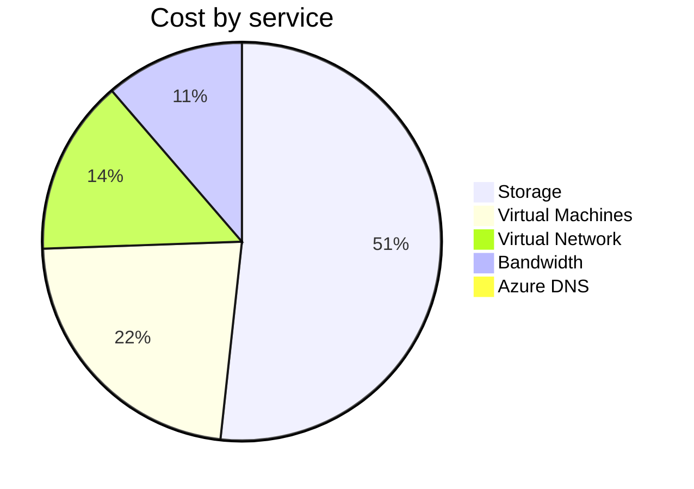
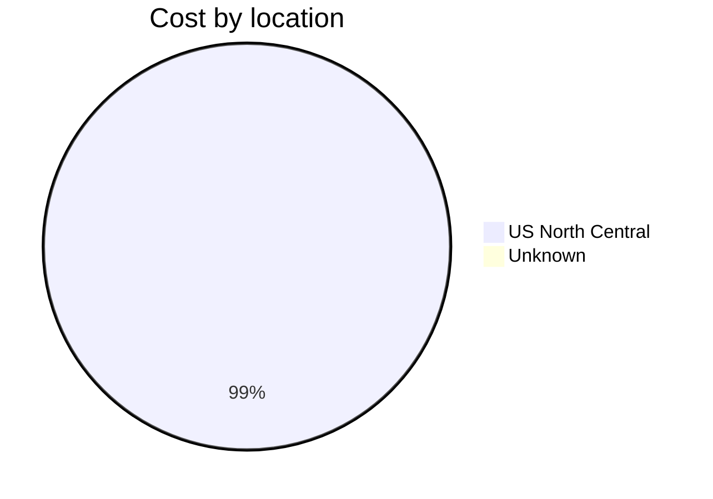
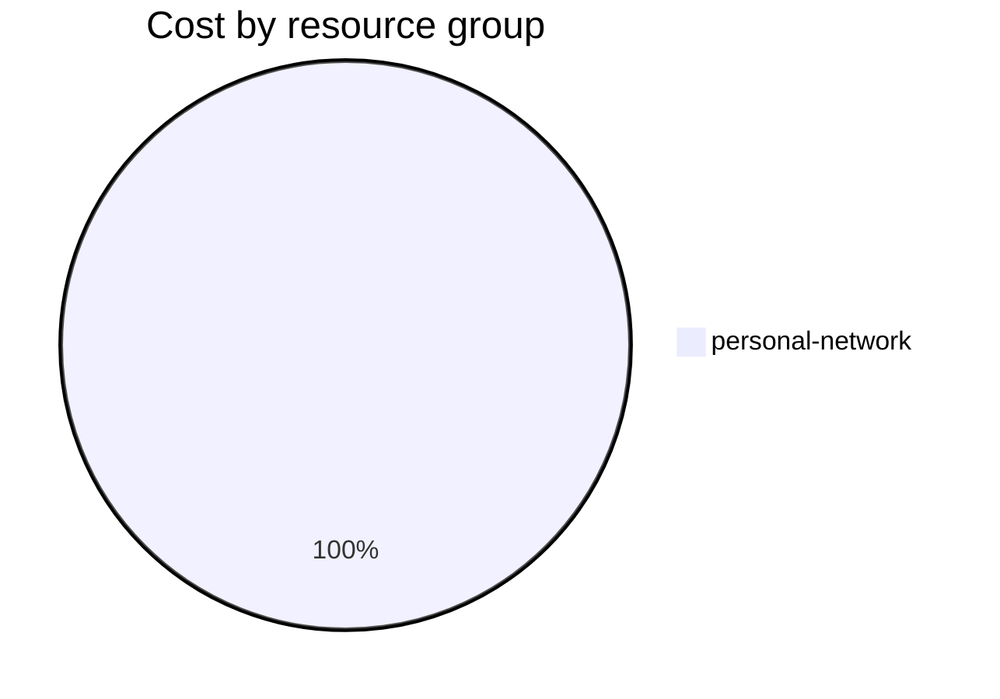

Fetching subscription details...
Fetching cost data...
Fetching forecasted cost data...
Fetching cost data by service name...
Fetching cost data by location...
Fetching cost data by resource group...
# Azure Cost Overview

> Accumulated cost for subscription id `JPF Pay-As-You-Go` from **11/01/2023** to **11/15/2023**

## Totals

|Period|Amount|
|---|---:|
|Today|0.10 USD|
|Yesterday|1.44 USD|
|Last 7 days|11.17 USD|
|Last 30 days|23.73 USD|

```mermaid
gantt
   title Accumulated cost
   dateFormat  X
   axisFormat %s
   section 01 Nov
   USD 1.83 :0, 183
   section 02 Nov
   USD 3.53 :0, 353
   section 03 Nov
   USD 5.51 :0, 551
   section 04 Nov
   USD 7.30 :0, 730
   section 05 Nov
   USD 9.02 :0, 902
   section 06 Nov
   USD 10.82 :0, 1082
   section 07 Nov
   USD 12.56 :0, 1256
   section 08 Nov
   USD 14.39 :0, 1439
   section 09 Nov
   USD 16.17 :0, 1617
   section 10 Nov
   USD 17.68 :0, 1768
   section 11 Nov
   USD 19.18 :0, 1918
   section 12 Nov
   USD 20.69 :0, 2069
   section 13 Nov
   USD 22.19 :0, 2219
   section 14 Nov
   USD 23.63 :0, 2363
   section 15 Nov
   USD 23.73 :0, 2373
   section 16 Nov
   USD 25.30 : done, 0, 2530
   section 17 Nov
   USD 26.98 : done, 0, 2698
   section 18 Nov
   USD 28.46 : done, 0, 2846
   section 19 Nov
   USD 29.78 : done, 0, 2978
   section 20 Nov
   USD 31.21 : done, 0, 3121
   section 21 Nov
   USD 32.74 : done, 0, 3274
   section 22 Nov
   USD 34.32 : done, 0, 3432
   section 23 Nov
   USD 35.80 : done, 0, 3580
   section 24 Nov
   USD 37.39 : done, 0, 3739
   section 25 Nov
   USD 38.77 : done, 0, 3877
   section 26 Nov
   USD 40.01 : done, 0, 4001
   section 27 Nov
   USD 41.35 : done, 0, 4135
   section 28 Nov
   USD 42.79 : done, 0, 4279
   section 29 Nov
   USD 44.28 : done, 0, 4428
   section 30 Nov
   USD 45.68 : done, 0, 4568
```

## By Service Name

|Service|Amount|
|---|---:|
|Storage|12.16 USD|
|Virtual Machines|5.34 USD|
|Virtual Network|3.35 USD|
|Bandwidth|2.66 USD|
|Azure DNS|0.23 USD|

## By Location

|Location|Amount|
|---|---:|
|US North Central|23.51 USD|
|Unknown|0.23 USD|

## By Resource Group

|Resource Group|Amount|
|---|---:|
|personal-network|23.73 USD|

Generated at 2023-11-15 11:06:42 for subscription with id `4913be3f-a345-4652-9bba-767418dd25e3`
