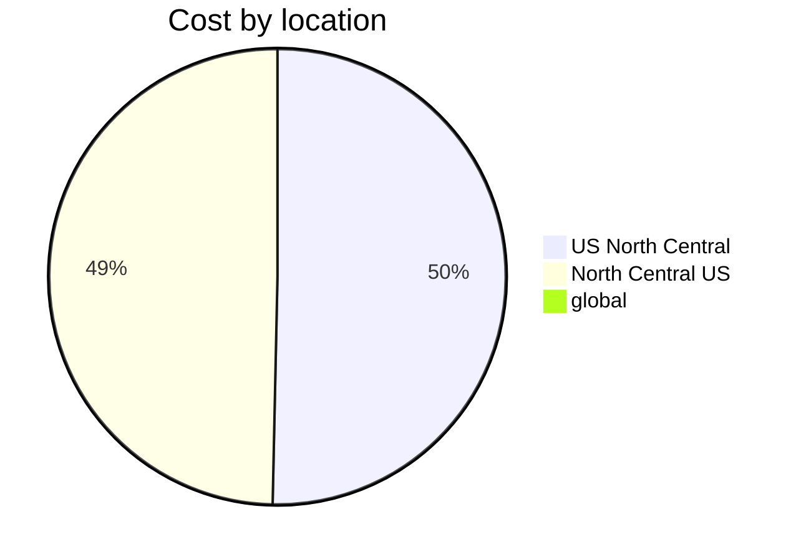
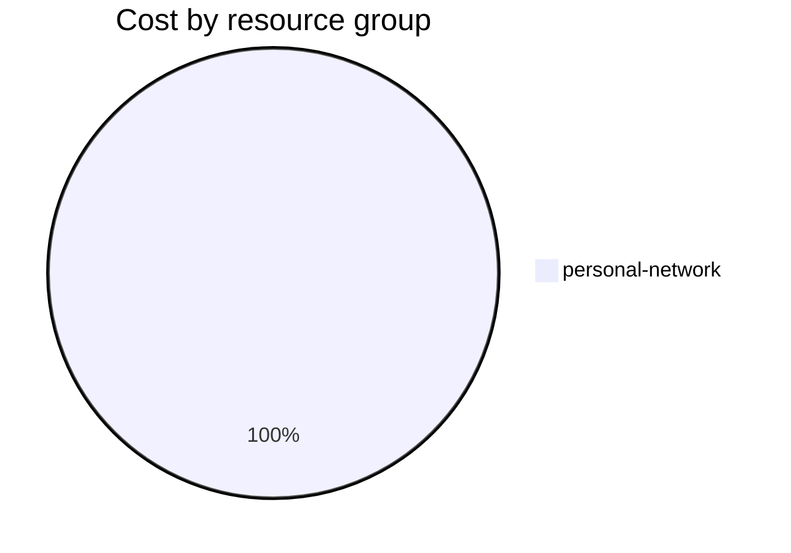

Fetching subscription details...
Fetching cost data...
Fetching forecasted cost data...
Fetching cost data by service name...
Fetching cost data by location...
Fetching cost data by resource group...
# Azure Cost Overview

> Accumulated cost for subscription id `JPF Pay-As-You-Go` from **10/01/2023** to **10/31/2023**

## Totals

|Period|Amount|
|---|---:|
|Today|0.10 USD|
|Yesterday|1.43 USD|
|Last 7 days|10.89 USD|
|Last 30 days|52.24 USD|

```mermaid
gantt
   title Accumulated cost
   dateFormat  X
   axisFormat %s
   section 01 Oct
   USD 3.16 :0, 316
   section 02 Oct
   USD 5.72 :0, 572
   section 03 Oct
   USD 7.55 :0, 755
   section 04 Oct
   USD 9.41 :0, 941
   section 05 Oct
   USD 11.15 :0, 1115
   section 06 Oct
   USD 13.05 :0, 1305
   section 07 Oct
   USD 14.85 :0, 1485
   section 08 Oct
   USD 16.35 :0, 1635
   section 09 Oct
   USD 17.97 :0, 1797
   section 10 Oct
   USD 19.56 :0, 1956
   section 11 Oct
   USD 21.16 :0, 2116
   section 12 Oct
   USD 22.83 :0, 2283
   section 13 Oct
   USD 24.46 :0, 2446
   section 14 Oct
   USD 25.90 :0, 2590
   section 15 Oct
   USD 27.37 :0, 2737
   section 16 Oct
   USD 29.10 :0, 2910
   section 17 Oct
   USD 30.94 :0, 3094
   section 18 Oct
   USD 32.80 :0, 3280
   section 19 Oct
   USD 34.63 :0, 3463
   section 20 Oct
   USD 36.51 :0, 3651
   section 21 Oct
   USD 38.26 :0, 3826
   section 22 Oct
   USD 39.77 :0, 3977
   section 23 Oct
   USD 41.34 :0, 4134
   section 24 Oct
   USD 42.96 :0, 4296
   section 25 Oct
   USD 44.57 :0, 4457
   section 26 Oct
   USD 46.13 :0, 4613
   section 27 Oct
   USD 47.75 :0, 4775
   section 28 Oct
   USD 49.27 :0, 4927
   section 29 Oct
   USD 50.70 :0, 5070
   section 30 Oct
   USD 52.14 :0, 5214
   section 31 Oct
   USD 52.24 :0, 5224
```

## By Service Name

|Service|Amount|
|---|---:|
|Storage|27.24 USD|
|Virtual Machines|10.79 USD|
|Virtual Network|7.18 USD|
|Bandwidth|6.54 USD|
|Azure DNS|0.48 USD|

## By Location

|Location|Amount|
|---|---:|
|US North Central|26.05 USD|
|North Central US|25.70 USD|
|global|0.48 USD|

## By Resource Group

|Resource Group|Amount|
|---|---:|
|personal-network|52.24 USD|

Generated at 2023-10-31 11:07:28 for subscription with id `4913be3f-a345-4652-9bba-767418dd25e3`
