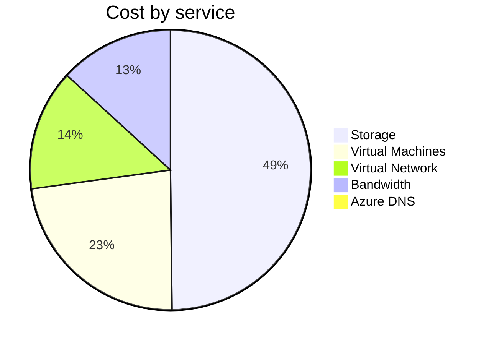
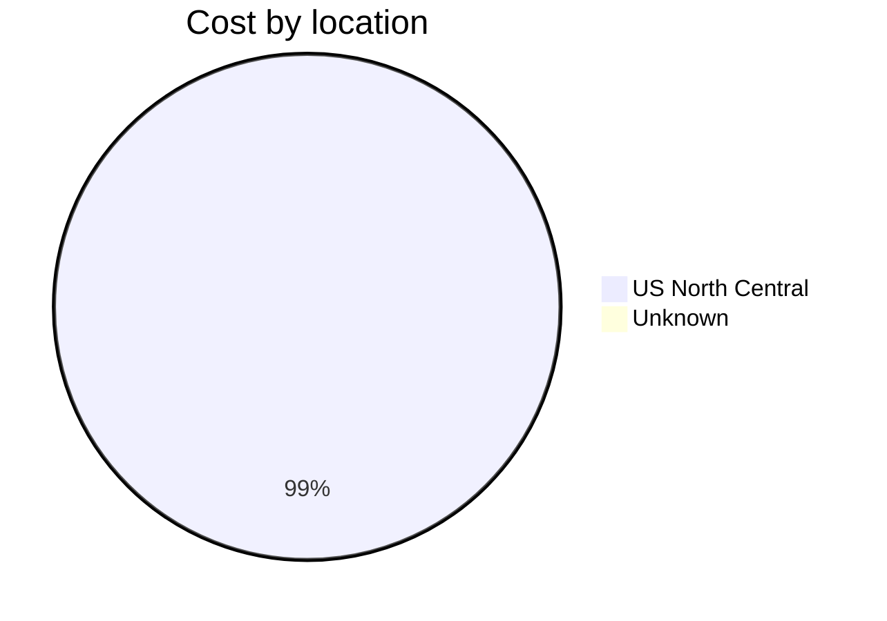
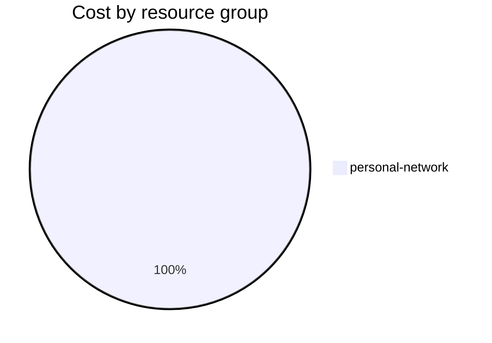

Fetching subscription details...
Fetching cost data...
Fetching forecasted cost data...
Fetching cost data by service name...
Fetching cost data by location...
Fetching cost data by resource group...
# Azure Cost Overview

> Accumulated cost for subscription id `JPF Pay-As-You-Go` from **12/01/2023** to **12/13/2023**

## Totals

|Period|Amount|
|---|---:|
|Today|0.02 USD|
|Yesterday|1.47 USD|
|Last 7 days|11.77 USD|
|Last 30 days|20.74 USD|

```mermaid
gantt
   title Accumulated cost
   dateFormat  X
   axisFormat %s
   section 01 Dec
   USD 1.75 :0, 175
   section 02 Dec
   USD 3.60 :0, 360
   section 03 Dec
   USD 5.81 :0, 581
   section 04 Dec
   USD 7.40 :0, 740
   section 05 Dec
   USD 8.97 :0, 897
   section 06 Dec
   USD 11.15 :0, 1115
   section 07 Dec
   USD 12.94 :0, 1294
   section 08 Dec
   USD 14.43 :0, 1443
   section 09 Dec
   USD 16.17 :0, 1617
   section 10 Dec
   USD 17.72 :0, 1772
   section 11 Dec
   USD 19.25 :0, 1925
   section 12 Dec
   USD 20.72 :0, 2072
   section 13 Dec
   USD 20.74 :0, 2074
   section 14 Dec
   USD 22.48 : done, 0, 2248
   section 15 Dec
   USD 24.23 : done, 0, 2423
   section 16 Dec
   USD 26.01 : done, 0, 2601
   section 17 Dec
   USD 27.68 : done, 0, 2768
   section 18 Dec
   USD 29.26 : done, 0, 2926
   section 19 Dec
   USD 31.12 : done, 0, 3112
   section 20 Dec
   USD 32.88 : done, 0, 3288
   section 21 Dec
   USD 34.60 : done, 0, 3460
   section 22 Dec
   USD 36.33 : done, 0, 3633
   section 23 Dec
   USD 38.09 : done, 0, 3809
   section 24 Dec
   USD 39.74 : done, 0, 3974
   section 25 Dec
   USD 41.30 : done, 0, 4130
   section 26 Dec
   USD 43.15 : done, 0, 4315
   section 27 Dec
   USD 44.89 : done, 0, 4489
   section 28 Dec
   USD 46.59 : done, 0, 4659
   section 29 Dec
   USD 48.30 : done, 0, 4830
   section 30 Dec
   USD 50.05 : done, 0, 5005
   section 31 Dec
   USD 51.68 : done, 0, 5168
```

## By Service Name

|Service|Amount|
|---|---:|
|Storage|10.24 USD|
|Virtual Machines|4.73 USD|
|Virtual Network|2.87 USD|
|Bandwidth|2.71 USD|
|Azure DNS|0.19 USD|

## By Location

|Location|Amount|
|---|---:|
|US North Central|20.55 USD|
|Unknown|0.19 USD|

## By Resource Group

|Resource Group|Amount|
|---|---:|
|personal-network|20.74 USD|

Generated at 2023-12-13 11:08:25 for subscription with id `4913be3f-a345-4652-9bba-767418dd25e3`
