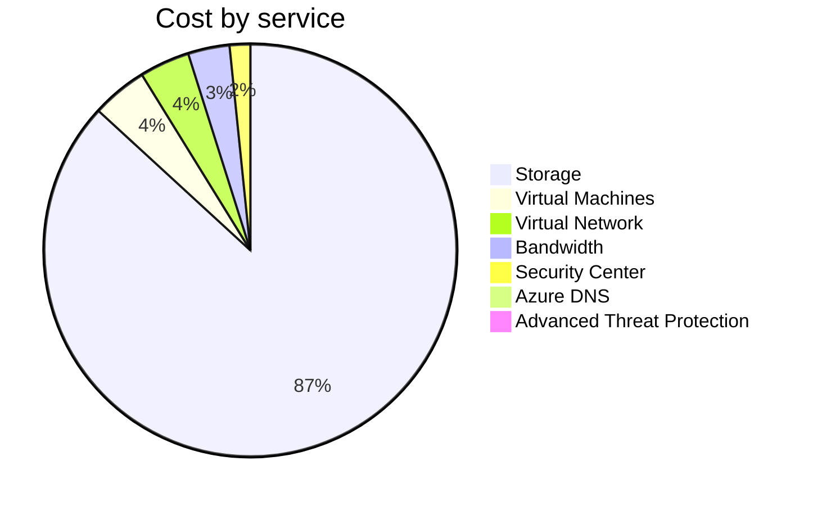
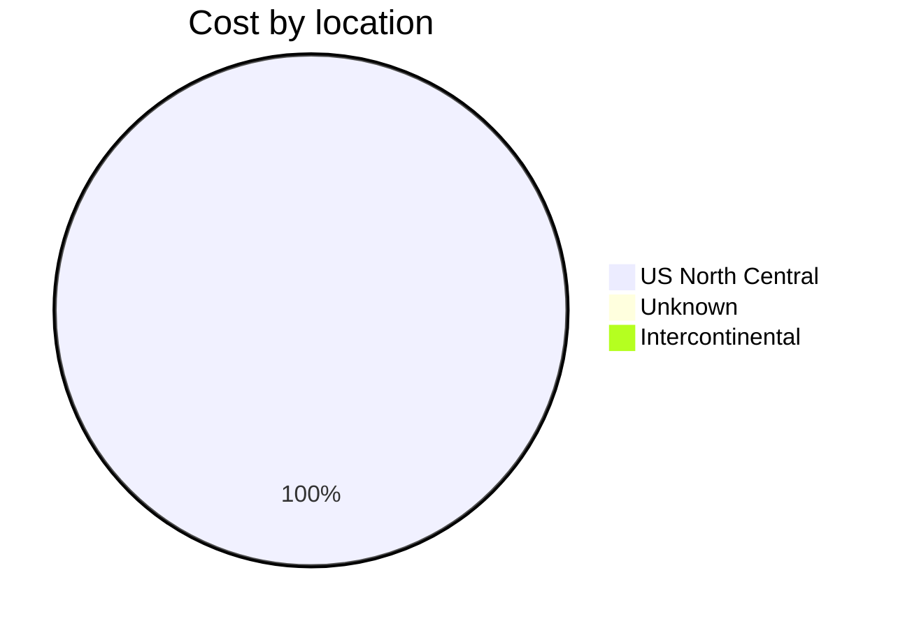
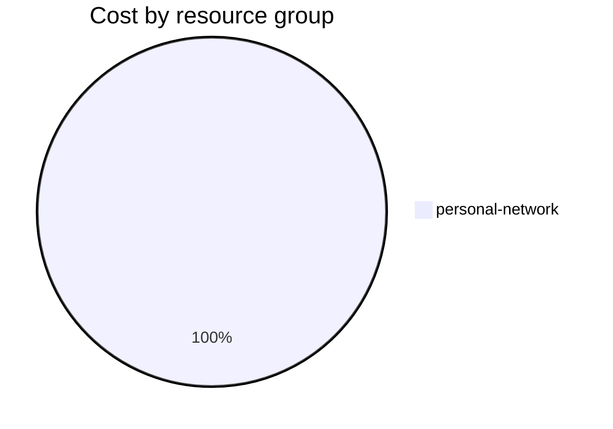

Fetching subscription details...
Fetching cost data...
Fetching forecasted cost data...
Fetching cost data by service name...
Fetching cost data by location...
Fetching cost data by resource group...
# Azure Cost Overview

> Accumulated cost for subscription id `JPF Pay-As-You-Go` from **09/01/2023** to **09/28/2023**

## Totals

|Period|Amount|
|---|---:|
|Today|0.10 USD|
|Yesterday|2.56 USD|
|Last 7 days|21.64 USD|
|Last 30 days|228.96 USD|

```mermaid
gantt
   title Accumulated cost
   dateFormat  X
   axisFormat %s
   section 01 Sep
   USD 3.20 :0, 320
   section 02 Sep
   USD 6.19 :0, 619
   section 03 Sep
   USD 9.27 :0, 927
   section 04 Sep
   USD 12.30 :0, 1230
   section 05 Sep
   USD 15.47 :0, 1547
   section 06 Sep
   USD 18.50 :0, 1850
   section 07 Sep
   USD 21.60 :0, 2160
   section 08 Sep
   USD 24.70 :0, 2470
   section 09 Sep
   USD 27.71 :0, 2771
   section 10 Sep
   USD 30.61 :0, 3061
   section 11 Sep
   USD 33.59 :0, 3359
   section 12 Sep
   USD 46.22 :0, 4622
   section 13 Sep
   USD 92.56 :0, 9256
   section 14 Sep
   USD 127.18 :0, 12718
   section 15 Sep
   USD 132.93 :0, 13293
   section 16 Sep
   USD 146.24 :0, 14624
   section 17 Sep
   USD 173.94 :0, 17394
   section 18 Sep
   USD 188.96 :0, 18896
   section 19 Sep
   USD 204.19 :0, 20419
   section 20 Sep
   USD 207.32 :0, 20732
   section 21 Sep
   USD 210.61 :0, 21061
   section 22 Sep
   USD 214.32 :0, 21432
   section 23 Sep
   USD 217.26 :0, 21726
   section 24 Sep
   USD 220.24 :0, 22024
   section 25 Sep
   USD 223.27 :0, 22327
   section 26 Sep
   USD 226.30 :0, 22630
   section 27 Sep
   USD 228.86 :0, 22886
   section 28 Sep
   USD 228.96 :0, 22896
   section 29 Sep
   USD 241.13 : done, 0, 24113
   section 30 Sep
   USD 253.06 : done, 0, 25306
```

## By Service Name

|Service|Amount|
|---|---:|
|Storage|198.42 USD|
|Virtual Machines|9.98 USD|
|Virtual Network|8.99 USD|
|Bandwidth|7.44 USD|
|Security Center|3.70 USD|
|Azure DNS|0.43 USD|
|Advanced Threat Protection|0.00 USD|

## By Location

|Location|Amount|
|---|---:|
|US North Central|228.53 USD|
|Unknown|0.43 USD|
|Intercontinental|0.00 USD|

## By Resource Group

|Resource Group|Amount|
|---|---:|
|personal-network|228.96 USD|

Generated at 2023-09-28 11:04:15 for subscription with id `4913be3f-a345-4652-9bba-767418dd25e3`
