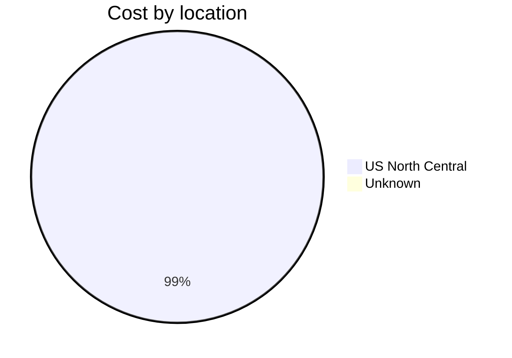
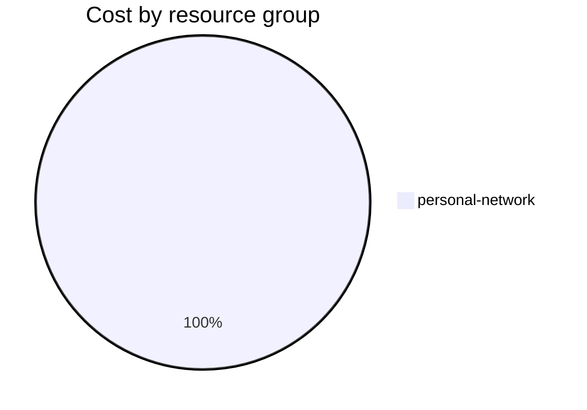

Fetching subscription details...
Fetching cost data...
Fetching forecasted cost data...
Fetching cost data by service name...
Fetching cost data by location...
Fetching cost data by resource group...
# Azure Cost Overview

> Accumulated cost for subscription id `JPF Pay-As-You-Go` from **01/01/2024** to **01/06/2024**

## Totals

|Period|Amount|
|---|---:|
|Today|0.12 USD|
|Yesterday|1.75 USD|
|Last 7 days|9.72 USD|
|Last 30 days|9.72 USD|

```mermaid
gantt
   title Accumulated cost
   dateFormat  X
   axisFormat %s
   section 01 Jan
   USD 1.93 :0, 193
   section 02 Jan
   USD 4.24 :0, 424
   section 03 Jan
   USD 6.00 :0, 600
   section 04 Jan
   USD 7.86 :0, 786
   section 05 Jan
   USD 9.60 :0, 960
   section 06 Jan
   USD 9.72 :0, 972
   section 07 Jan
   USD 11.49 : done, 0, 1149
   section 08 Jan
   USD 13.39 : done, 0, 1339
   section 09 Jan
   USD 15.30 : done, 0, 1530
   section 10 Jan
   USD 16.94 : done, 0, 1694
   section 11 Jan
   USD 18.65 : done, 0, 1865
   section 12 Jan
   USD 20.15 : done, 0, 2015
   section 13 Jan
   USD 21.83 : done, 0, 2183
   section 14 Jan
   USD 23.57 : done, 0, 2357
   section 15 Jan
   USD 25.46 : done, 0, 2546
   section 16 Jan
   USD 27.34 : done, 0, 2734
   section 17 Jan
   USD 28.95 : done, 0, 2895
   section 18 Jan
   USD 30.64 : done, 0, 3064
   section 19 Jan
   USD 32.13 : done, 0, 3213
   section 20 Jan
   USD 33.78 : done, 0, 3378
   section 21 Jan
   USD 35.50 : done, 0, 3550
   section 22 Jan
   USD 37.37 : done, 0, 3737
   section 23 Jan
   USD 39.23 : done, 0, 3923
   section 24 Jan
   USD 40.82 : done, 0, 4082
   section 25 Jan
   USD 42.49 : done, 0, 4249
   section 26 Jan
   USD 43.95 : done, 0, 4395
   section 27 Jan
   USD 45.58 : done, 0, 4558
   section 28 Jan
   USD 47.29 : done, 0, 4729
   section 29 Jan
   USD 49.13 : done, 0, 4913
   section 30 Jan
   USD 50.97 : done, 0, 5097
   section 31 Jan
   USD 52.54 : done, 0, 5254
```

## By Service Name

|Service|Amount|
|---|---:|
|Storage|4.24 USD|
|Virtual Machines|2.18 USD|
|Bandwidth|2.04 USD|
|Virtual Network|1.18 USD|
|Azure DNS|0.08 USD|

## By Location

|Location|Amount|
|---|---:|
|US North Central|9.64 USD|
|Unknown|0.08 USD|

## By Resource Group

|Resource Group|Amount|
|---|---:|
|personal-network|9.72 USD|

Generated at 2024-01-06 11:08:04 for subscription with id `4913be3f-a345-4652-9bba-767418dd25e3`
