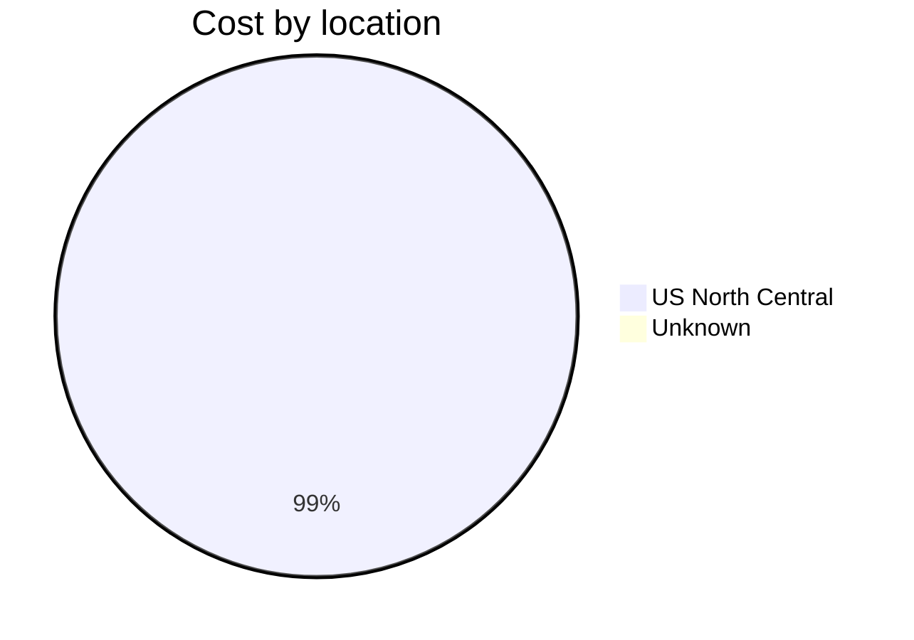
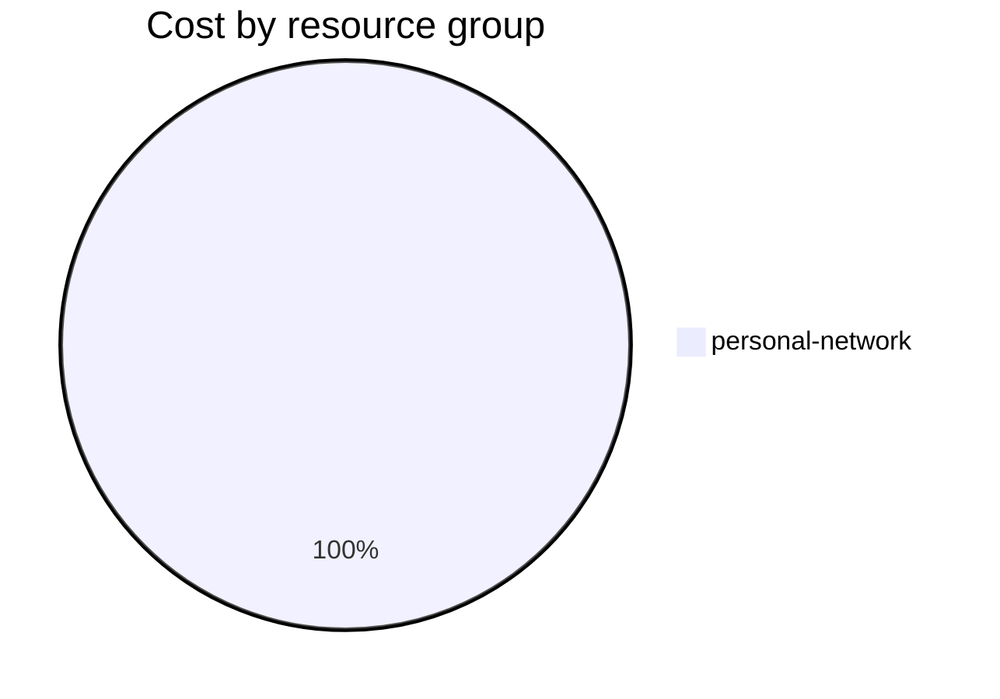

Fetching subscription details...
Fetching cost data...
Fetching forecasted cost data...
Fetching cost data by service name...
Fetching cost data by location...
Fetching cost data by resource group...
# Azure Cost Overview

> Accumulated cost for subscription id `JPF Pay-As-You-Go` from **01/01/2024** to **01/29/2024**

## Totals

|Period|Amount|
|---|---:|
|Today|0.10 USD|
|Yesterday|1.97 USD|
|Last 7 days|15.23 USD|
|Last 30 days|58.55 USD|

```mermaid
gantt
   title Accumulated cost
   dateFormat  X
   axisFormat %s
   section 01 Jan
   USD 2.01 :0, 201
   section 02 Jan
   USD 4.48 :0, 448
   section 03 Jan
   USD 6.29 :0, 629
   section 04 Jan
   USD 8.20 :0, 820
   section 05 Jan
   USD 10.14 :0, 1014
   section 06 Jan
   USD 12.40 :0, 1240
   section 07 Jan
   USD 14.14 :0, 1414
   section 08 Jan
   USD 16.56 :0, 1656
   section 09 Jan
   USD 18.53 :0, 1853
   section 10 Jan
   USD 20.19 :0, 2019
   section 11 Jan
   USD 22.12 :0, 2212
   section 12 Jan
   USD 24.09 :0, 2409
   section 13 Jan
   USD 26.56 :0, 2656
   section 14 Jan
   USD 28.10 :0, 2810
   section 15 Jan
   USD 29.75 :0, 2975
   section 16 Jan
   USD 32.56 :0, 3256
   section 17 Jan
   USD 34.68 :0, 3468
   section 18 Jan
   USD 36.70 :0, 3670
   section 19 Jan
   USD 38.75 :0, 3875
   section 20 Jan
   USD 41.28 :0, 4128
   section 21 Jan
   USD 43.33 :0, 4333
   section 22 Jan
   USD 45.39 :0, 4539
   section 23 Jan
   USD 47.38 :0, 4738
   section 24 Jan
   USD 49.16 :0, 4916
   section 25 Jan
   USD 50.98 :0, 5098
   section 26 Jan
   USD 53.26 :0, 5326
   section 27 Jan
   USD 56.48 :0, 5648
   section 28 Jan
   USD 58.45 :0, 5845
   section 29 Jan
   USD 58.55 :0, 5855
   section 30 Jan
   USD 60.95 : done, 0, 6095
   section 31 Jan
   USD 62.91 : done, 0, 6291
```

## By Service Name

|Service|Amount|
|---|---:|
|Storage|24.04 USD|
|Bandwidth|15.71 USD|
|Virtual Machines|11.65 USD|
|Virtual Network|6.71 USD|
|Azure DNS|0.45 USD|

## By Location

|Location|Amount|
|---|---:|
|US North Central|58.10 USD|
|Unknown|0.45 USD|

## By Resource Group

|Resource Group|Amount|
|---|---:|
|personal-network|58.55 USD|

Generated at 2024-01-29 11:09:13 for subscription with id `4913be3f-a345-4652-9bba-767418dd25e3`
