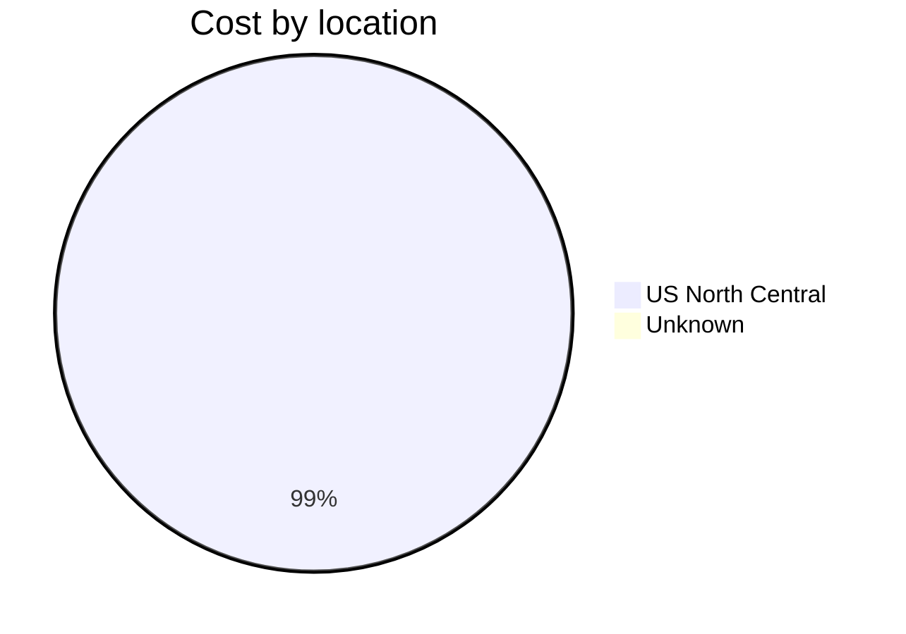
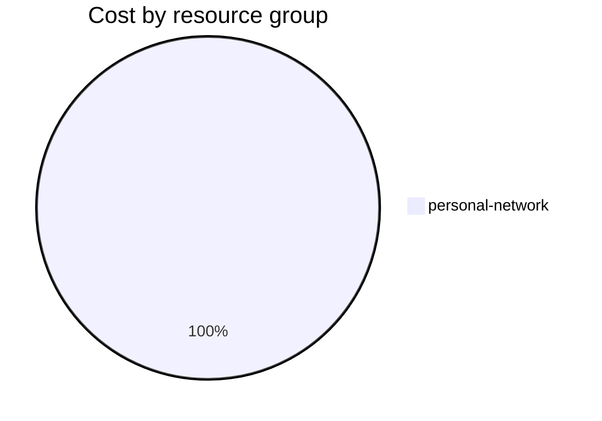

Fetching subscription details...
Fetching cost data...
Fetching forecasted cost data...
Fetching cost data by service name...
Fetching cost data by location...
Fetching cost data by resource group...
# Azure Cost Overview

> Accumulated cost for subscription id `JPF Pay-As-You-Go` from **03/01/2024** to **03/06/2024**

## Totals

|Period|Amount|
|---|---:|
|Today|0.04 USD|
|Yesterday|1.34 USD|
|Last 7 days|8.36 USD|
|Last 30 days|8.36 USD|

```mermaid
gantt
   title Accumulated cost
   dateFormat  X
   axisFormat %s
   section 01 Mar
   USD 2.68 :0, 268
   section 02 Mar
   USD 4.11 :0, 411
   section 03 Mar
   USD 5.54 :0, 554
   section 04 Mar
   USD 6.98 :0, 698
   section 05 Mar
   USD 8.31 :0, 831
   section 06 Mar
   USD 8.36 :0, 836
   section 07 Mar
   USD 9.76 : done, 0, 976
   section 08 Mar
   USD 11.56 : done, 0, 1156
   section 09 Mar
   USD 12.95 : done, 0, 1295
   section 10 Mar
   USD 14.27 : done, 0, 1427
   section 11 Mar
   USD 15.37 : done, 0, 1537
   section 12 Mar
   USD 17.03 : done, 0, 1703
   section 13 Mar
   USD 18.51 : done, 0, 1851
   section 14 Mar
   USD 19.76 : done, 0, 1976
   section 15 Mar
   USD 21.41 : done, 0, 2141
   section 16 Mar
   USD 22.64 : done, 0, 2264
   section 17 Mar
   USD 23.80 : done, 0, 2380
   section 18 Mar
   USD 24.75 : done, 0, 2475
   section 19 Mar
   USD 26.26 : done, 0, 2626
   section 20 Mar
   USD 27.59 : done, 0, 2759
   section 21 Mar
   USD 28.68 : done, 0, 2868
   section 22 Mar
   USD 30.17 : done, 0, 3017
   section 23 Mar
   USD 31.25 : done, 0, 3125
   section 24 Mar
   USD 32.26 : done, 0, 3226
   section 25 Mar
   USD 33.06 : done, 0, 3306
   section 26 Mar
   USD 34.41 : done, 0, 3441
   section 27 Mar
   USD 35.58 : done, 0, 3558
   section 28 Mar
   USD 36.52 : done, 0, 3652
   section 29 Mar
   USD 37.86 : done, 0, 3786
   section 30 Mar
   USD 38.79 : done, 0, 3879
   section 31 Mar
   USD 39.64 : done, 0, 3964
```

## By Service Name

|Service|Amount|
|---|---:|
|Storage|4.12 USD|
|Virtual Machines|1.80 USD|
|Bandwidth|1.18 USD|
|Virtual Network|1.18 USD|
|Azure DNS|0.08 USD|

## By Location

|Location|Amount|
|---|---:|
|US North Central|8.28 USD|
|Unknown|0.08 USD|

## By Resource Group

|Resource Group|Amount|
|---|---:|
|personal-network|8.36 USD|

Generated at 2024-03-06 11:06:11 for subscription with id `4913be3f-a345-4652-9bba-767418dd25e3`
