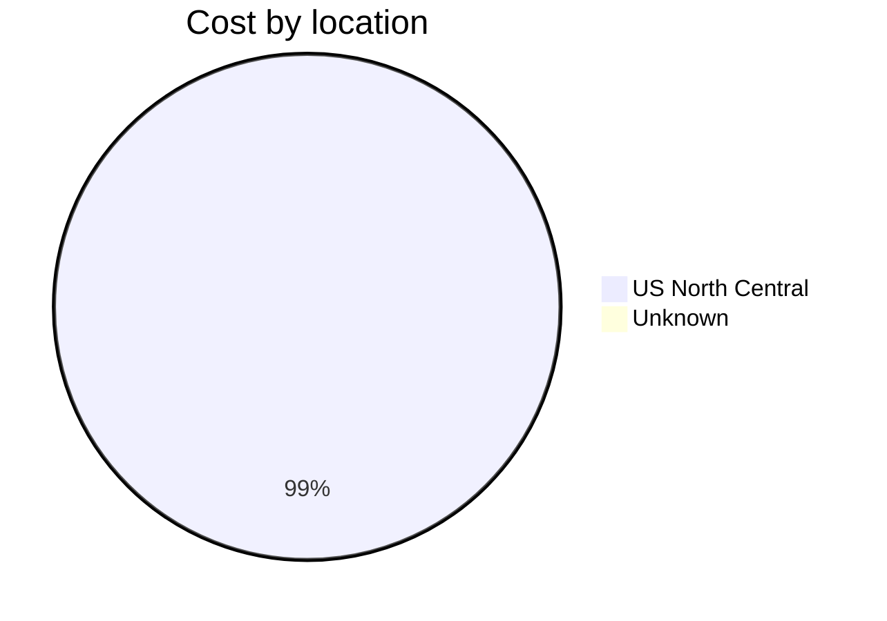
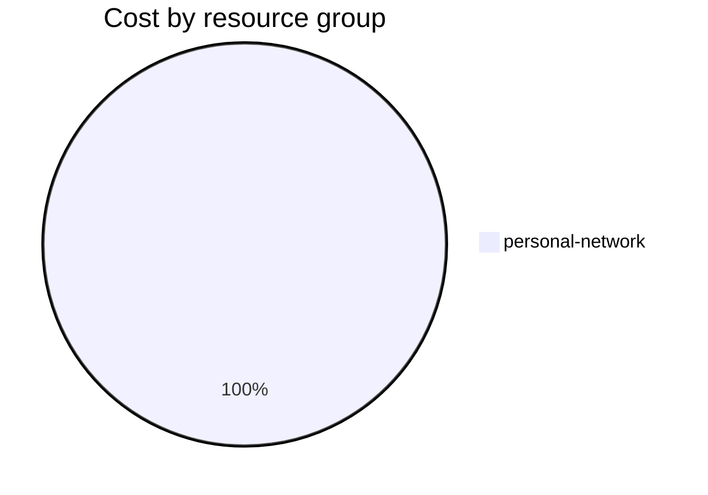

Fetching subscription details...
Fetching cost data...
Fetching forecasted cost data...
Fetching cost data by service name...
Fetching cost data by location...
Fetching cost data by resource group...
# Azure Cost Overview

> Accumulated cost for subscription id `JPF Pay-As-You-Go` from **10/01/2023** to **10/23/2023**

## Totals

|Period|Amount|
|---|---:|
|Today|0.10 USD|
|Yesterday|1.33 USD|
|Last 7 days|10.87 USD|
|Last 30 days|37.73 USD|

```mermaid
gantt
   title Accumulated cost
   dateFormat  X
   axisFormat %s
   section 01 Oct
   USD 3.16 :0, 316
   section 02 Oct
   USD 5.72 :0, 572
   section 03 Oct
   USD 7.55 :0, 755
   section 04 Oct
   USD 9.41 :0, 941
   section 05 Oct
   USD 11.15 :0, 1115
   section 06 Oct
   USD 13.05 :0, 1305
   section 07 Oct
   USD 14.85 :0, 1485
   section 08 Oct
   USD 16.35 :0, 1635
   section 09 Oct
   USD 17.95 :0, 1795
   section 10 Oct
   USD 19.44 :0, 1944
   section 11 Oct
   USD 20.94 :0, 2094
   section 12 Oct
   USD 22.46 :0, 2246
   section 13 Oct
   USD 23.97 :0, 2397
   section 14 Oct
   USD 25.41 :0, 2541
   section 15 Oct
   USD 26.86 :0, 2686
   section 16 Oct
   USD 28.40 :0, 2840
   section 17 Oct
   USD 29.98 :0, 2998
   section 18 Oct
   USD 31.57 :0, 3157
   section 19 Oct
   USD 33.14 :0, 3314
   section 20 Oct
   USD 34.74 :0, 3474
   section 21 Oct
   USD 36.30 :0, 3630
   section 22 Oct
   USD 37.63 :0, 3763
   section 23 Oct
   USD 37.73 :0, 3773
   section 24 Oct
   USD 38.51 : done, 0, 3851
   section 25 Oct
   USD 39.23 : done, 0, 3923
   section 26 Oct
   USD 39.81 : done, 0, 3981
   section 27 Oct
   USD 40.42 : done, 0, 4042
   section 28 Oct
   USD 41.01 : done, 0, 4101
   section 29 Oct
   USD 42.01 : done, 0, 4201
   section 30 Oct
   USD 42.73 : done, 0, 4273
   section 31 Oct
   USD 43.02 : done, 0, 4302
```

## By Service Name

|Service|Amount|
|---|---:|
|Storage|20.49 USD|
|Virtual Machines|7.94 USD|
|Virtual Network|5.26 USD|
|Bandwidth|3.68 USD|
|Azure DNS|0.35 USD|

## By Location

|Location|Amount|
|---|---:|
|US North Central|37.38 USD|
|Unknown|0.35 USD|

## By Resource Group

|Resource Group|Amount|
|---|---:|
|personal-network|37.73 USD|

Generated at 2023-10-23 11:07:06 for subscription with id `4913be3f-a345-4652-9bba-767418dd25e3`
