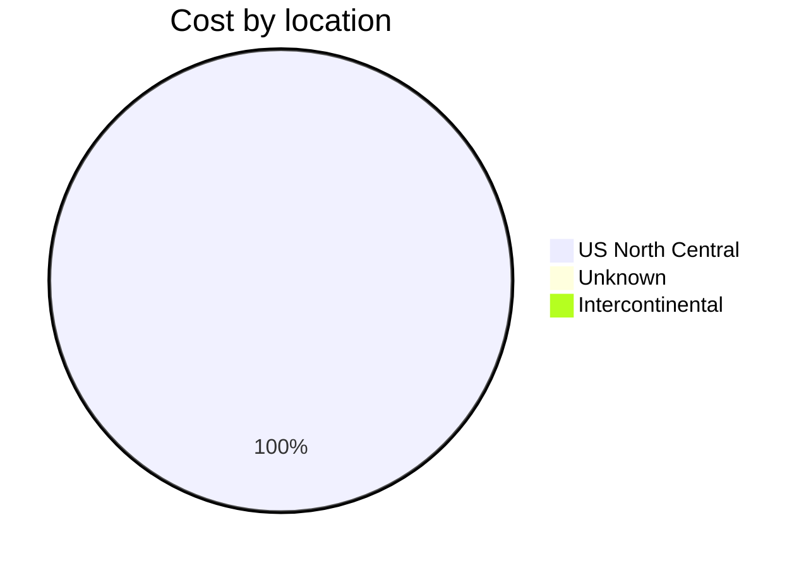
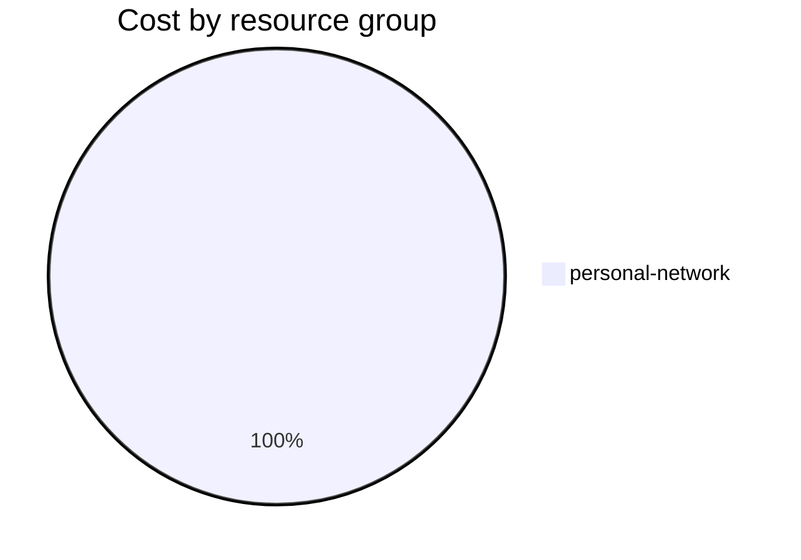

Fetching subscription details...
Fetching cost data...
Fetching forecasted cost data...
Fetching cost data by service name...
Fetching cost data by location...
Fetching cost data by resource group...
# Azure Cost Overview

> Accumulated cost for subscription id `JPF Pay-As-You-Go` from **09/01/2023** to **09/25/2023**

## Totals

|Period|Amount|
|---|---:|
|Today|0.09 USD|
|Yesterday|2.74 USD|
|Last 7 days|45.58 USD|
|Last 30 days|219.15 USD|

```mermaid
gantt
   title Accumulated cost
   dateFormat  X
   axisFormat %s
   section 01 Sep
   USD 3.20 :0, 320
   section 02 Sep
   USD 6.19 :0, 619
   section 03 Sep
   USD 9.27 :0, 927
   section 04 Sep
   USD 12.30 :0, 1230
   section 05 Sep
   USD 15.47 :0, 1547
   section 06 Sep
   USD 18.50 :0, 1850
   section 07 Sep
   USD 21.60 :0, 2160
   section 08 Sep
   USD 24.70 :0, 2470
   section 09 Sep
   USD 27.70 :0, 2770
   section 10 Sep
   USD 30.57 :0, 3057
   section 11 Sep
   USD 33.51 :0, 3351
   section 12 Sep
   USD 46.11 :0, 4611
   section 13 Sep
   USD 92.40 :0, 9240
   section 14 Sep
   USD 126.97 :0, 12697
   section 15 Sep
   USD 132.69 :0, 13269
   section 16 Sep
   USD 145.92 :0, 14592
   section 17 Sep
   USD 173.57 :0, 17357
   section 18 Sep
   USD 188.47 :0, 18847
   section 19 Sep
   USD 203.64 :0, 20364
   section 20 Sep
   USD 206.70 :0, 20670
   section 21 Sep
   USD 209.90 :0, 20990
   section 22 Sep
   USD 213.41 :0, 21341
   section 23 Sep
   USD 216.33 :0, 21633
   section 24 Sep
   USD 219.06 :0, 21906
   section 25 Sep
   USD 219.15 :0, 21915
   section 26 Sep
   USD 238.74 : done, 0, 23874
   section 27 Sep
   USD 253.94 : done, 0, 25394
   section 28 Sep
   USD 269.65 : done, 0, 26965
   section 29 Sep
   USD 286.02 : done, 0, 28602
   section 30 Sep
   USD 302.46 : done, 0, 30246
```

## By Service Name

|Service|Amount|
|---|---:|
|Storage|191.92 USD|
|Virtual Machines|8.92 USD|
|Virtual Network|8.29 USD|
|Bandwidth|5.94 USD|
|Security Center|3.70 USD|
|Azure DNS|0.39 USD|
|Advanced Threat Protection|0.00 USD|

## By Location

|Location|Amount|
|---|---:|
|US North Central|218.76 USD|
|Unknown|0.39 USD|
|Intercontinental|0.00 USD|

## By Resource Group

|Resource Group|Amount|
|---|---:|
|personal-network|219.15 USD|

Generated at 2023-09-25 11:06:23 for subscription with id `4913be3f-a345-4652-9bba-767418dd25e3`
