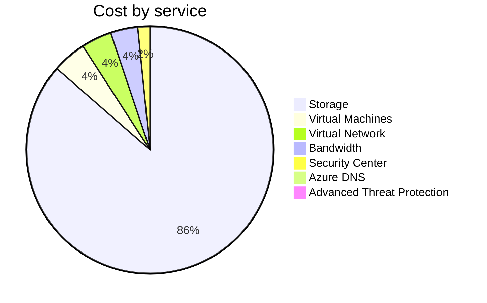
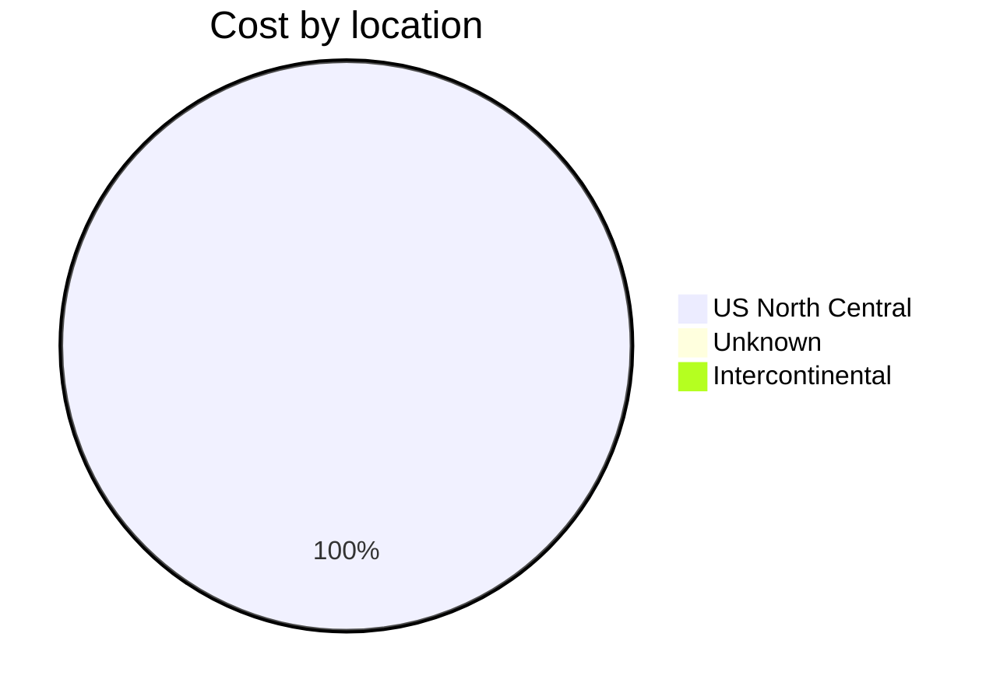
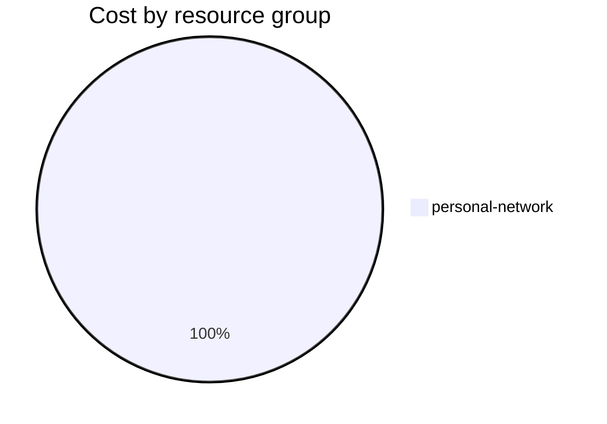

Fetching subscription details...
Fetching cost data...
Fetching forecasted cost data...
Fetching cost data by service name...
Fetching cost data by location...
Fetching cost data by resource group...
# Azure Cost Overview

> Accumulated cost for subscription id `JPF Pay-As-You-Go` from **09/01/2023** to **09/29/2023**

## Totals

|Period|Amount|
|---|---:|
|Today|0.10 USD|
|Yesterday|2.92 USD|
|Last 7 days|21.89 USD|
|Last 30 days|232.84 USD|

```mermaid
gantt
   title Accumulated cost
   dateFormat  X
   axisFormat %s
   section 01 Sep
   USD 3.20 :0, 320
   section 02 Sep
   USD 6.19 :0, 619
   section 03 Sep
   USD 9.27 :0, 927
   section 04 Sep
   USD 12.30 :0, 1230
   section 05 Sep
   USD 15.47 :0, 1547
   section 06 Sep
   USD 18.50 :0, 1850
   section 07 Sep
   USD 21.60 :0, 2160
   section 08 Sep
   USD 24.70 :0, 2470
   section 09 Sep
   USD 27.71 :0, 2771
   section 10 Sep
   USD 30.63 :0, 3063
   section 11 Sep
   USD 33.63 :0, 3363
   section 12 Sep
   USD 46.27 :0, 4627
   section 13 Sep
   USD 92.63 :0, 9263
   section 14 Sep
   USD 127.28 :0, 12728
   section 15 Sep
   USD 133.05 :0, 13305
   section 16 Sep
   USD 146.38 :0, 14638
   section 17 Sep
   USD 174.12 :0, 17412
   section 18 Sep
   USD 189.19 :0, 18919
   section 19 Sep
   USD 204.44 :0, 20444
   section 20 Sep
   USD 207.60 :0, 20760
   section 21 Sep
   USD 210.94 :0, 21094
   section 22 Sep
   USD 214.74 :0, 21474
   section 23 Sep
   USD 217.70 :0, 21770
   section 24 Sep
   USD 220.68 :0, 22068
   section 25 Sep
   USD 223.74 :0, 22374
   section 26 Sep
   USD 226.79 :0, 22679
   section 27 Sep
   USD 229.82 :0, 22982
   section 28 Sep
   USD 232.74 :0, 23274
   section 29 Sep
   USD 232.84 :0, 23284
   section 30 Sep
   USD 242.31 : done, 0, 24231
```

## By Service Name

|Service|Amount|
|---|---:|
|Storage|200.84 USD|
|Virtual Machines|10.33 USD|
|Virtual Network|9.25 USD|
|Bandwidth|8.26 USD|
|Security Center|3.70 USD|
|Azure DNS|0.45 USD|
|Advanced Threat Protection|0.00 USD|

## By Location

|Location|Amount|
|---|---:|
|US North Central|232.39 USD|
|Unknown|0.45 USD|
|Intercontinental|0.00 USD|

## By Resource Group

|Resource Group|Amount|
|---|---:|
|personal-network|232.84 USD|

Generated at 2023-09-29 11:08:09 for subscription with id `4913be3f-a345-4652-9bba-767418dd25e3`
