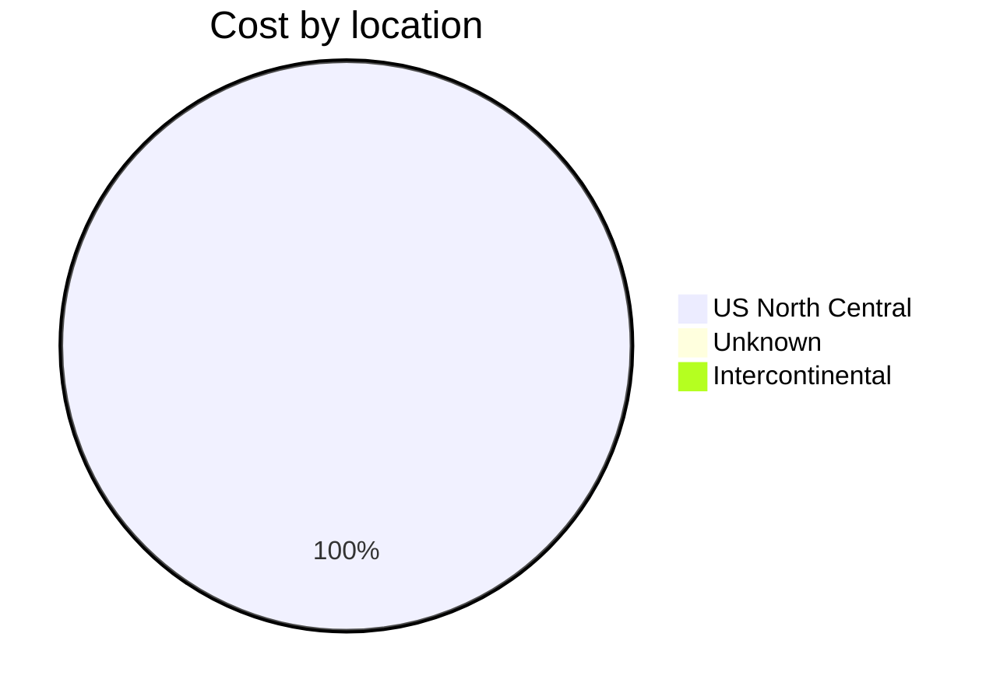
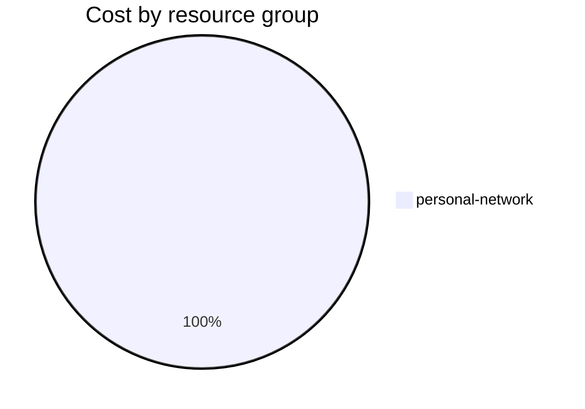

Fetching subscription details...
Fetching cost data...
Fetching forecasted cost data...
Fetching cost data by service name...
Fetching cost data by location...
Fetching cost data by resource group...
# Azure Cost Overview

> Accumulated cost for subscription id `JPF Pay-As-You-Go` from **09/01/2023** to **09/23/2023**

## Totals

|Period|Amount|
|---|---:|
|Today|0.10 USD|
|Yesterday|3.29 USD|
|Last 7 days|80.33 USD|
|Last 30 days|212.88 USD|

```mermaid
gantt
   title Accumulated cost
   dateFormat  X
   axisFormat %s
   section 01 Sep
   USD 3.20 :0, 320
   section 02 Sep
   USD 6.19 :0, 619
   section 03 Sep
   USD 9.27 :0, 927
   section 04 Sep
   USD 12.30 :0, 1230
   section 05 Sep
   USD 15.47 :0, 1547
   section 06 Sep
   USD 18.50 :0, 1850
   section 07 Sep
   USD 21.60 :0, 2160
   section 08 Sep
   USD 24.70 :0, 2470
   section 09 Sep
   USD 27.70 :0, 2770
   section 10 Sep
   USD 30.55 :0, 3055
   section 11 Sep
   USD 33.46 :0, 3346
   section 12 Sep
   USD 46.05 :0, 4605
   section 13 Sep
   USD 92.31 :0, 9231
   section 14 Sep
   USD 126.85 :0, 12685
   section 15 Sep
   USD 132.54 :0, 13254
   section 16 Sep
   USD 145.74 :0, 14574
   section 17 Sep
   USD 173.35 :0, 17335
   section 18 Sep
   USD 188.18 :0, 18818
   section 19 Sep
   USD 203.32 :0, 20332
   section 20 Sep
   USD 206.35 :0, 20635
   section 21 Sep
   USD 209.48 :0, 20948
   section 22 Sep
   USD 212.77 :0, 21277
   section 23 Sep
   USD 212.88 :0, 21288
   section 24 Sep
   USD 229.71 : done, 0, 22971
   section 25 Sep
   USD 247.05 : done, 0, 24705
   section 26 Sep
   USD 269.82 : done, 0, 26982
   section 27 Sep
   USD 288.30 : done, 0, 28830
   section 28 Sep
   USD 307.40 : done, 0, 30740
   section 29 Sep
   USD 327.17 : done, 0, 32717
   section 30 Sep
   USD 347.44 : done, 0, 34744
```

## By Service Name

|Service|Amount|
|---|---:|
|Storage|187.56 USD|
|Virtual Machines|8.23 USD|
|Virtual Network|7.82 USD|
|Bandwidth|5.21 USD|
|Security Center|3.70 USD|
|Azure DNS|0.35 USD|
|Advanced Threat Protection|0.00 USD|

## By Location

|Location|Amount|
|---|---:|
|US North Central|212.52 USD|
|Unknown|0.35 USD|
|Intercontinental|0.00 USD|

## By Resource Group

|Resource Group|Amount|
|---|---:|
|personal-network|212.88 USD|

Generated at 2023-09-23 11:08:09 for subscription with id `4913be3f-a345-4652-9bba-767418dd25e3`
