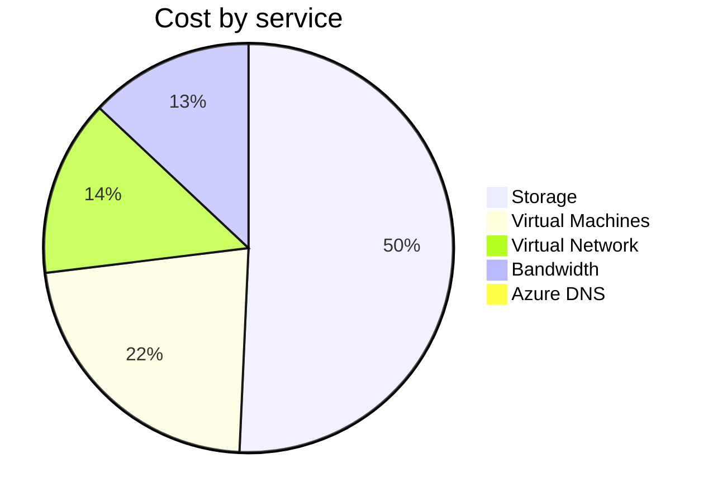
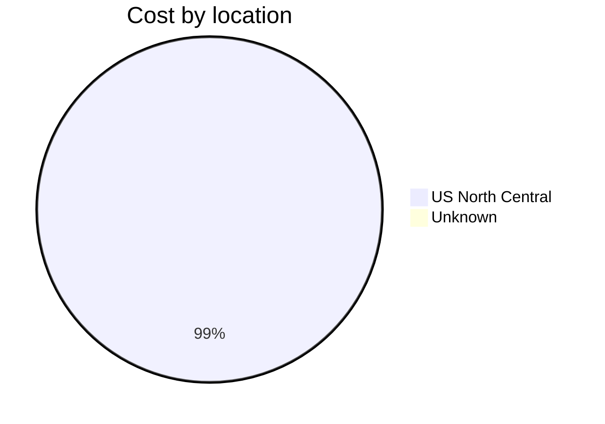
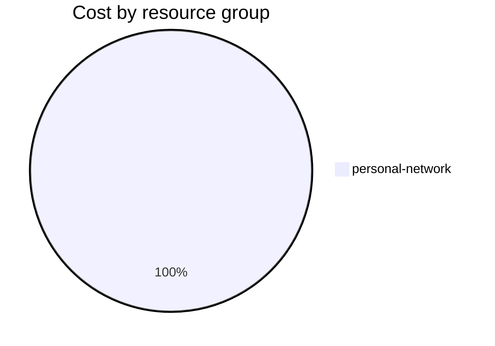

Fetching subscription details...
Fetching cost data...
Fetching forecasted cost data...
Fetching cost data by service name...
Fetching cost data by location...
Fetching cost data by resource group...
# Azure Cost Overview

> Accumulated cost for subscription id `JPF Pay-As-You-Go` from **11/01/2023** to **11/13/2023**

## Totals

|Period|Amount|
|---|---:|
|Today|0.09 USD|
|Yesterday|1.41 USD|
|Last 7 days|11.67 USD|
|Last 30 days|20.68 USD|

```mermaid
gantt
   title Accumulated cost
   dateFormat  X
   axisFormat %s
   section 01 Nov
   USD 1.83 :0, 183
   section 02 Nov
   USD 3.53 :0, 353
   section 03 Nov
   USD 5.51 :0, 551
   section 04 Nov
   USD 7.30 :0, 730
   section 05 Nov
   USD 9.02 :0, 902
   section 06 Nov
   USD 10.82 :0, 1082
   section 07 Nov
   USD 12.56 :0, 1256
   section 08 Nov
   USD 14.39 :0, 1439
   section 09 Nov
   USD 16.17 :0, 1617
   section 10 Nov
   USD 17.68 :0, 1768
   section 11 Nov
   USD 19.18 :0, 1918
   section 12 Nov
   USD 20.59 :0, 2059
   section 13 Nov
   USD 20.68 :0, 2068
   section 14 Nov
   USD 22.36 : done, 0, 2236
   section 15 Nov
   USD 24.09 : done, 0, 2409
   section 16 Nov
   USD 25.73 : done, 0, 2573
   section 17 Nov
   USD 27.48 : done, 0, 2748
   section 18 Nov
   USD 28.93 : done, 0, 2893
   section 19 Nov
   USD 30.32 : done, 0, 3032
   section 20 Nov
   USD 31.92 : done, 0, 3192
   section 21 Nov
   USD 33.54 : done, 0, 3354
   section 22 Nov
   USD 35.21 : done, 0, 3521
   section 23 Nov
   USD 36.80 : done, 0, 3680
   section 24 Nov
   USD 38.49 : done, 0, 3849
   section 25 Nov
   USD 39.88 : done, 0, 3988
   section 26 Nov
   USD 41.22 : done, 0, 4122
   section 27 Nov
   USD 42.76 : done, 0, 4276
   section 28 Nov
   USD 44.32 : done, 0, 4432
   section 29 Nov
   USD 45.94 : done, 0, 4594
   section 30 Nov
   USD 47.47 : done, 0, 4747
```

## By Service Name

|Service|Amount|
|---|---:|
|Storage|10.39 USD|
|Virtual Machines|4.58 USD|
|Virtual Network|2.86 USD|
|Bandwidth|2.66 USD|
|Azure DNS|0.19 USD|

## By Location

|Location|Amount|
|---|---:|
|US North Central|20.49 USD|
|Unknown|0.19 USD|

## By Resource Group

|Resource Group|Amount|
|---|---:|
|personal-network|20.68 USD|

Generated at 2023-11-13 11:05:32 for subscription with id `4913be3f-a345-4652-9bba-767418dd25e3`
