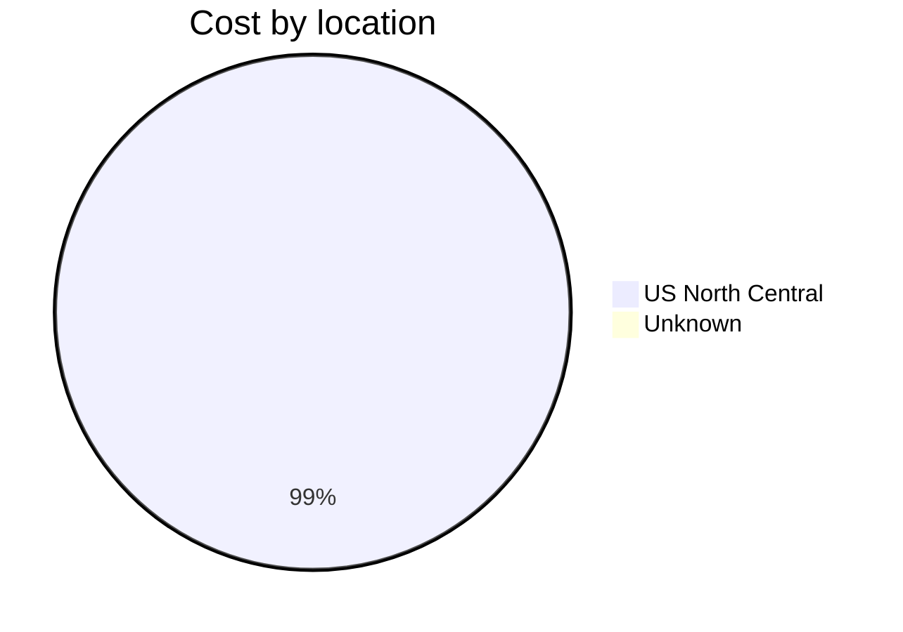
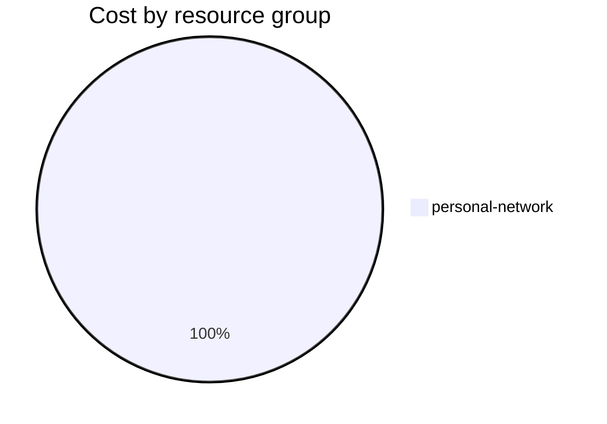

Fetching subscription details...
Fetching cost data...
Fetching forecasted cost data...
Fetching cost data by service name...
Fetching cost data by location...
Fetching cost data by resource group...
# Azure Cost Overview

> Accumulated cost for subscription id `JPF Pay-As-You-Go` from **12/01/2023** to **12/06/2023**

## Totals

|Period|Amount|
|---|---:|
|Today|0.11 USD|
|Yesterday|1.47 USD|
|Last 7 days|8.77 USD|
|Last 30 days|8.77 USD|

```mermaid
gantt
   title Accumulated cost
   dateFormat  X
   axisFormat %s
   section 01 Dec
   USD 1.71 :0, 171
   section 02 Dec
   USD 3.51 :0, 351
   section 03 Dec
   USD 5.61 :0, 561
   section 04 Dec
   USD 7.19 :0, 719
   section 05 Dec
   USD 8.65 :0, 865
   section 06 Dec
   USD 8.77 :0, 877
   section 07 Dec
   USD 10.54 : done, 0, 1054
   section 08 Dec
   USD 12.29 : done, 0, 1229
   section 09 Dec
   USD 14.05 : done, 0, 1405
   section 10 Dec
   USD 15.81 : done, 0, 1581
   section 11 Dec
   USD 17.64 : done, 0, 1764
   section 12 Dec
   USD 19.59 : done, 0, 1959
   section 13 Dec
   USD 21.36 : done, 0, 2136
   section 14 Dec
   USD 23.14 : done, 0, 2314
   section 15 Dec
   USD 24.90 : done, 0, 2490
   section 16 Dec
   USD 26.68 : done, 0, 2668
   section 17 Dec
   USD 28.45 : done, 0, 2845
   section 18 Dec
   USD 30.30 : done, 0, 3030
   section 19 Dec
   USD 32.25 : done, 0, 3225
   section 20 Dec
   USD 34.03 : done, 0, 3403
   section 21 Dec
   USD 35.83 : done, 0, 3583
   section 22 Dec
   USD 37.60 : done, 0, 3760
   section 23 Dec
   USD 39.39 : done, 0, 3939
   section 24 Dec
   USD 41.18 : done, 0, 4118
   section 25 Dec
   USD 43.03 : done, 0, 4303
   section 26 Dec
   USD 45.00 : done, 0, 4500
   section 27 Dec
   USD 46.79 : done, 0, 4679
   section 28 Dec
   USD 48.60 : done, 0, 4860
   section 29 Dec
   USD 50.39 : done, 0, 5039
   section 30 Dec
   USD 52.19 : done, 0, 5219
   section 31 Dec
   USD 53.99 : done, 0, 5399
```

## By Service Name

|Service|Amount|
|---|---:|
|Storage|4.15 USD|
|Virtual Machines|2.08 USD|
|Bandwidth|1.28 USD|
|Virtual Network|1.18 USD|
|Azure DNS|0.08 USD|

## By Location

|Location|Amount|
|---|---:|
|US North Central|8.69 USD|
|Unknown|0.08 USD|

## By Resource Group

|Resource Group|Amount|
|---|---:|
|personal-network|8.77 USD|

Generated at 2023-12-06 11:05:20 for subscription with id `4913be3f-a345-4652-9bba-767418dd25e3`
