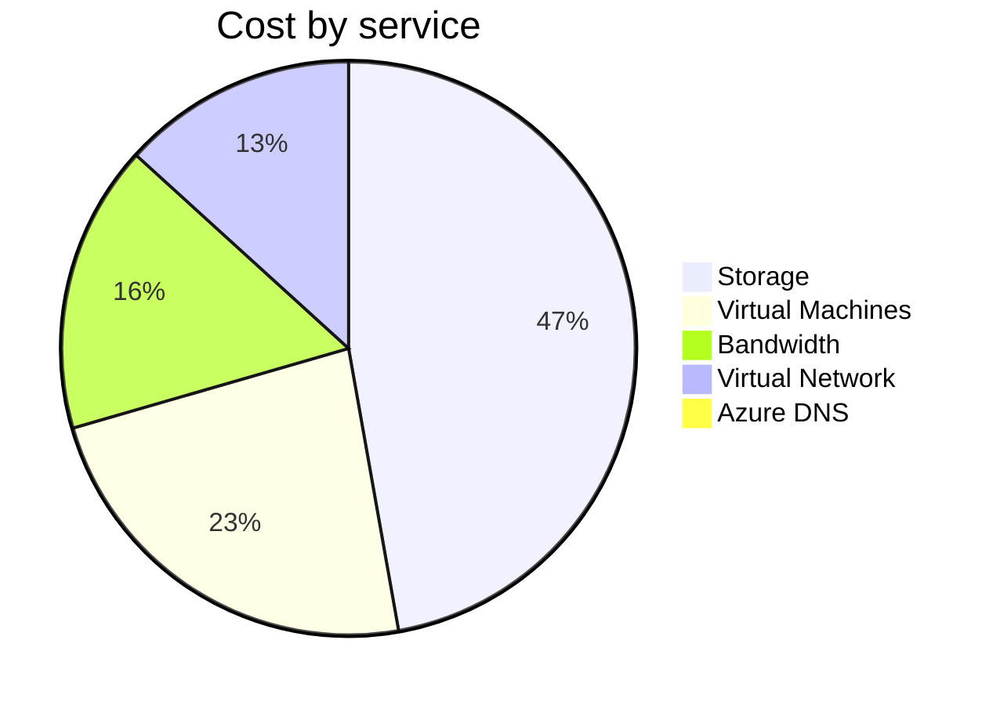
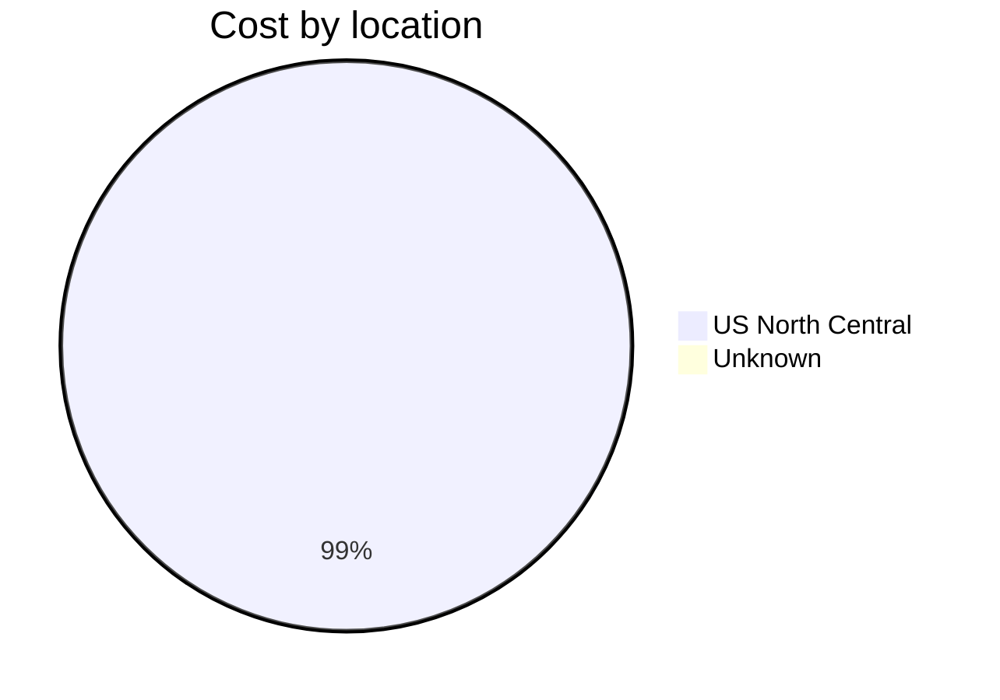
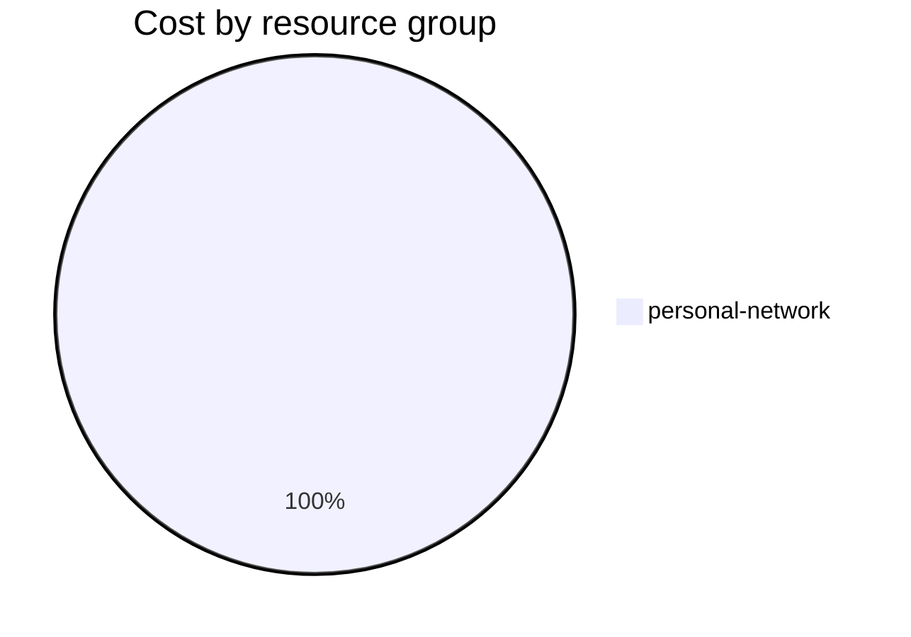

Fetching subscription details...
Fetching cost data...
Fetching forecasted cost data...
Fetching cost data by service name...
Fetching cost data by location...
Fetching cost data by resource group...
# Azure Cost Overview

> Accumulated cost for subscription id `JPF Pay-As-You-Go` from **01/01/2024** to **01/17/2024**

## Totals

|Period|Amount|
|---|---:|
|Today|0.12 USD|
|Yesterday|1.42 USD|
|Last 7 days|10.63 USD|
|Last 30 days|29.09 USD|

## By Service Name

|Service|Amount|
|---|---:|
|Storage|13.61 USD|
|Virtual Machines|6.72 USD|
|Bandwidth|4.68 USD|
|Virtual Network|3.82 USD|
|Azure DNS|0.26 USD|

## By Location

|Location|Amount|
|---|---:|
|US North Central|28.84 USD|
|Unknown|0.26 USD|

## By Resource Group

|Resource Group|Amount|
|---|---:|
|personal-network|29.09 USD|

Generated at 2024-01-17 11:07:01 for subscription with id `4913be3f-a345-4652-9bba-767418dd25e3`
