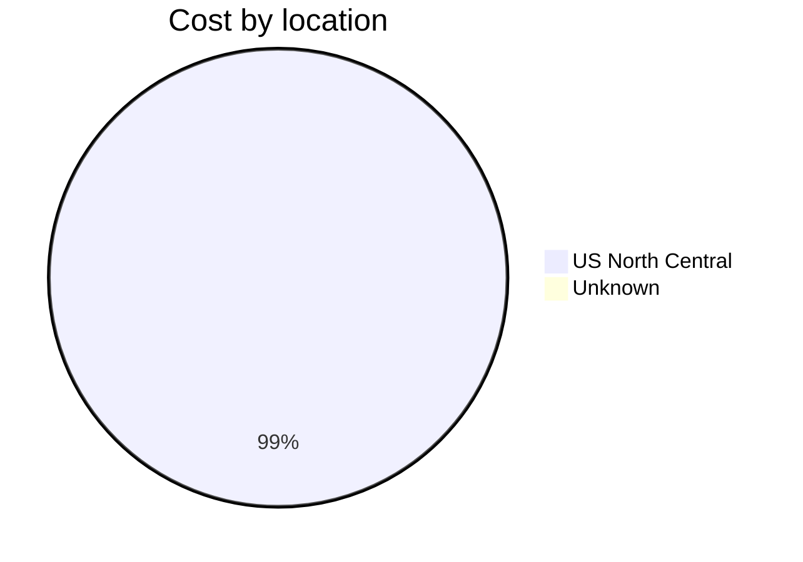
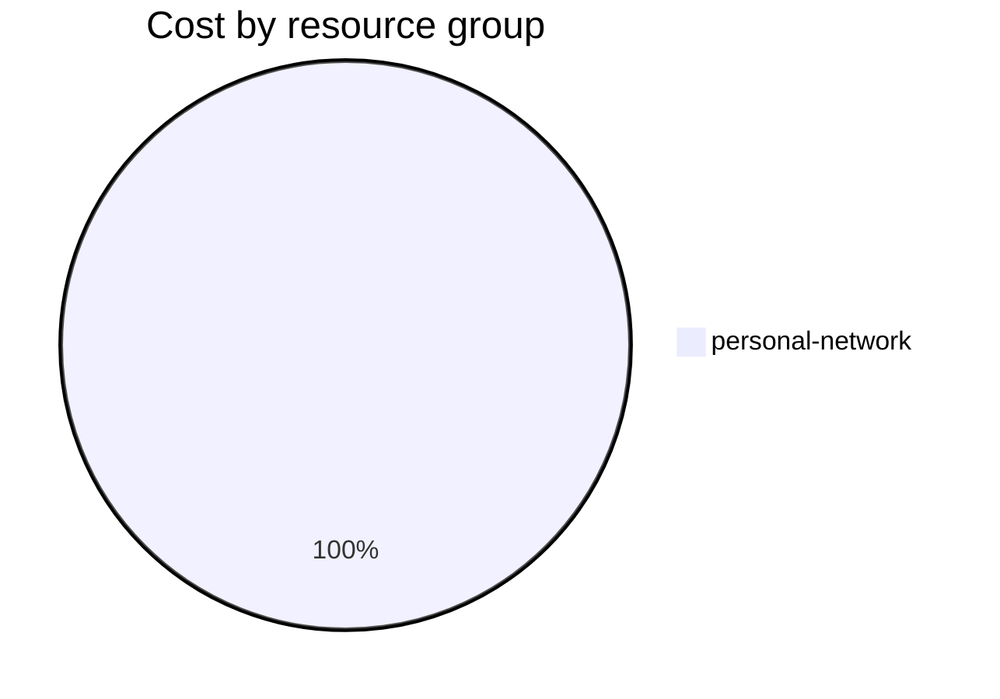

Fetching subscription details...
Fetching cost data...
Fetching forecasted cost data...
Fetching cost data by service name...
Fetching cost data by location...
Fetching cost data by resource group...
# Azure Cost Overview

> Accumulated cost for subscription id `JPF Pay-As-You-Go` from **12/01/2023** to **12/31/2023**

## Totals

|Period|Amount|
|---|---:|
|Today|0.08 USD|
|Yesterday|1.01 USD|
|Last 7 days|10.22 USD|
|Last 30 days|49.35 USD|

```mermaid
gantt
   title Accumulated cost
   dateFormat  X
   axisFormat %s
   section 01 Dec
   USD 1.75 :0, 175
   section 02 Dec
   USD 3.60 :0, 360
   section 03 Dec
   USD 5.81 :0, 581
   section 04 Dec
   USD 7.40 :0, 740
   section 05 Dec
   USD 8.97 :0, 897
   section 06 Dec
   USD 11.15 :0, 1115
   section 07 Dec
   USD 12.94 :0, 1294
   section 08 Dec
   USD 14.43 :0, 1443
   section 09 Dec
   USD 16.19 :0, 1619
   section 10 Dec
   USD 18.16 :0, 1816
   section 11 Dec
   USD 20.12 :0, 2012
   section 12 Dec
   USD 21.76 :0, 2176
   section 13 Dec
   USD 23.39 :0, 2339
   section 14 Dec
   USD 25.00 :0, 2500
   section 15 Dec
   USD 26.50 :0, 2650
   section 16 Dec
   USD 28.07 :0, 2807
   section 17 Dec
   USD 29.67 :0, 2967
   section 18 Dec
   USD 31.36 :0, 3136
   section 19 Dec
   USD 33.12 :0, 3312
   section 20 Dec
   USD 34.64 :0, 3464
   section 21 Dec
   USD 36.13 :0, 3613
   section 22 Dec
   USD 37.65 :0, 3765
   section 23 Dec
   USD 39.13 :0, 3913
   section 24 Dec
   USD 40.60 :0, 4060
   section 25 Dec
   USD 42.07 :0, 4207
   section 26 Dec
   USD 43.55 :0, 4355
   section 27 Dec
   USD 45.07 :0, 4507
   section 28 Dec
   USD 46.60 :0, 4660
   section 29 Dec
   USD 48.25 :0, 4825
   section 30 Dec
   USD 49.26 :0, 4926
   section 31 Dec
   USD 49.35 :0, 4935
```

## By Service Name

|Service|Amount|
|---|---:|
|Storage|24.97 USD|
|Virtual Machines|11.86 USD|
|Virtual Network|7.06 USD|
|Bandwidth|4.98 USD|
|Azure DNS|0.47 USD|

## By Location

|Location|Amount|
|---|---:|
|US North Central|48.87 USD|
|Unknown|0.47 USD|

## By Resource Group

|Resource Group|Amount|
|---|---:|
|personal-network|49.35 USD|

Generated at 2023-12-31 11:04:54 for subscription with id `4913be3f-a345-4652-9bba-767418dd25e3`
