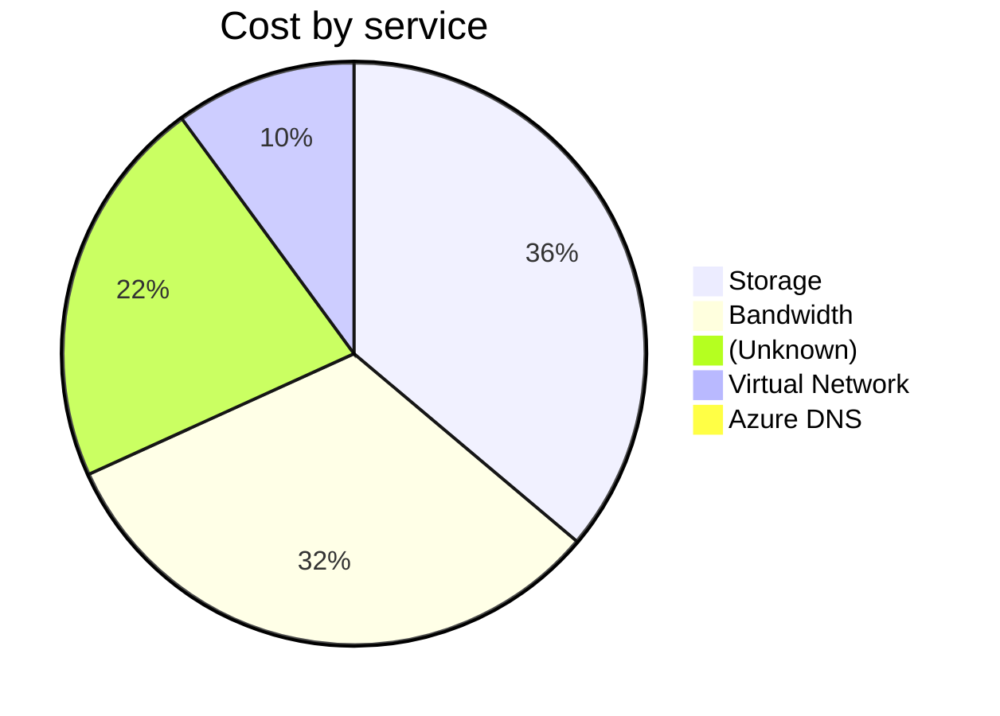
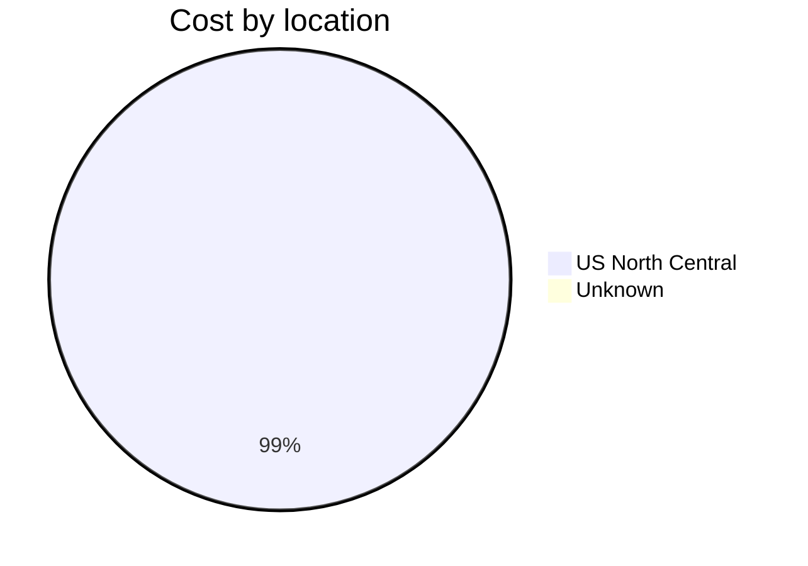
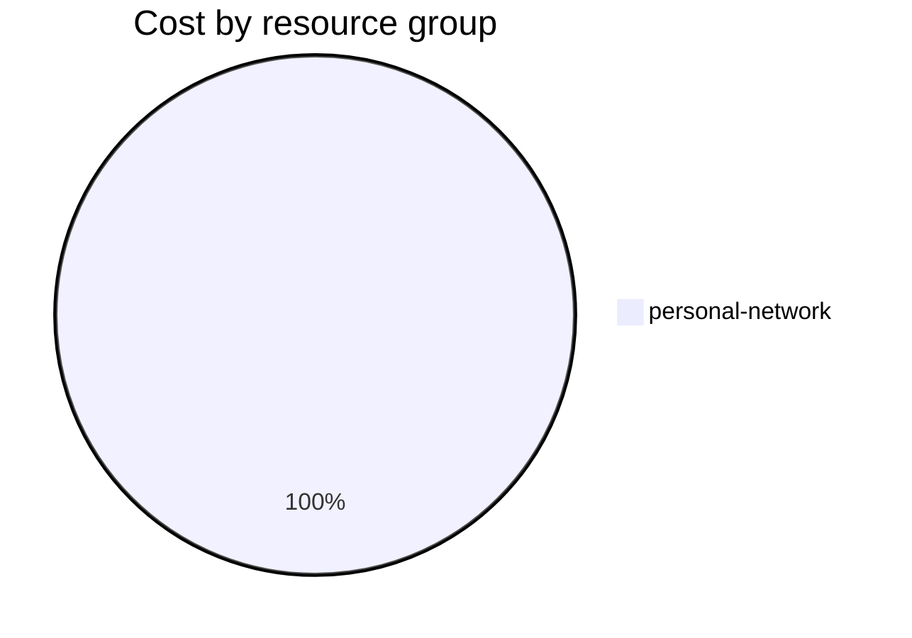

Fetching subscription details...
Fetching cost data...
Fetching forecasted cost data...
Fetching cost data by service name...
Fetching cost data by location...
Fetching cost data by resource group...
# Azure Cost Overview

> Accumulated cost for subscription id `JPF Pay-As-You-Go` from **03/01/2024** to **03/03/2024**

## Totals

|Period|Amount|
|---|---:|
|Today|0.10 USD|
|Yesterday|1.21 USD|
|Last 7 days|3.99 USD|
|Last 30 days|3.99 USD|

```mermaid
gantt
   title Accumulated cost
   dateFormat  X
   axisFormat %s
   section 01 Mar
   USD 2.68 :0, 268
   section 02 Mar
   USD 3.88 :0, 388
   section 03 Mar
   USD 3.99 :0, 399
   section 04 Mar
   USD 5.28 : done, 0, 528
   section 05 Mar
   USD 6.95 : done, 0, 695
   section 06 Mar
   USD 8.37 : done, 0, 837
   section 07 Mar
   USD 9.77 : done, 0, 977
   section 08 Mar
   USD 11.43 : done, 0, 1143
   section 09 Mar
   USD 12.90 : done, 0, 1290
   section 10 Mar
   USD 14.48 : done, 0, 1448
   section 11 Mar
   USD 15.61 : done, 0, 1561
   section 12 Mar
   USD 17.11 : done, 0, 1711
   section 13 Mar
   USD 18.35 : done, 0, 1835
   section 14 Mar
   USD 19.59 : done, 0, 1959
   section 15 Mar
   USD 21.07 : done, 0, 2107
   section 16 Mar
   USD 22.38 : done, 0, 2238
   section 17 Mar
   USD 23.79 : done, 0, 2379
   section 18 Mar
   USD 24.75 : done, 0, 2475
   section 19 Mar
   USD 26.08 : done, 0, 2608
   section 20 Mar
   USD 27.15 : done, 0, 2715
   section 21 Mar
   USD 28.22 : done, 0, 2822
   section 22 Mar
   USD 29.54 : done, 0, 2954
   section 23 Mar
   USD 30.67 : done, 0, 3067
   section 24 Mar
   USD 31.91 : done, 0, 3191
   section 25 Mar
   USD 32.70 : done, 0, 3270
   section 26 Mar
   USD 33.87 : done, 0, 3387
   section 27 Mar
   USD 34.77 : done, 0, 3477
   section 28 Mar
   USD 35.66 : done, 0, 3566
   section 29 Mar
   USD 36.81 : done, 0, 3681
   section 30 Mar
   USD 37.78 : done, 0, 3778
   section 31 Mar
   USD 38.85 : done, 0, 3885
```

## By Service Name

|Service|Amount|
|---|---:|
|Storage|1.33 USD|
|Bandwidth|1.18 USD|
||0.80 USD|
|Virtual Network|0.37 USD|
|Azure DNS|0.02 USD|

## By Location

|Location|Amount|
|---|---:|
|US North Central|3.69 USD|
|Unknown|0.02 USD|

## By Resource Group

|Resource Group|Amount|
|---|---:|
|personal-network|3.99 USD|

Generated at 2024-03-03 11:04:02 for subscription with id `4913be3f-a345-4652-9bba-767418dd25e3`
