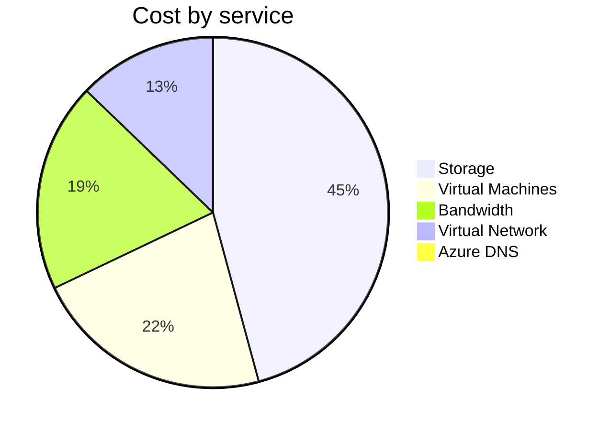
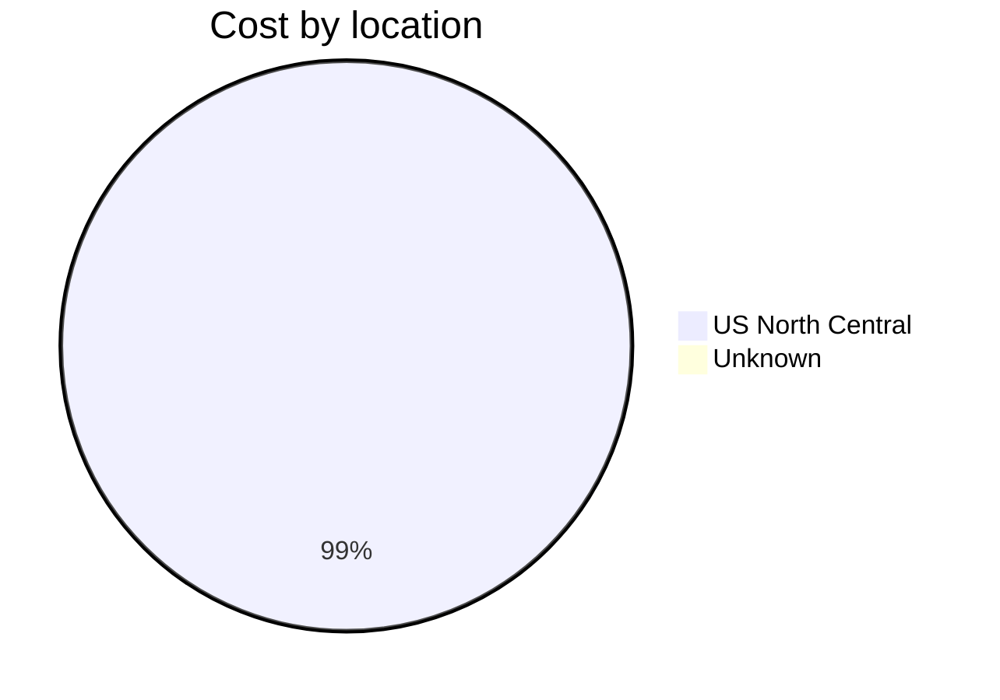
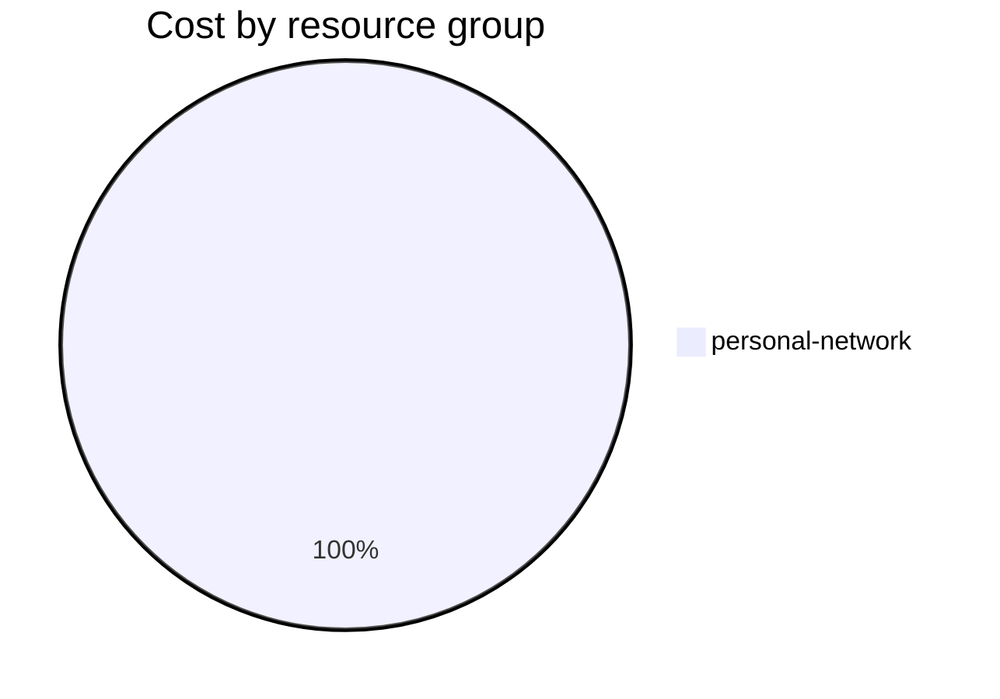

Fetching subscription details...
Fetching cost data...
Fetching forecasted cost data...
Fetching cost data by service name...
Fetching cost data by location...
Fetching cost data by resource group...
# Azure Cost Overview

> Accumulated cost for subscription id `JPF Pay-As-You-Go` from **01/01/2024** to **01/22/2024**

## Totals

|Period|Amount|
|---|---:|
|Today|0.03 USD|
|Yesterday|1.61 USD|
|Last 7 days|12.63 USD|
|Last 30 days|39.59 USD|

```mermaid
gantt
   title Accumulated cost
   dateFormat  X
   axisFormat %s
   section 01 Jan
   USD 2.01 :0, 201
   section 02 Jan
   USD 4.48 :0, 448
   section 03 Jan
   USD 6.29 :0, 629
   section 04 Jan
   USD 8.20 :0, 820
   section 05 Jan
   USD 10.14 :0, 1014
   section 06 Jan
   USD 12.40 :0, 1240
   section 07 Jan
   USD 14.14 :0, 1414
   section 08 Jan
   USD 16.56 :0, 1656
   section 09 Jan
   USD 18.49 :0, 1849
   section 10 Jan
   USD 20.07 :0, 2007
   section 11 Jan
   USD 21.78 :0, 2178
   section 12 Jan
   USD 23.49 :0, 2349
   section 13 Jan
   USD 25.44 :0, 2544
   section 14 Jan
   USD 26.96 :0, 2696
   section 15 Jan
   USD 28.53 :0, 2853
   section 16 Jan
   USD 30.65 :0, 3065
   section 17 Jan
   USD 32.44 :0, 3244
   section 18 Jan
   USD 34.19 :0, 3419
   section 19 Jan
   USD 35.95 :0, 3595
   section 20 Jan
   USD 37.94 :0, 3794
   section 21 Jan
   USD 39.55 :0, 3955
   section 22 Jan
   USD 39.59 :0, 3959
   section 23 Jan
   USD 41.72 : done, 0, 4172
   section 24 Jan
   USD 43.51 : done, 0, 4351
   section 25 Jan
   USD 45.35 : done, 0, 4535
   section 26 Jan
   USD 47.31 : done, 0, 4731
   section 27 Jan
   USD 49.42 : done, 0, 4942
   section 28 Jan
   USD 51.18 : done, 0, 5118
   section 29 Jan
   USD 53.10 : done, 0, 5310
   section 30 Jan
   USD 55.26 : done, 0, 5526
   section 31 Jan
   USD 57.10 : done, 0, 5710
```

## By Service Name

|Service|Amount|
|---|---:|
|Storage|17.98 USD|
|Virtual Machines|8.68 USD|
|Bandwidth|7.58 USD|
|Virtual Network|5.02 USD|
|Azure DNS|0.34 USD|

## By Location

|Location|Amount|
|---|---:|
|US North Central|39.25 USD|
|Unknown|0.34 USD|

## By Resource Group

|Resource Group|Amount|
|---|---:|
|personal-network|39.59 USD|

Generated at 2024-01-22 11:08:25 for subscription with id `4913be3f-a345-4652-9bba-767418dd25e3`
