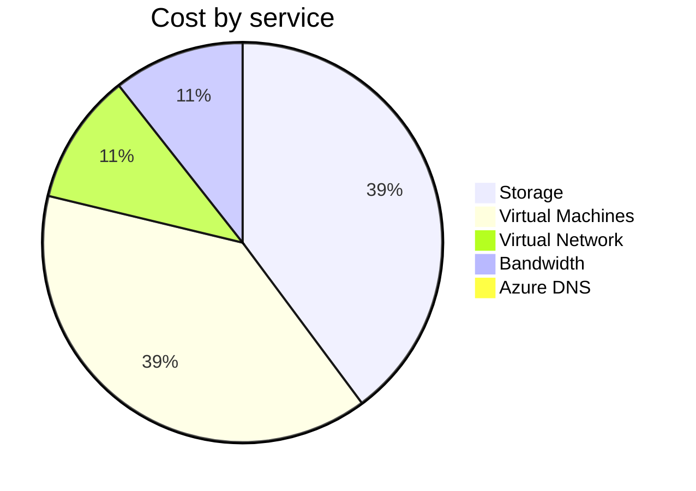
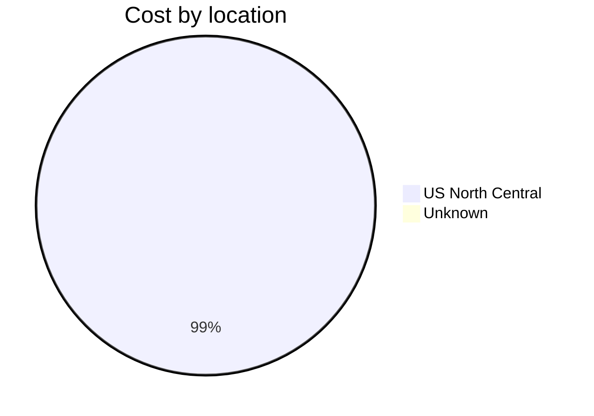
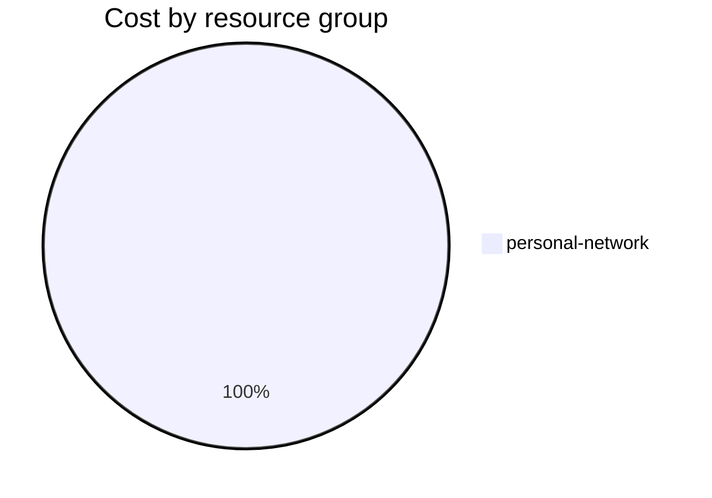

Fetching subscription details...
Fetching cost data...
Fetching forecasted cost data...
Fetching cost data by service name...
Fetching cost data by location...
Fetching cost data by resource group...
# Azure Cost Overview

> Accumulated cost for subscription id `JPF Pay-As-You-Go` from **02/01/2024** to **02/02/2024**

## Totals

|Period|Amount|
|---|---:|
|Today|0.09 USD|
|Yesterday|1.05 USD|
|Last 7 days|1.13 USD|
|Last 30 days|1.13 USD|

```mermaid
gantt
   title Accumulated cost
   dateFormat  X
   axisFormat %s
   section 01 Feb
   USD 1.05 :0, 105
   section 02 Feb
   USD 1.13 :0, 113
   section 03 Feb
   USD 3.82 : done, 0, 382
   section 04 Feb
   USD 5.84 : done, 0, 584
   section 05 Feb
   USD 7.84 : done, 0, 784
   section 06 Feb
   USD 10.01 : done, 0, 1001
   section 07 Feb
   USD 11.93 : done, 0, 1193
   section 08 Feb
   USD 14.01 : done, 0, 1401
   section 09 Feb
   USD 16.19 : done, 0, 1619
   section 10 Feb
   USD 18.89 : done, 0, 1889
   section 11 Feb
   USD 20.94 : done, 0, 2094
   section 12 Feb
   USD 22.96 : done, 0, 2296
   section 13 Feb
   USD 25.15 : done, 0, 2515
   section 14 Feb
   USD 27.10 : done, 0, 2710
   section 15 Feb
   USD 29.19 : done, 0, 2919
   section 16 Feb
   USD 31.40 : done, 0, 3140
   section 17 Feb
   USD 34.12 : done, 0, 3412
   section 18 Feb
   USD 36.18 : done, 0, 3618
   section 19 Feb
   USD 38.23 : done, 0, 3823
   section 20 Feb
   USD 40.44 : done, 0, 4044
   section 21 Feb
   USD 42.41 : done, 0, 4241
   section 22 Feb
   USD 44.53 : done, 0, 4453
   section 23 Feb
   USD 46.75 : done, 0, 4675
   section 24 Feb
   USD 49.49 : done, 0, 4949
   section 25 Feb
   USD 51.58 : done, 0, 5158
   section 26 Feb
   USD 53.65 : done, 0, 5365
   section 27 Feb
   USD 55.88 : done, 0, 5588
   section 28 Feb
   USD 57.86 : done, 0, 5786
   section 29 Feb
   USD 60.00 : done, 0, 6000
```

## By Service Name

|Service|Amount|
|---|---:|
|Storage|0.45 USD|
|Virtual Machines|0.44 USD|
|Virtual Network|0.12 USD|
|Bandwidth|0.12 USD|
|Azure DNS|0.01 USD|

## By Location

|Location|Amount|
|---|---:|
|US North Central|1.13 USD|
|Unknown|0.01 USD|

## By Resource Group

|Resource Group|Amount|
|---|---:|
|personal-network|1.13 USD|

Generated at 2024-02-02 11:08:02 for subscription with id `4913be3f-a345-4652-9bba-767418dd25e3`
