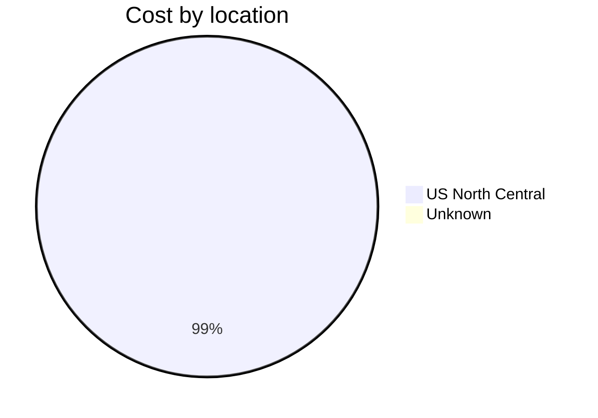
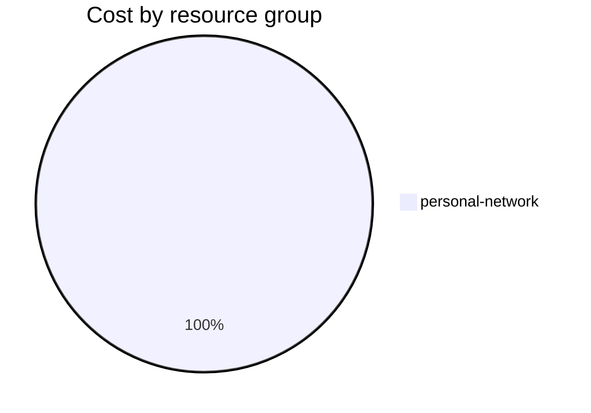

Fetching subscription details...
Fetching cost data...
Fetching forecasted cost data...
Fetching cost data by service name...
Fetching cost data by location...
Fetching cost data by resource group...
# Azure Cost Overview

> Accumulated cost for subscription id `JPF Pay-As-You-Go` from **02/01/2024** to **02/12/2024**

## Totals

|Period|Amount|
|---|---:|
|Today|0.09 USD|
|Yesterday|0.82 USD|
|Last 7 days|14.12 USD|
|Last 30 days|24.30 USD|

```mermaid
gantt
   title Accumulated cost
   dateFormat  X
   axisFormat %s
   section 01 Feb
   USD 2.32 :0, 232
   section 02 Feb
   USD 5.34 :0, 534
   section 03 Feb
   USD 7.82 :0, 782
   section 04 Feb
   USD 10.18 :0, 1018
   section 05 Feb
   USD 12.59 :0, 1259
   section 06 Feb
   USD 14.75 :0, 1475
   section 07 Feb
   USD 17.01 :0, 1701
   section 08 Feb
   USD 19.77 :0, 1977
   section 09 Feb
   USD 21.86 :0, 2186
   section 10 Feb
   USD 23.39 :0, 2339
   section 11 Feb
   USD 24.21 :0, 2421
   section 12 Feb
   USD 24.30 :0, 2430
   section 13 Feb
   USD 26.42 : done, 0, 2642
   section 14 Feb
   USD 28.43 : done, 0, 2843
   section 15 Feb
   USD 30.62 : done, 0, 3062
   section 16 Feb
   USD 32.94 : done, 0, 3294
   section 17 Feb
   USD 35.64 : done, 0, 3564
   section 18 Feb
   USD 37.77 : done, 0, 3777
   section 19 Feb
   USD 39.67 : done, 0, 3967
   section 20 Feb
   USD 41.77 : done, 0, 4177
   section 21 Feb
   USD 43.75 : done, 0, 4375
   section 22 Feb
   USD 45.92 : done, 0, 4592
   section 23 Feb
   USD 48.21 : done, 0, 4821
   section 24 Feb
   USD 50.89 : done, 0, 5089
   section 25 Feb
   USD 52.99 : done, 0, 5299
   section 26 Feb
   USD 54.86 : done, 0, 5486
   section 27 Feb
   USD 56.93 : done, 0, 5693
   section 28 Feb
   USD 58.89 : done, 0, 5889
   section 29 Feb
   USD 61.03 : done, 0, 6103
```

## By Service Name

|Service|Amount|
|---|---:|
|Storage|9.53 USD|
|Bandwidth|8.16 USD|
|Virtual Machines|3.94 USD|
|Virtual Network|2.50 USD|
|Azure DNS|0.17 USD|

## By Location

|Location|Amount|
|---|---:|
|US North Central|24.13 USD|
|Unknown|0.17 USD|

## By Resource Group

|Resource Group|Amount|
|---|---:|
|personal-network|24.30 USD|

Generated at 2024-02-12 11:06:51 for subscription with id `4913be3f-a345-4652-9bba-767418dd25e3`
