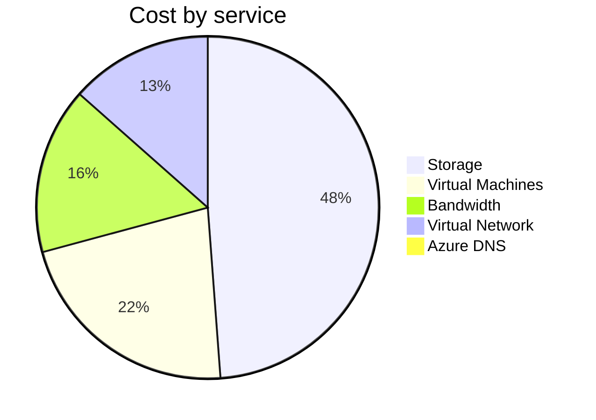
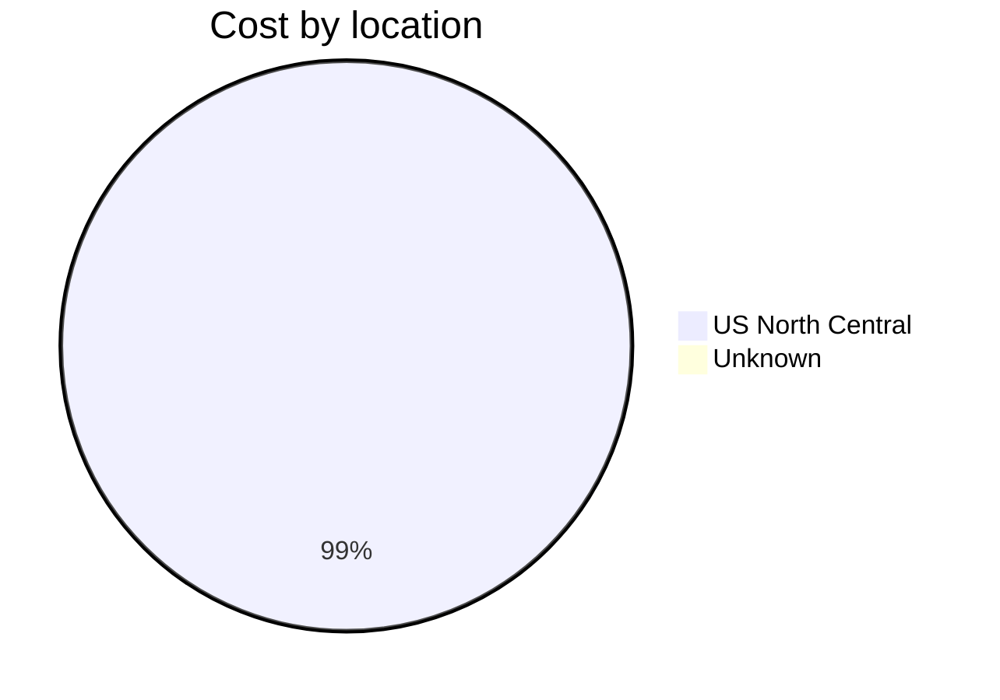
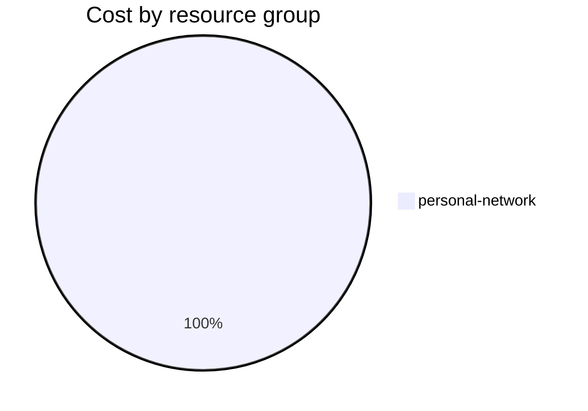

Fetching subscription details...
Fetching cost data...
Fetching forecasted cost data...
Fetching cost data by service name...
Fetching cost data by location...
Fetching cost data by resource group...
# Azure Cost Overview

> Accumulated cost for subscription id `JPF Pay-As-You-Go` from **11/01/2023** to **11/07/2023**

## Totals

|Period|Amount|
|---|---:|
|Today|0.08 USD|
|Yesterday|1.69 USD|
|Last 7 days|10.65 USD|
|Last 30 days|10.65 USD|

```mermaid
gantt
   title Accumulated cost
   dateFormat  X
   axisFormat %s
   section 01 Nov
   USD 1.80 :0, 180
   section 02 Nov
   USD 3.49 :0, 349
   section 03 Nov
   USD 5.42 :0, 542
   section 04 Nov
   USD 7.18 :0, 718
   section 05 Nov
   USD 8.88 :0, 888
   section 06 Nov
   USD 10.57 :0, 1057
   section 07 Nov
   USD 10.65 :0, 1065
   section 08 Nov
   USD 12.45 : done, 0, 1245
   section 09 Nov
   USD 14.24 : done, 0, 1424
   section 10 Nov
   USD 16.12 : done, 0, 1612
   section 11 Nov
   USD 17.83 : done, 0, 1783
   section 12 Nov
   USD 19.38 : done, 0, 1938
   section 13 Nov
   USD 21.07 : done, 0, 2107
   section 14 Nov
   USD 22.86 : done, 0, 2286
   section 15 Nov
   USD 24.66 : done, 0, 2466
   section 16 Nov
   USD 26.46 : done, 0, 2646
   section 17 Nov
   USD 28.34 : done, 0, 2834
   section 18 Nov
   USD 30.05 : done, 0, 3005
   section 19 Nov
   USD 31.60 : done, 0, 3160
   section 20 Nov
   USD 33.30 : done, 0, 3330
   section 21 Nov
   USD 35.09 : done, 0, 3509
   section 22 Nov
   USD 36.89 : done, 0, 3689
   section 23 Nov
   USD 38.68 : done, 0, 3868
   section 24 Nov
   USD 40.57 : done, 0, 4057
   section 25 Nov
   USD 42.28 : done, 0, 4228
   section 26 Nov
   USD 43.84 : done, 0, 4384
   section 27 Nov
   USD 45.53 : done, 0, 4553
   section 28 Nov
   USD 47.33 : done, 0, 4733
   section 29 Nov
   USD 49.13 : done, 0, 4913
   section 30 Nov
   USD 50.92 : done, 0, 5092
```

## By Service Name

|Service|Amount|
|---|---:|
|Storage|5.15 USD|
|Virtual Machines|2.32 USD|
|Bandwidth|1.66 USD|
|Virtual Network|1.42 USD|
|Azure DNS|0.10 USD|

## By Location

|Location|Amount|
|---|---:|
|US North Central|10.55 USD|
|Unknown|0.10 USD|

## By Resource Group

|Resource Group|Amount|
|---|---:|
|personal-network|10.65 USD|

Generated at 2023-11-07 11:07:28 for subscription with id `4913be3f-a345-4652-9bba-767418dd25e3`
