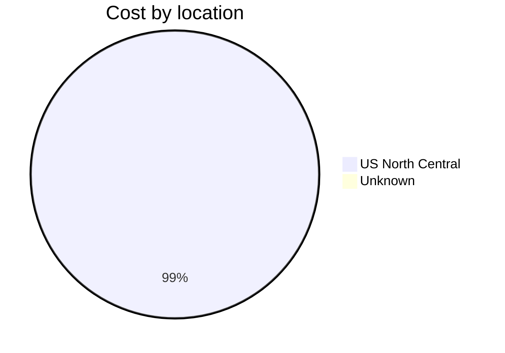
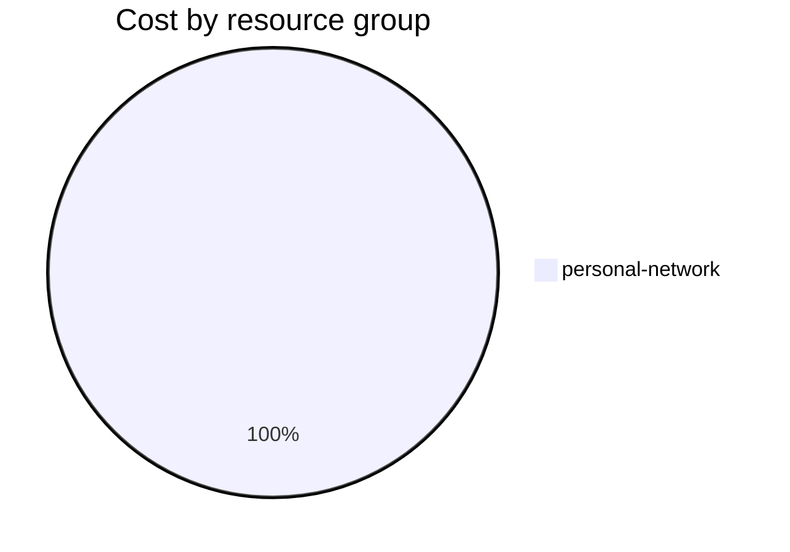

Fetching subscription details...
Fetching cost data...
Fetching forecasted cost data...
Fetching cost data by service name...
Fetching cost data by location...
Fetching cost data by resource group...
# Azure Cost Overview

> Accumulated cost for subscription id `JPF Pay-As-You-Go` from **02/01/2024** to **02/14/2024**

## Totals

|Period|Amount|
|---|---:|
|Today|0.10 USD|
|Yesterday|1.48 USD|
|Last 7 days|13.20 USD|
|Last 30 days|27.95 USD|

```mermaid
gantt
   title Accumulated cost
   dateFormat  X
   axisFormat %s
   section 01 Feb
   USD 2.32 :0, 232
   section 02 Feb
   USD 5.35 :0, 535
   section 03 Feb
   USD 7.82 :0, 782
   section 04 Feb
   USD 10.18 :0, 1018
   section 05 Feb
   USD 12.59 :0, 1259
   section 06 Feb
   USD 14.76 :0, 1476
   section 07 Feb
   USD 17.01 :0, 1701
   section 08 Feb
   USD 19.77 :0, 1977
   section 09 Feb
   USD 21.86 :0, 2186
   section 10 Feb
   USD 23.39 :0, 2339
   section 11 Feb
   USD 24.88 :0, 2488
   section 12 Feb
   USD 26.37 :0, 2637
   section 13 Feb
   USD 27.85 :0, 2785
   section 14 Feb
   USD 27.95 :0, 2795
   section 15 Feb
   USD 29.98 : done, 0, 2998
   section 16 Feb
   USD 32.12 : done, 0, 3212
   section 17 Feb
   USD 34.52 : done, 0, 3452
   section 18 Feb
   USD 36.44 : done, 0, 3644
   section 19 Feb
   USD 37.86 : done, 0, 3786
   section 20 Feb
   USD 39.72 : done, 0, 3972
   section 21 Feb
   USD 41.46 : done, 0, 4146
   section 22 Feb
   USD 43.37 : done, 0, 4337
   section 23 Feb
   USD 45.39 : done, 0, 4539
   section 24 Feb
   USD 47.68 : done, 0, 4768
   section 25 Feb
   USD 49.49 : done, 0, 4949
   section 26 Feb
   USD 50.78 : done, 0, 5078
   section 27 Feb
   USD 52.53 : done, 0, 5253
   section 28 Feb
   USD 54.15 : done, 0, 5415
   section 29 Feb
   USD 55.95 : done, 0, 5595
```

## By Service Name

|Service|Amount|
|---|---:|
|Storage|11.82 USD|
|Bandwidth|8.16 USD|
|Virtual Machines|4.66 USD|
|Virtual Network|3.11 USD|
|Azure DNS|0.21 USD|

## By Location

|Location|Amount|
|---|---:|
|US North Central|27.74 USD|
|Unknown|0.21 USD|

## By Resource Group

|Resource Group|Amount|
|---|---:|
|personal-network|27.95 USD|

Generated at 2024-02-14 11:09:08 for subscription with id `4913be3f-a345-4652-9bba-767418dd25e3`
