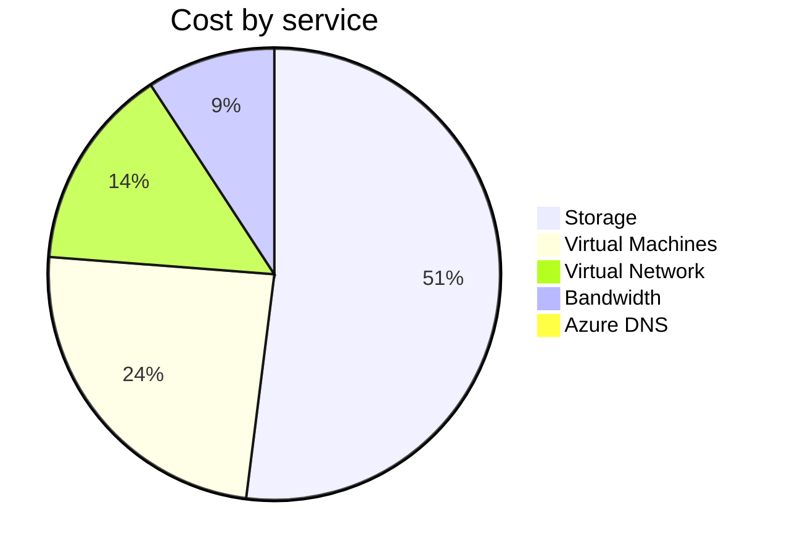
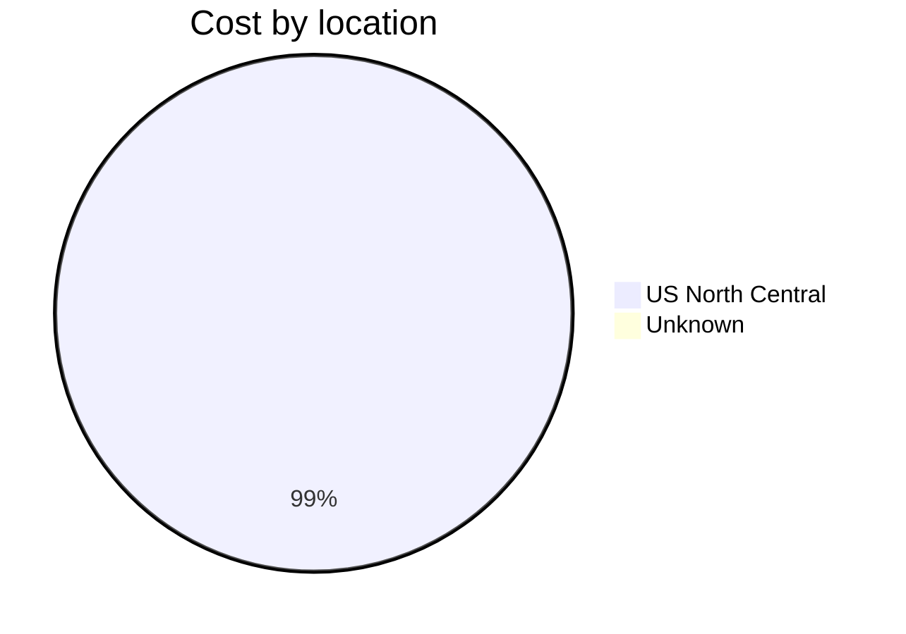
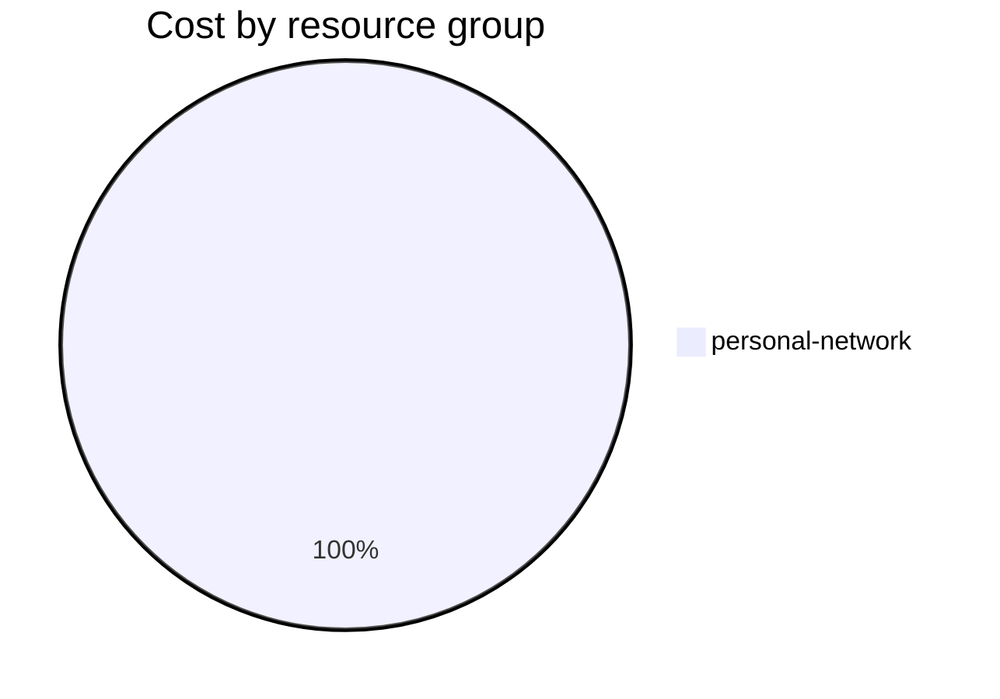

Fetching subscription details...
Fetching cost data...
Fetching forecasted cost data...
Fetching cost data by service name...
Fetching cost data by location...
Fetching cost data by resource group...
# Azure Cost Overview

> Accumulated cost for subscription id `JPF Pay-As-You-Go` from **12/01/2023** to **12/21/2023**

## Totals

|Period|Amount|
|---|---:|
|Today|0.10 USD|
|Yesterday|1.43 USD|
|Last 7 days|10.67 USD|
|Last 30 days|33.13 USD|

```mermaid
gantt
   title Accumulated cost
   dateFormat  X
   axisFormat %s
   section 01 Dec
   USD 1.75 :0, 175
   section 02 Dec
   USD 3.60 :0, 360
   section 03 Dec
   USD 5.81 :0, 581
   section 04 Dec
   USD 7.40 :0, 740
   section 05 Dec
   USD 8.97 :0, 897
   section 06 Dec
   USD 11.15 :0, 1115
   section 07 Dec
   USD 12.94 :0, 1294
   section 08 Dec
   USD 14.43 :0, 1443
   section 09 Dec
   USD 16.17 :0, 1617
   section 10 Dec
   USD 17.79 :0, 1779
   section 11 Dec
   USD 19.40 :0, 1940
   section 12 Dec
   USD 20.93 :0, 2093
   section 13 Dec
   USD 22.46 :0, 2246
   section 14 Dec
   USD 23.99 :0, 2399
   section 15 Dec
   USD 25.48 :0, 2548
   section 16 Dec
   USD 26.99 :0, 2699
   section 17 Dec
   USD 28.50 :0, 2850
   section 18 Dec
   USD 30.04 :0, 3004
   section 19 Dec
   USD 31.60 :0, 3160
   section 20 Dec
   USD 33.03 :0, 3303
   section 21 Dec
   USD 33.13 :0, 3313
   section 22 Dec
   USD 34.55 : done, 0, 3455
   section 23 Dec
   USD 36.13 : done, 0, 3613
   section 24 Dec
   USD 37.53 : done, 0, 3753
   section 25 Dec
   USD 38.88 : done, 0, 3888
   section 26 Dec
   USD 40.19 : done, 0, 4019
   section 27 Dec
   USD 41.58 : done, 0, 4158
   section 28 Dec
   USD 43.01 : done, 0, 4301
   section 29 Dec
   USD 44.32 : done, 0, 4432
   section 30 Dec
   USD 45.79 : done, 0, 4579
   section 31 Dec
   USD 47.08 : done, 0, 4708
```

## By Service Name

|Service|Amount|
|---|---:|
|Storage|17.06 USD|
|Virtual Machines|7.95 USD|
|Virtual Network|4.78 USD|
|Bandwidth|3.02 USD|
|Azure DNS|0.32 USD|

## By Location

|Location|Amount|
|---|---:|
|US North Central|32.81 USD|
|Unknown|0.32 USD|

## By Resource Group

|Resource Group|Amount|
|---|---:|
|personal-network|33.13 USD|

Generated at 2023-12-21 11:08:14 for subscription with id `4913be3f-a345-4652-9bba-767418dd25e3`
