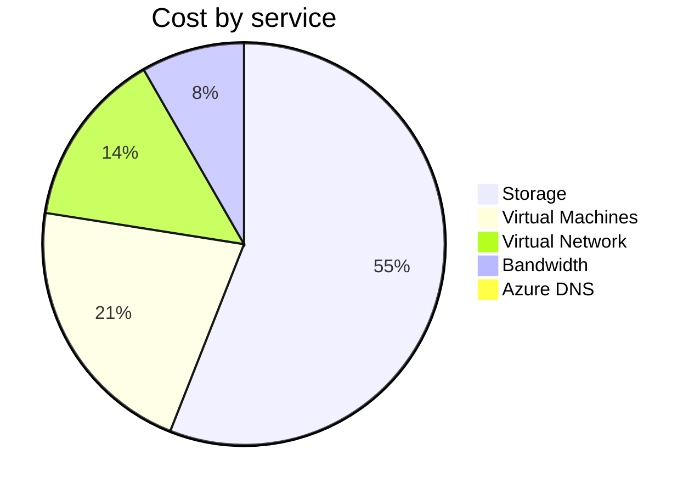
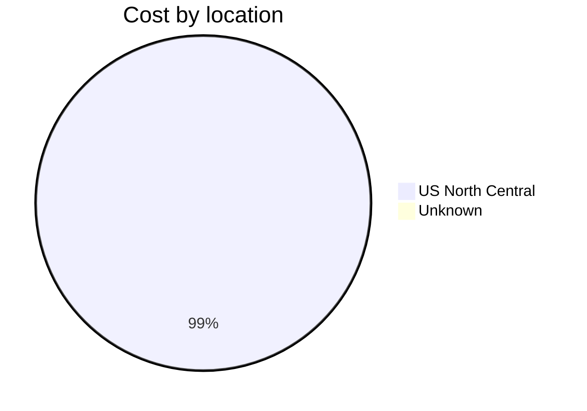
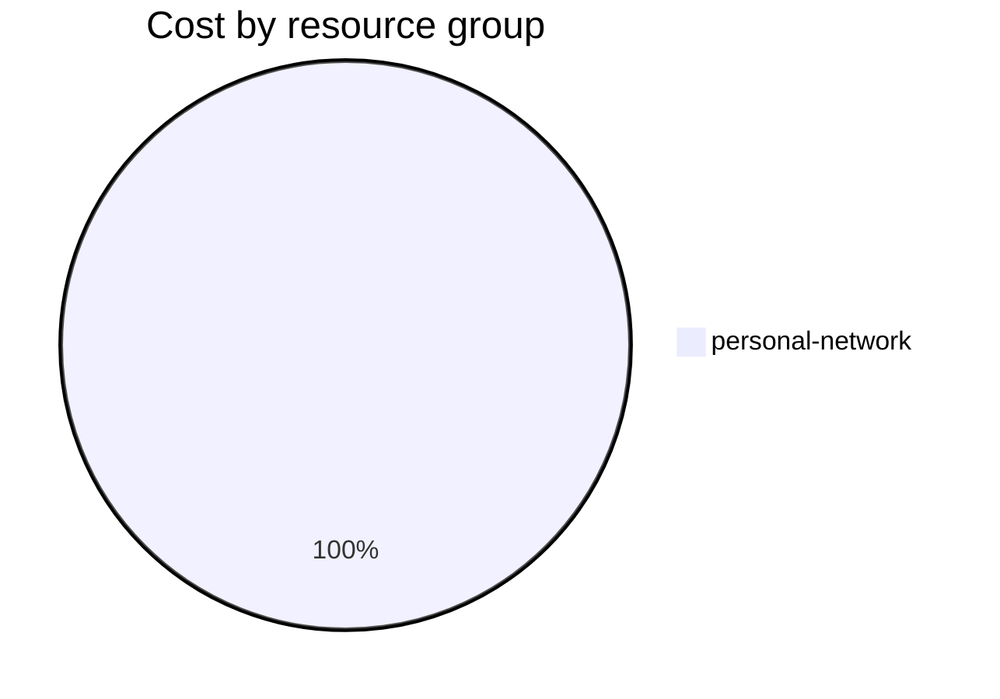

Fetching subscription details...
Fetching cost data...
Fetching forecasted cost data...
Fetching cost data by service name...
Fetching cost data by location...
Fetching cost data by resource group...
# Azure Cost Overview

> Accumulated cost for subscription id `JPF Pay-As-You-Go` from **10/01/2023** to **10/21/2023**

## Totals

|Period|Amount|
|---|---:|
|Today|0.09 USD|
|Yesterday|1.33 USD|
|Last 7 days|10.15 USD|
|Last 30 days|33.90 USD|

```mermaid
gantt
   title Accumulated cost
   dateFormat  X
   axisFormat %s
   section 01 Oct
   USD 3.16 :0, 316
   section 02 Oct
   USD 5.72 :0, 572
   section 03 Oct
   USD 7.55 :0, 755
   section 04 Oct
   USD 9.41 :0, 941
   section 05 Oct
   USD 11.15 :0, 1115
   section 06 Oct
   USD 13.05 :0, 1305
   section 07 Oct
   USD 14.85 :0, 1485
   section 08 Oct
   USD 16.35 :0, 1635
   section 09 Oct
   USD 17.94 :0, 1794
   section 10 Oct
   USD 19.39 :0, 1939
   section 11 Oct
   USD 20.84 :0, 2084
   section 12 Oct
   USD 22.29 :0, 2229
   section 13 Oct
   USD 23.75 :0, 2375
   section 14 Oct
   USD 25.19 :0, 2519
   section 15 Oct
   USD 26.63 :0, 2663
   section 16 Oct
   USD 28.09 :0, 2809
   section 17 Oct
   USD 29.55 :0, 2955
   section 18 Oct
   USD 31.02 :0, 3102
   section 19 Oct
   USD 32.48 :0, 3248
   section 20 Oct
   USD 33.81 :0, 3381
   section 21 Oct
   USD 33.90 :0, 3390
   section 22 Oct
   USD 34.93 : done, 0, 3493
   section 23 Oct
   USD 35.67 : done, 0, 3567
   section 24 Oct
   USD 35.90 : done, 0, 3590
   section 25 Oct
   USD 36.05 : done, 0, 3605
   section 26 Oct
   USD 36.20 : done, 0, 3620
   section 27 Oct
   USD 37.03 : done, 0, 3703
   section 28 Oct
   USD 37.68 : done, 0, 3768
   section 29 Oct
   USD 38.11 : done, 0, 3811
   section 30 Oct
   USD 38.25 : done, 0, 3825
   section 31 Oct
   USD 38.25 : done, 0, 3825
```

## By Service Name

|Service|Amount|
|---|---:|
|Storage|18.80 USD|
|Virtual Machines|7.22 USD|
|Virtual Network|4.77 USD|
|Bandwidth|2.79 USD|
|Azure DNS|0.32 USD|

## By Location

|Location|Amount|
|---|---:|
|US North Central|33.58 USD|
|Unknown|0.32 USD|

## By Resource Group

|Resource Group|Amount|
|---|---:|
|personal-network|33.90 USD|

Generated at 2023-10-21 11:03:54 for subscription with id `4913be3f-a345-4652-9bba-767418dd25e3`
