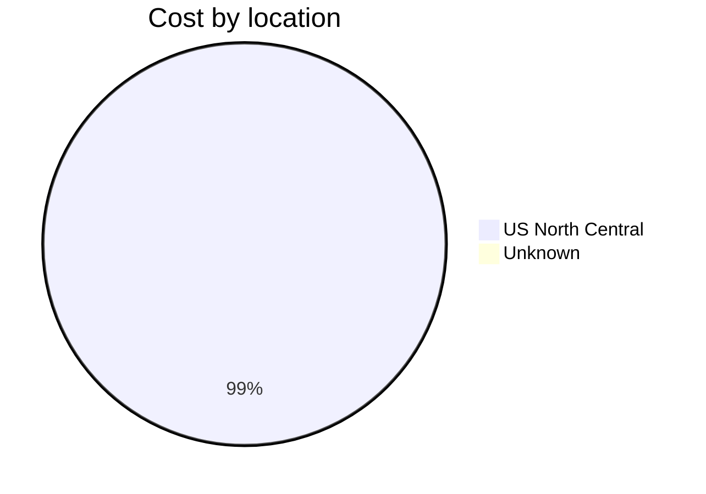
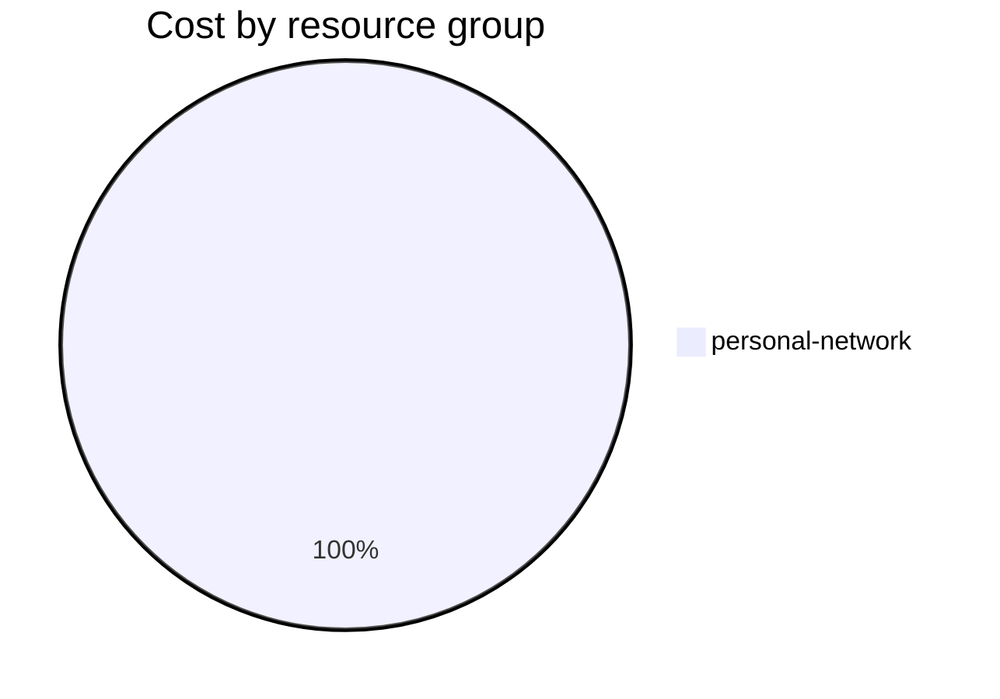

Fetching subscription details...
Fetching cost data...
Fetching forecasted cost data...
Fetching cost data by service name...
Fetching cost data by location...
Fetching cost data by resource group...
# Azure Cost Overview

> Accumulated cost for subscription id `JPF Pay-As-You-Go` from **12/01/2023** to **12/07/2023**

## Totals

|Period|Amount|
|---|---:|
|Today|0.08 USD|
|Yesterday|1.95 USD|
|Last 7 days|10.89 USD|
|Last 30 days|10.89 USD|

```mermaid
gantt
   title Accumulated cost
   dateFormat  X
   axisFormat %s
   section 01 Dec
   USD 1.73 :0, 173
   section 02 Dec
   USD 3.56 :0, 356
   section 03 Dec
   USD 5.71 :0, 571
   section 04 Dec
   USD 7.30 :0, 730
   section 05 Dec
   USD 8.86 :0, 886
   section 06 Dec
   USD 10.81 :0, 1081
   section 07 Dec
   USD 10.89 :0, 1089
   section 08 Dec
   USD 12.68 : done, 0, 1268
   section 09 Dec
   USD 14.48 : done, 0, 1448
   section 10 Dec
   USD 16.27 : done, 0, 1627
   section 11 Dec
   USD 18.02 : done, 0, 1802
   section 12 Dec
   USD 19.79 : done, 0, 1979
   section 13 Dec
   USD 21.59 : done, 0, 2159
   section 14 Dec
   USD 23.39 : done, 0, 2339
   section 15 Dec
   USD 25.18 : done, 0, 2518
   section 16 Dec
   USD 26.98 : done, 0, 2698
   section 17 Dec
   USD 28.78 : done, 0, 2878
   section 18 Dec
   USD 30.53 : done, 0, 3053
   section 19 Dec
   USD 32.31 : done, 0, 3231
   section 20 Dec
   USD 34.11 : done, 0, 3411
   section 21 Dec
   USD 35.91 : done, 0, 3591
   section 22 Dec
   USD 37.71 : done, 0, 3771
   section 23 Dec
   USD 39.51 : done, 0, 3951
   section 24 Dec
   USD 41.31 : done, 0, 4131
   section 25 Dec
   USD 43.07 : done, 0, 4307
   section 26 Dec
   USD 44.85 : done, 0, 4485
   section 27 Dec
   USD 46.65 : done, 0, 4665
   section 28 Dec
   USD 48.46 : done, 0, 4846
   section 29 Dec
   USD 50.25 : done, 0, 5025
   section 30 Dec
   USD 52.06 : done, 0, 5206
   section 31 Dec
   USD 53.87 : done, 0, 5387
```

## By Service Name

|Service|Amount|
|---|---:|
|Storage|5.01 USD|
|Virtual Machines|2.44 USD|
|Bandwidth|1.92 USD|
|Virtual Network|1.42 USD|
|Azure DNS|0.10 USD|

## By Location

|Location|Amount|
|---|---:|
|US North Central|10.79 USD|
|Unknown|0.10 USD|

## By Resource Group

|Resource Group|Amount|
|---|---:|
|personal-network|10.89 USD|

Generated at 2023-12-07 11:06:15 for subscription with id `4913be3f-a345-4652-9bba-767418dd25e3`
