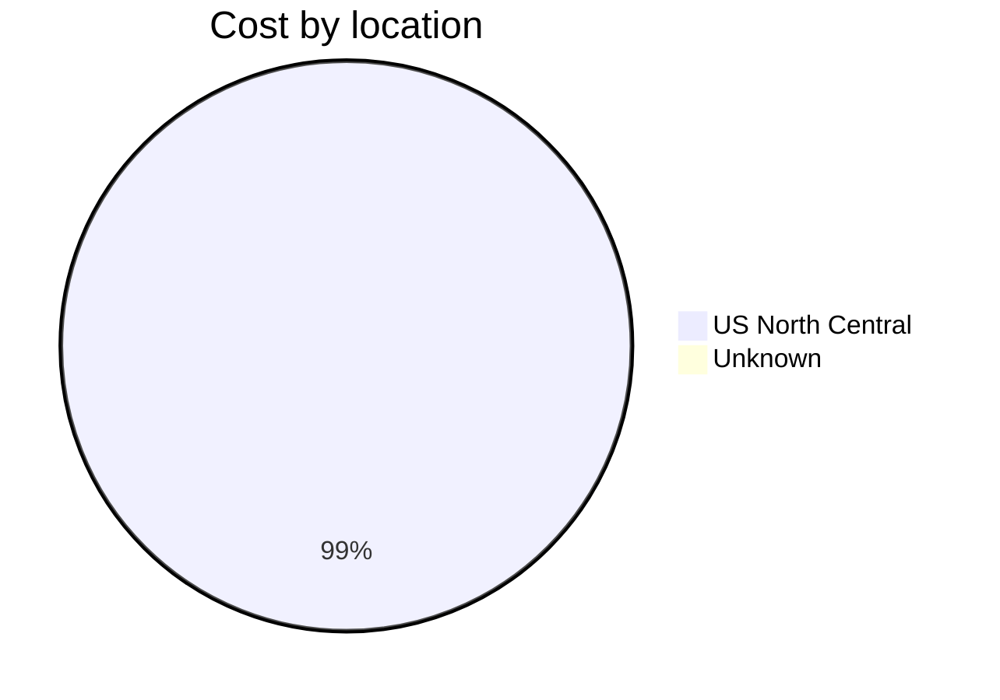
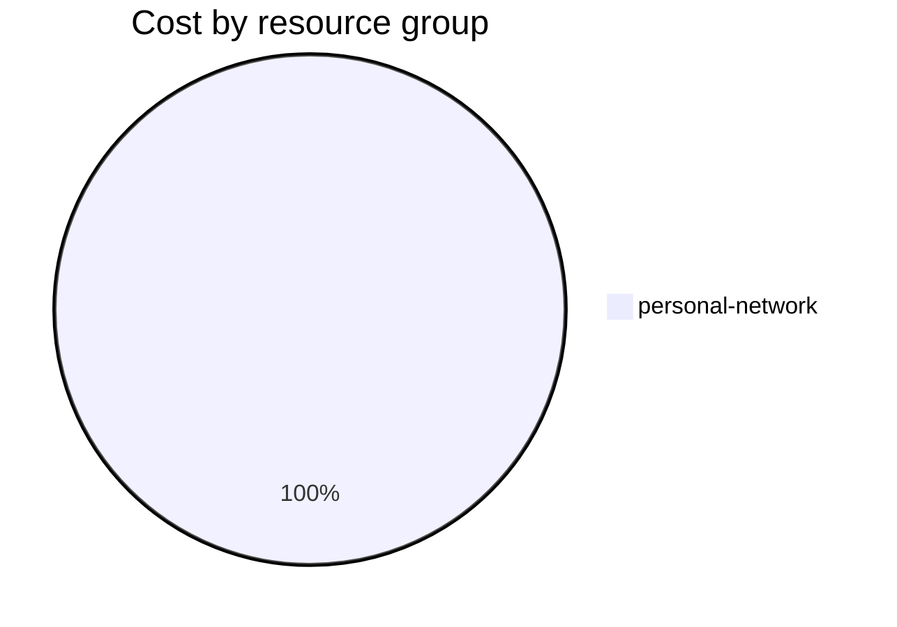

Fetching subscription details...
Fetching cost data...
Fetching forecasted cost data...
Fetching cost data by service name...
Fetching cost data by location...
Fetching cost data by resource group...
# Azure Cost Overview

> Accumulated cost for subscription id `JPF Pay-As-You-Go` from **01/01/2024** to **01/28/2024**

## Totals

|Period|Amount|
|---|---:|
|Today|0.09 USD|
|Yesterday|3.07 USD|
|Last 7 days|15.02 USD|
|Last 30 days|56.06 USD|

```mermaid
gantt
   title Accumulated cost
   dateFormat  X
   axisFormat %s
   section 01 Jan
   USD 2.01 :0, 201
   section 02 Jan
   USD 4.48 :0, 448
   section 03 Jan
   USD 6.29 :0, 629
   section 04 Jan
   USD 8.20 :0, 820
   section 05 Jan
   USD 10.14 :0, 1014
   section 06 Jan
   USD 12.40 :0, 1240
   section 07 Jan
   USD 14.14 :0, 1414
   section 08 Jan
   USD 16.56 :0, 1656
   section 09 Jan
   USD 18.53 :0, 1853
   section 10 Jan
   USD 20.18 :0, 2018
   section 11 Jan
   USD 22.10 :0, 2210
   section 12 Jan
   USD 24.04 :0, 2404
   section 13 Jan
   USD 26.48 :0, 2648
   section 14 Jan
   USD 28.01 :0, 2801
   section 15 Jan
   USD 29.66 :0, 2966
   section 16 Jan
   USD 32.42 :0, 3242
   section 17 Jan
   USD 34.52 :0, 3452
   section 18 Jan
   USD 36.52 :0, 3652
   section 19 Jan
   USD 38.55 :0, 3855
   section 20 Jan
   USD 41.04 :0, 4104
   section 21 Jan
   USD 43.06 :0, 4306
   section 22 Jan
   USD 45.10 :0, 4510
   section 23 Jan
   USD 47.08 :0, 4708
   section 24 Jan
   USD 48.84 :0, 4884
   section 25 Jan
   USD 50.65 :0, 5065
   section 26 Jan
   USD 52.90 :0, 5290
   section 27 Jan
   USD 55.97 :0, 5597
   section 28 Jan
   USD 56.06 :0, 5606
   section 29 Jan
   USD 58.13 : done, 0, 5813
   section 30 Jan
   USD 60.40 : done, 0, 6040
   section 31 Jan
   USD 62.24 : done, 0, 6224
```

## By Service Name

|Service|Amount|
|---|---:|
|Storage|23.18 USD|
|Bandwidth|14.74 USD|
|Virtual Machines|11.22 USD|
|Virtual Network|6.48 USD|
|Azure DNS|0.43 USD|

## By Location

|Location|Amount|
|---|---:|
|US North Central|55.62 USD|
|Unknown|0.43 USD|

## By Resource Group

|Resource Group|Amount|
|---|---:|
|personal-network|56.06 USD|

Generated at 2024-01-28 11:08:00 for subscription with id `4913be3f-a345-4652-9bba-767418dd25e3`
