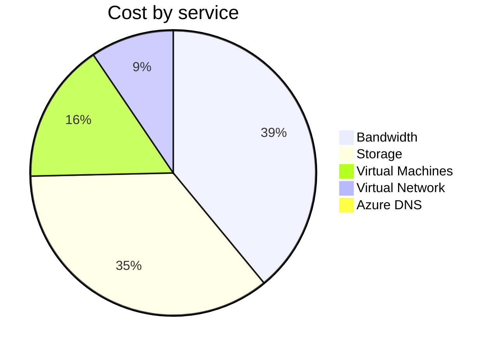
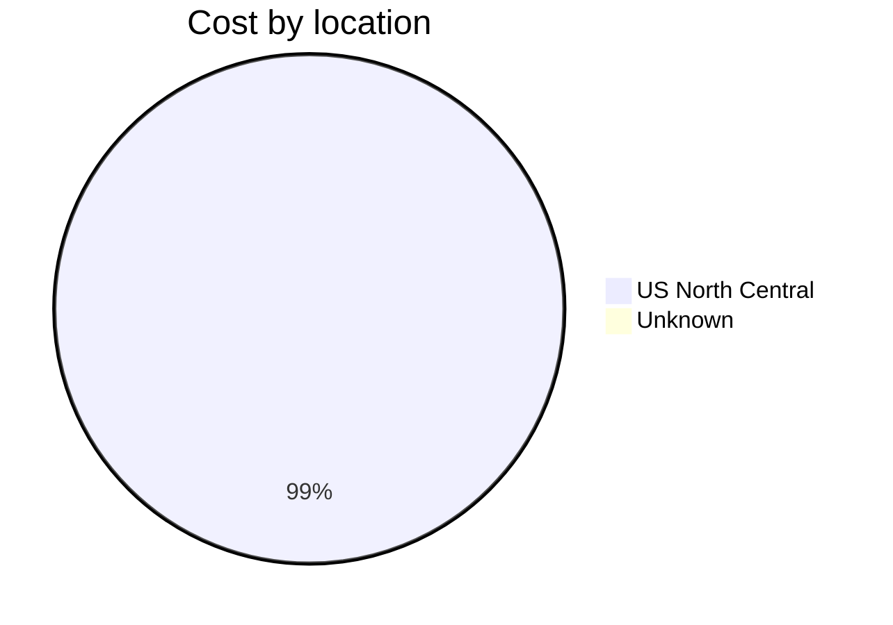
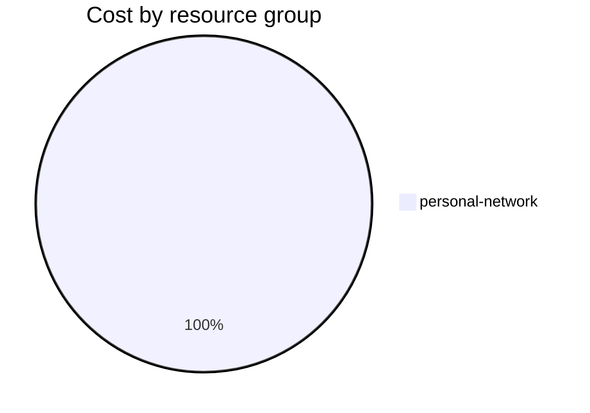

Fetching subscription details...
Fetching cost data...
Fetching forecasted cost data...
Fetching cost data by service name...
Fetching cost data by location...
Fetching cost data by resource group...
# Azure Cost Overview

> Accumulated cost for subscription id `JPF Pay-As-You-Go` from **02/01/2024** to **02/03/2024**

## Totals

|Period|Amount|
|---|---:|
|Today|0.09 USD|
|Yesterday|2.69 USD|
|Last 7 days|5.00 USD|
|Last 30 days|5.00 USD|

```mermaid
gantt
   title Accumulated cost
   dateFormat  X
   axisFormat %s
   section 01 Feb
   USD 2.22 :0, 222
   section 02 Feb
   USD 4.91 :0, 491
   section 03 Feb
   USD 5.00 :0, 500
   section 04 Feb
   USD 7.13 : done, 0, 713
   section 05 Feb
   USD 9.25 : done, 0, 925
   section 06 Feb
   USD 11.56 : done, 0, 1156
   section 07 Feb
   USD 13.60 : done, 0, 1360
   section 08 Feb
   USD 15.84 : done, 0, 1584
   section 09 Feb
   USD 18.18 : done, 0, 1818
   section 10 Feb
   USD 21.09 : done, 0, 2109
   section 11 Feb
   USD 23.28 : done, 0, 2328
   section 12 Feb
   USD 25.47 : done, 0, 2547
   section 13 Feb
   USD 27.83 : done, 0, 2783
   section 14 Feb
   USD 29.94 : done, 0, 2994
   section 15 Feb
   USD 32.24 : done, 0, 3224
   section 16 Feb
   USD 34.64 : done, 0, 3464
   section 17 Feb
   USD 37.61 : done, 0, 3761
   section 18 Feb
   USD 39.87 : done, 0, 3987
   section 19 Feb
   USD 42.12 : done, 0, 4212
   section 20 Feb
   USD 44.54 : done, 0, 4454
   section 21 Feb
   USD 46.71 : done, 0, 4671
   section 22 Feb
   USD 49.08 : done, 0, 4908
   section 23 Feb
   USD 51.54 : done, 0, 5154
   section 24 Feb
   USD 54.57 : done, 0, 5457
   section 25 Feb
   USD 56.89 : done, 0, 5689
   section 26 Feb
   USD 59.20 : done, 0, 5920
   section 27 Feb
   USD 61.69 : done, 0, 6169
   section 28 Feb
   USD 63.92 : done, 0, 6392
   section 29 Feb
   USD 66.35 : done, 0, 6635
```

## By Service Name

|Service|Amount|
|---|---:|
|Bandwidth|1.94 USD|
|Storage|1.77 USD|
|Virtual Machines|0.79 USD|
|Virtual Network|0.47 USD|
|Azure DNS|0.03 USD|

## By Location

|Location|Amount|
|---|---:|
|US North Central|4.97 USD|
|Unknown|0.03 USD|

## By Resource Group

|Resource Group|Amount|
|---|---:|
|personal-network|5.00 USD|

Generated at 2024-02-03 11:11:47 for subscription with id `4913be3f-a345-4652-9bba-767418dd25e3`
