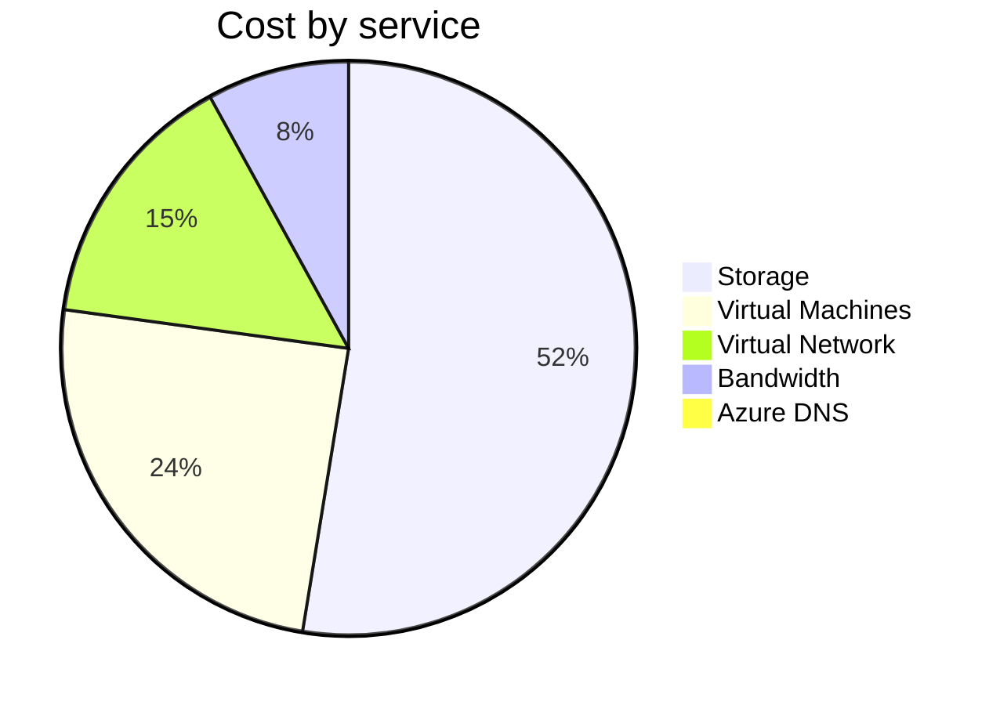
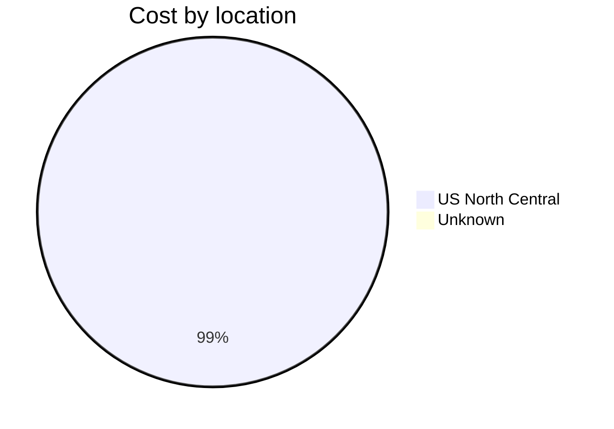
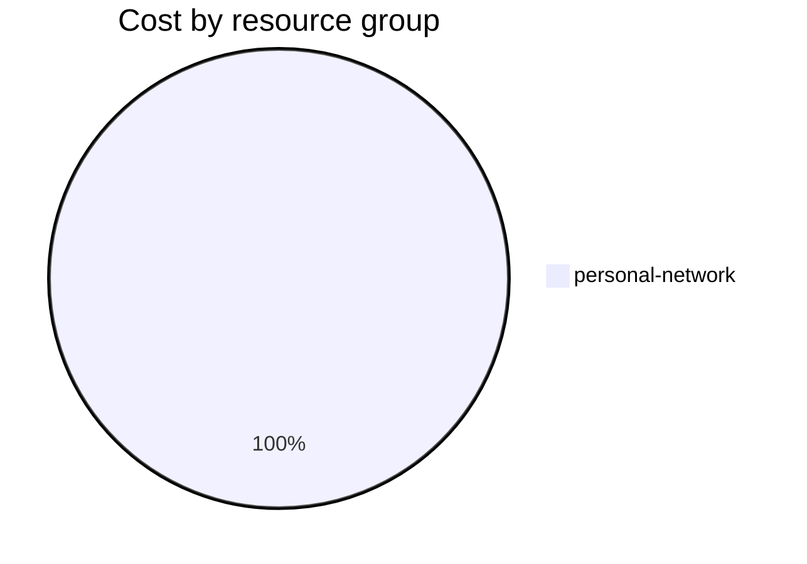

Fetching subscription details...
Fetching cost data...
Fetching forecasted cost data...
Fetching cost data by service name...
Fetching cost data by location...
Fetching cost data by resource group...
# Azure Cost Overview

> Accumulated cost for subscription id `JPF Pay-As-You-Go` from **12/01/2023** to **12/26/2023**

## Totals

|Period|Amount|
|---|---:|
|Today|0.10 USD|
|Yesterday|1.42 USD|
|Last 7 days|10.52 USD|
|Last 30 days|40.73 USD|

```mermaid
gantt
   title Accumulated cost
   dateFormat  X
   axisFormat %s
   section 01 Dec
   USD 1.75 :0, 175
   section 02 Dec
   USD 3.60 :0, 360
   section 03 Dec
   USD 5.81 :0, 581
   section 04 Dec
   USD 7.40 :0, 740
   section 05 Dec
   USD 8.97 :0, 897
   section 06 Dec
   USD 11.15 :0, 1115
   section 07 Dec
   USD 12.94 :0, 1294
   section 08 Dec
   USD 14.43 :0, 1443
   section 09 Dec
   USD 16.18 :0, 1618
   section 10 Dec
   USD 17.84 :0, 1784
   section 11 Dec
   USD 19.49 :0, 1949
   section 12 Dec
   USD 21.04 :0, 2104
   section 13 Dec
   USD 22.58 :0, 2258
   section 14 Dec
   USD 24.13 :0, 2413
   section 15 Dec
   USD 25.61 :0, 2561
   section 16 Dec
   USD 27.13 :0, 2713
   section 17 Dec
   USD 28.65 :0, 2865
   section 18 Dec
   USD 30.21 :0, 3021
   section 19 Dec
   USD 31.80 :0, 3180
   section 20 Dec
   USD 33.29 :0, 3329
   section 21 Dec
   USD 34.77 :0, 3477
   section 22 Dec
   USD 36.27 :0, 3627
   section 23 Dec
   USD 37.74 :0, 3774
   section 24 Dec
   USD 39.22 :0, 3922
   section 25 Dec
   USD 40.63 :0, 4063
   section 26 Dec
   USD 40.73 :0, 4073
   section 27 Dec
   USD 42.11 : done, 0, 4211
   section 28 Dec
   USD 43.52 : done, 0, 4352
   section 29 Dec
   USD 44.80 : done, 0, 4480
   section 30 Dec
   USD 46.21 : done, 0, 4621
   section 31 Dec
   USD 47.63 : done, 0, 4763
```

## By Service Name

|Service|Amount|
|---|---:|
|Storage|21.20 USD|
|Virtual Machines|9.92 USD|
|Virtual Network|5.98 USD|
|Bandwidth|3.23 USD|
|Azure DNS|0.40 USD|

## By Location

|Location|Amount|
|---|---:|
|US North Central|40.33 USD|
|Unknown|0.40 USD|

## By Resource Group

|Resource Group|Amount|
|---|---:|
|personal-network|40.73 USD|

Generated at 2023-12-26 11:06:02 for subscription with id `4913be3f-a345-4652-9bba-767418dd25e3`
