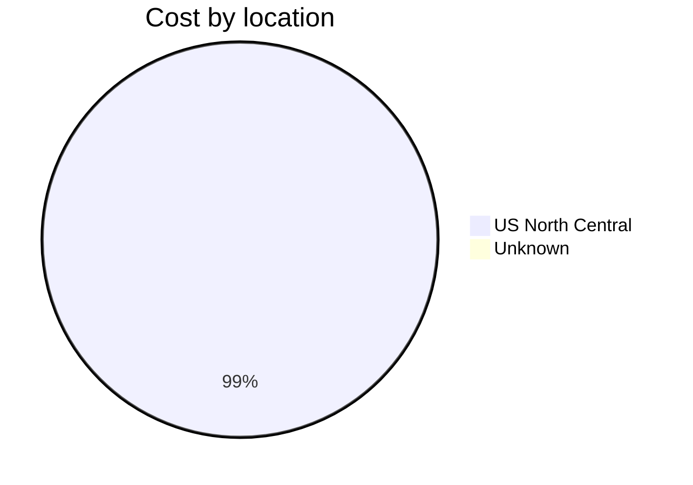
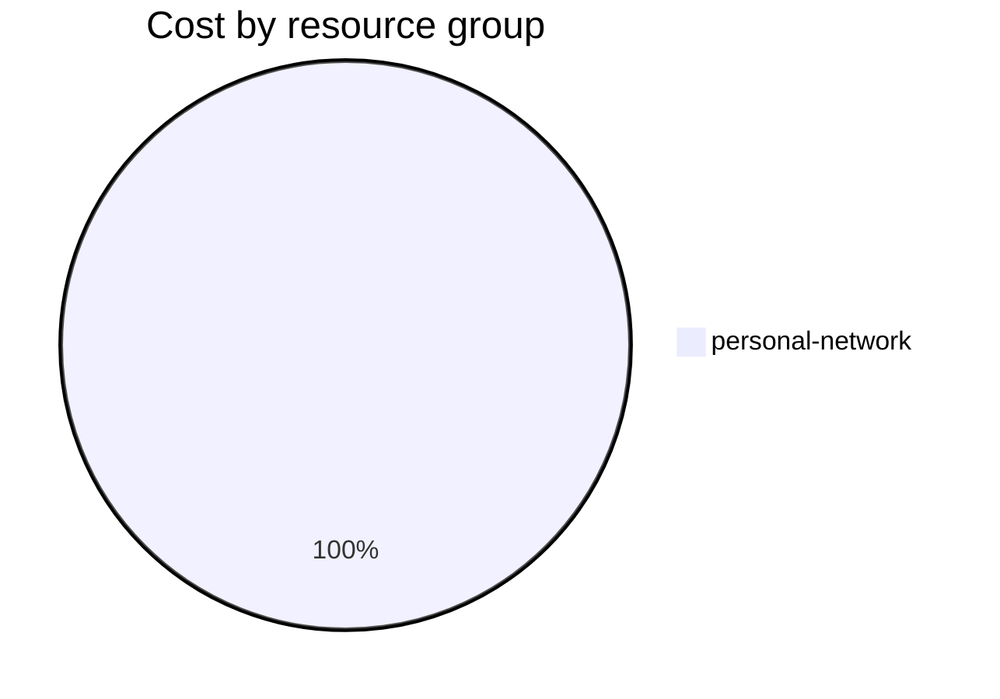

Fetching subscription details...
Fetching cost data...
Fetching forecasted cost data...
Fetching cost data by service name...
Fetching cost data by location...
Fetching cost data by resource group...
# Azure Cost Overview

> Accumulated cost for subscription id `JPF Pay-As-You-Go` from **11/01/2023** to **11/04/2023**

## Totals

|Period|Amount|
|---|---:|
|Today|0.09 USD|
|Yesterday|0.94 USD|
|Last 7 days|4.45 USD|
|Last 30 days|4.45 USD|

```mermaid
gantt
   title Accumulated cost
   dateFormat  X
   axisFormat %s
   section 01 Nov
   USD 1.76 :0, 176
   section 02 Nov
   USD 3.42 :0, 342
   section 03 Nov
   USD 4.36 :0, 436
   section 04 Nov
   USD 4.45 :0, 445
   section 05 Nov
   USD 5.91 : done, 0, 591
   section 06 Nov
   USD 7.51 : done, 0, 751
   section 07 Nov
   USD 9.17 : done, 0, 917
   section 08 Nov
   USD 10.84 : done, 0, 1084
   section 09 Nov
   USD 12.55 : done, 0, 1255
   section 10 Nov
   USD 14.30 : done, 0, 1430
   section 11 Nov
   USD 15.93 : done, 0, 1593
   section 12 Nov
   USD 17.37 : done, 0, 1737
   section 13 Nov
   USD 18.95 : done, 0, 1895
   section 14 Nov
   USD 20.59 : done, 0, 2059
   section 15 Nov
   USD 22.25 : done, 0, 2225
   section 16 Nov
   USD 23.93 : done, 0, 2393
   section 17 Nov
   USD 25.66 : done, 0, 2566
   section 18 Nov
   USD 27.27 : done, 0, 2727
   section 19 Nov
   USD 28.69 : done, 0, 2869
   section 20 Nov
   USD 30.25 : done, 0, 3025
   section 21 Nov
   USD 31.87 : done, 0, 3187
   section 22 Nov
   USD 33.51 : done, 0, 3351
   section 23 Nov
   USD 35.17 : done, 0, 3517
   section 24 Nov
   USD 36.88 : done, 0, 3688
   section 25 Nov
   USD 38.47 : done, 0, 3847
   section 26 Nov
   USD 39.87 : done, 0, 3987
   section 27 Nov
   USD 41.41 : done, 0, 4141
   section 28 Nov
   USD 43.01 : done, 0, 4301
   section 29 Nov
   USD 44.62 : done, 0, 4462
   section 30 Nov
   USD 46.27 : done, 0, 4627
```

## By Service Name

|Service|Amount|
|---|---:|
|Storage|2.04 USD|
|Virtual Machines|1.22 USD|
|Bandwidth|0.59 USD|
|Virtual Network|0.57 USD|
|Azure DNS|0.04 USD|

## By Location

|Location|Amount|
|---|---:|
|US North Central|4.41 USD|
|Unknown|0.04 USD|

## By Resource Group

|Resource Group|Amount|
|---|---:|
|personal-network|4.45 USD|

Generated at 2023-11-04 11:07:16 for subscription with id `4913be3f-a345-4652-9bba-767418dd25e3`
