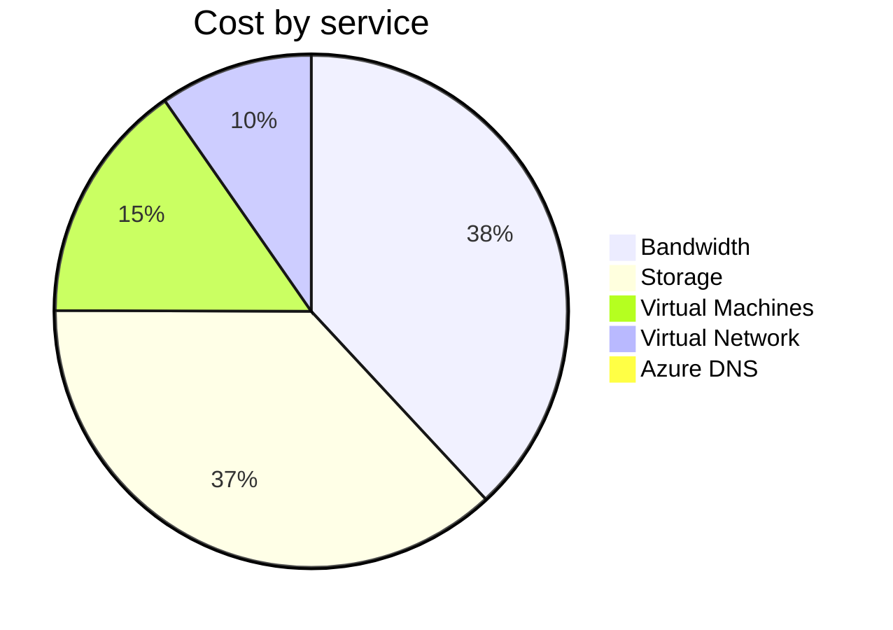
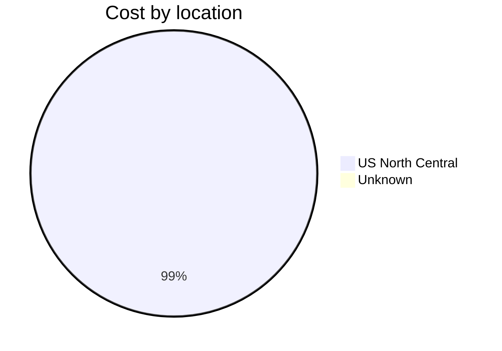
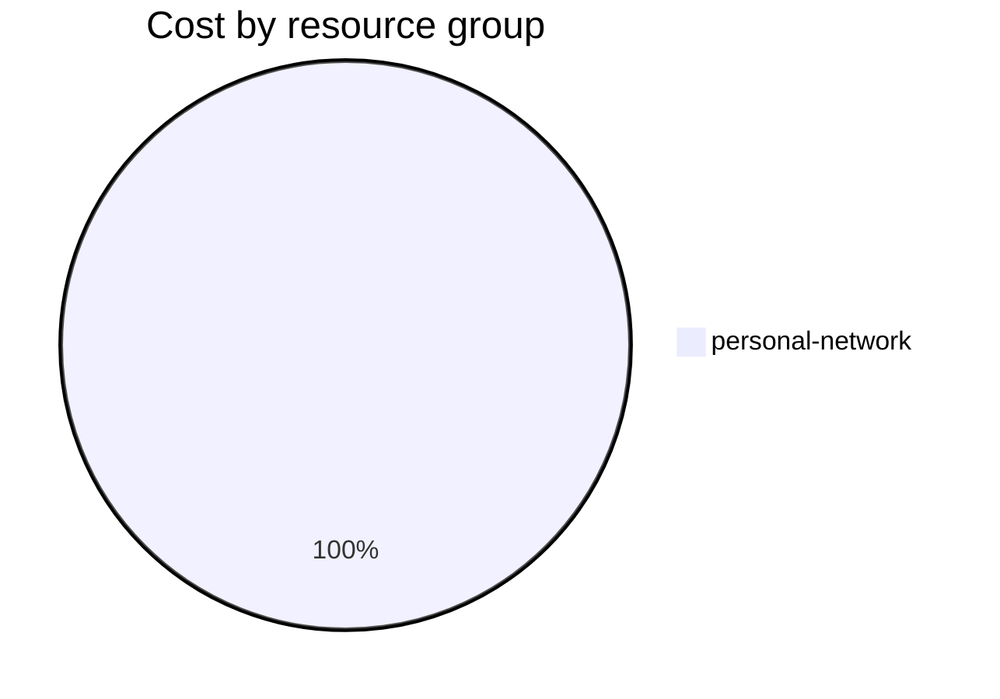

Fetching subscription details...
Fetching cost data...
Fetching forecasted cost data...
Fetching cost data by service name...
Fetching cost data by location...
Fetching cost data by resource group...
# Azure Cost Overview

> Accumulated cost for subscription id `JPF Pay-As-You-Go` from **02/01/2024** to **02/05/2024**

## Totals

|Period|Amount|
|---|---:|
|Today|0.10 USD|
|Yesterday|2.22 USD|
|Last 7 days|9.89 USD|
|Last 30 days|9.89 USD|

```mermaid
gantt
   title Accumulated cost
   dateFormat  X
   axisFormat %s
   section 01 Feb
   USD 2.26 :0, 226
   section 02 Feb
   USD 5.17 :0, 517
   section 03 Feb
   USD 7.57 :0, 757
   section 04 Feb
   USD 9.79 :0, 979
   section 05 Feb
   USD 9.89 :0, 989
   section 06 Feb
   USD 12.19 : done, 0, 1219
   section 07 Feb
   USD 14.22 : done, 0, 1422
   section 08 Feb
   USD 16.51 : done, 0, 1651
   section 09 Feb
   USD 19.04 : done, 0, 1904
   section 10 Feb
   USD 21.94 : done, 0, 2194
   section 11 Feb
   USD 24.12 : done, 0, 2412
   section 12 Feb
   USD 26.30 : done, 0, 2630
   section 13 Feb
   USD 28.66 : done, 0, 2866
   section 14 Feb
   USD 30.75 : done, 0, 3075
   section 15 Feb
   USD 33.10 : done, 0, 3310
   section 16 Feb
   USD 35.68 : done, 0, 3568
   section 17 Feb
   USD 38.65 : done, 0, 3865
   section 18 Feb
   USD 40.88 : done, 0, 4088
   section 19 Feb
   USD 43.12 : done, 0, 4312
   section 20 Feb
   USD 45.54 : done, 0, 4554
   section 21 Feb
   USD 47.69 : done, 0, 4769
   section 22 Feb
   USD 50.10 : done, 0, 5010
   section 23 Feb
   USD 52.74 : done, 0, 5274
   section 24 Feb
   USD 55.76 : done, 0, 5576
   section 25 Feb
   USD 58.06 : done, 0, 5806
   section 26 Feb
   USD 60.36 : done, 0, 6036
   section 27 Feb
   USD 62.84 : done, 0, 6284
   section 28 Feb
   USD 65.04 : done, 0, 6504
   section 29 Feb
   USD 67.51 : done, 0, 6751
```

## By Service Name

|Service|Amount|
|---|---:|
|Bandwidth|3.74 USD|
|Storage|3.63 USD|
|Virtual Machines|1.50 USD|
|Virtual Network|0.95 USD|
|Azure DNS|0.06 USD|

## By Location

|Location|Amount|
|---|---:|
|US North Central|9.83 USD|
|Unknown|0.06 USD|

## By Resource Group

|Resource Group|Amount|
|---|---:|
|personal-network|9.89 USD|

Generated at 2024-02-05 11:09:58 for subscription with id `4913be3f-a345-4652-9bba-767418dd25e3`
