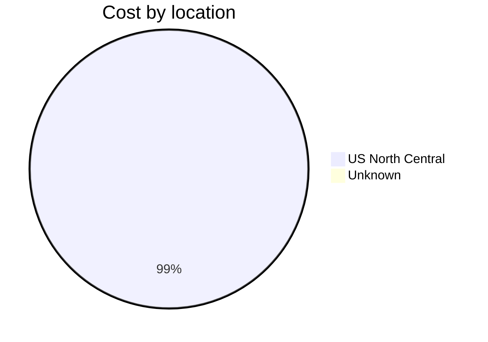
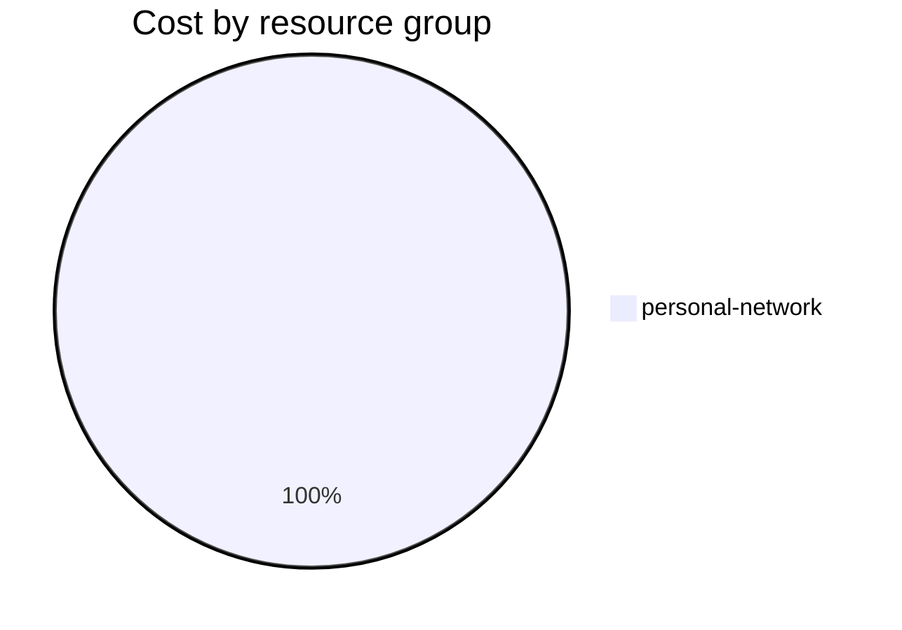

Fetching subscription details...
Fetching cost data...
Fetching forecasted cost data...
Fetching cost data by service name...
Fetching cost data by location...
Fetching cost data by resource group...
# Azure Cost Overview

> Accumulated cost for subscription id `JPF Pay-As-You-Go` from **12/01/2023** to **12/17/2023**

## Totals

|Period|Amount|
|---|---:|
|Today|0.11 USD|
|Yesterday|1.45 USD|
|Last 7 days|10.67 USD|
|Last 30 days|26.84 USD|

## By Service Name

|Service|Amount|
|---|---:|
|Storage|13.65 USD|
|Virtual Machines|6.40 USD|
|Virtual Network|3.83 USD|
|Bandwidth|2.71 USD|
|Azure DNS|0.26 USD|

## By Location

|Location|Amount|
|---|---:|
|US North Central|26.58 USD|
|Unknown|0.26 USD|

## By Resource Group

|Resource Group|Amount|
|---|---:|
|personal-network|26.84 USD|

Generated at 2023-12-17 11:07:02 for subscription with id `4913be3f-a345-4652-9bba-767418dd25e3`
