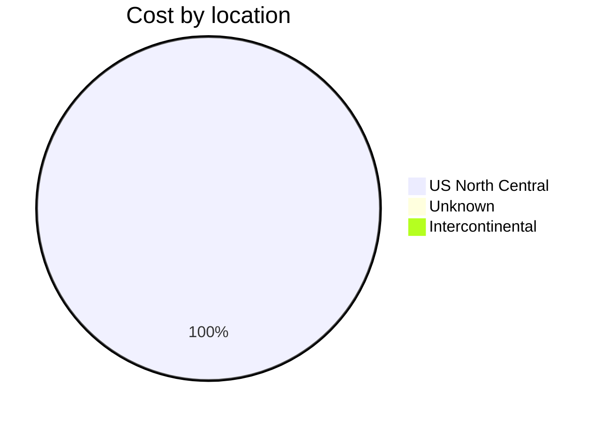
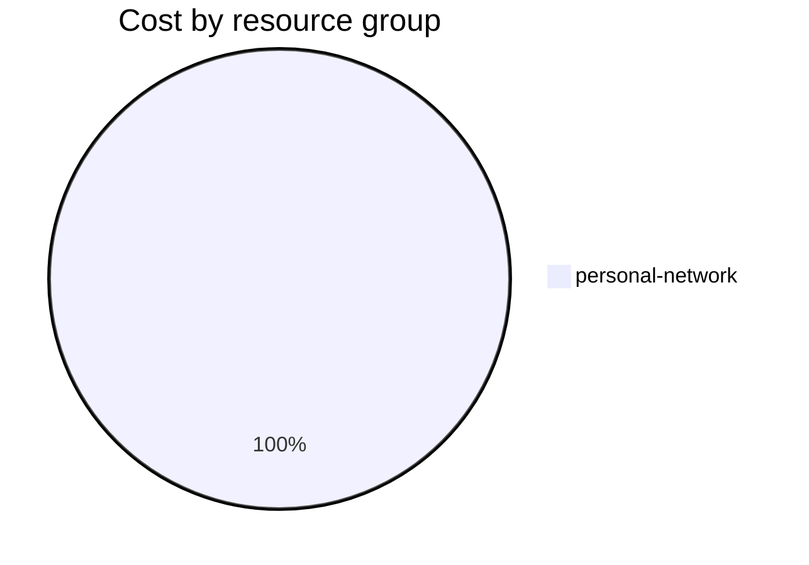

Fetching subscription details...
Fetching cost data...
Fetching forecasted cost data...
Fetching cost data by service name...
Fetching cost data by location...
Fetching cost data by resource group...
# Azure Cost Overview

> Accumulated cost for subscription id `JPF Pay-As-You-Go` from **09/01/2023** to **09/26/2023**

## Totals

|Period|Amount|
|---|---:|
|Today|0.10 USD|
|Yesterday|2.90 USD|
|Last 7 days|33.98 USD|
|Last 30 days|222.63 USD|

```mermaid
gantt
   title Accumulated cost
   dateFormat  X
   axisFormat %s
   section 01 Sep
   USD 3.20 :0, 320
   section 02 Sep
   USD 6.19 :0, 619
   section 03 Sep
   USD 9.27 :0, 927
   section 04 Sep
   USD 12.30 :0, 1230
   section 05 Sep
   USD 15.47 :0, 1547
   section 06 Sep
   USD 18.50 :0, 1850
   section 07 Sep
   USD 21.60 :0, 2160
   section 08 Sep
   USD 24.70 :0, 2470
   section 09 Sep
   USD 27.71 :0, 2771
   section 10 Sep
   USD 30.59 :0, 3059
   section 11 Sep
   USD 33.54 :0, 3354
   section 12 Sep
   USD 46.15 :0, 4615
   section 13 Sep
   USD 92.46 :0, 9246
   section 14 Sep
   USD 127.05 :0, 12705
   section 15 Sep
   USD 132.78 :0, 13278
   section 16 Sep
   USD 146.04 :0, 14604
   section 17 Sep
   USD 173.71 :0, 17371
   section 18 Sep
   USD 188.65 :0, 18865
   section 19 Sep
   USD 203.84 :0, 20384
   section 20 Sep
   USD 206.93 :0, 20693
   section 21 Sep
   USD 210.17 :0, 21017
   section 22 Sep
   USD 213.75 :0, 21375
   section 23 Sep
   USD 216.68 :0, 21668
   section 24 Sep
   USD 219.63 :0, 21963
   section 25 Sep
   USD 222.53 :0, 22253
   section 26 Sep
   USD 222.63 :0, 22263
   section 27 Sep
   USD 236.39 : done, 0, 23639
   section 28 Sep
   USD 250.62 : done, 0, 25062
   section 29 Sep
   USD 265.46 : done, 0, 26546
   section 30 Sep
   USD 280.28 : done, 0, 28028
```

## By Service Name

|Service|Amount|
|---|---:|
|Storage|194.24 USD|
|Virtual Machines|9.28 USD|
|Virtual Network|8.55 USD|
|Bandwidth|6.46 USD|
|Security Center|3.70 USD|
|Azure DNS|0.40 USD|
|Advanced Threat Protection|0.00 USD|

## By Location

|Location|Amount|
|---|---:|
|US North Central|222.23 USD|
|Unknown|0.40 USD|
|Intercontinental|0.00 USD|

## By Resource Group

|Resource Group|Amount|
|---|---:|
|personal-network|222.63 USD|

Generated at 2023-09-26 11:07:18 for subscription with id `4913be3f-a345-4652-9bba-767418dd25e3`
