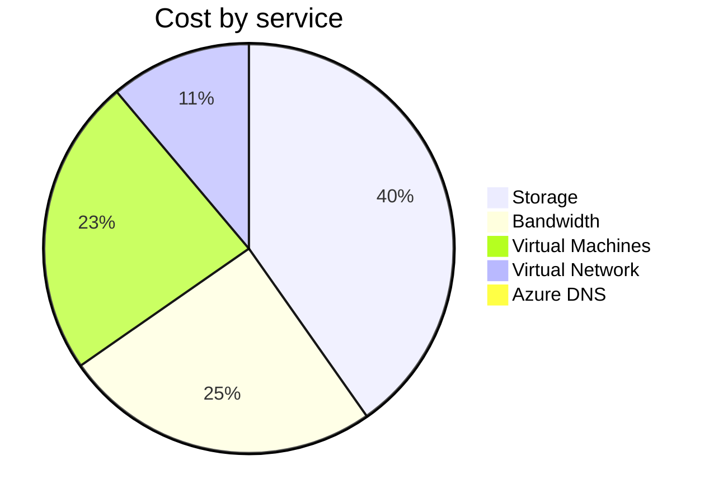
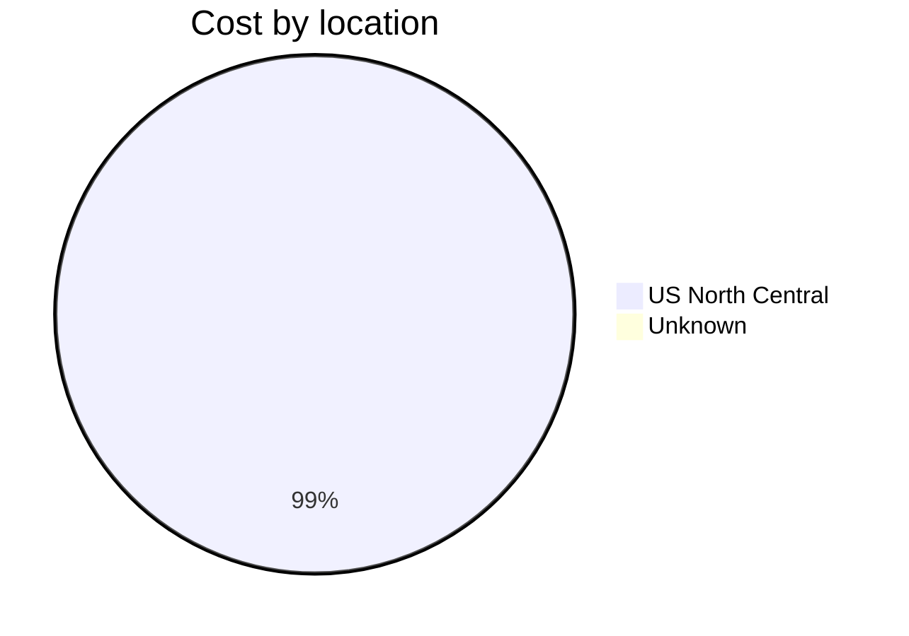
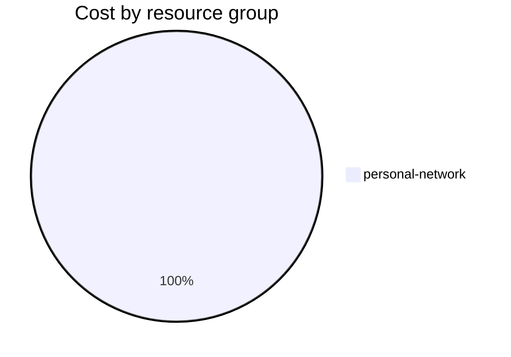

Fetching subscription details...
Fetching cost data...
Fetching forecasted cost data...
Fetching cost data by service name...
Fetching cost data by location...
Fetching cost data by resource group...
# Azure Cost Overview

> Accumulated cost for subscription id `JPF Pay-As-You-Go` from **01/01/2024** to **01/03/2024**

## Totals

|Period|Amount|
|---|---:|
|Today|0.10 USD|
|Yesterday|2.00 USD|
|Last 7 days|3.98 USD|
|Last 30 days|3.98 USD|

```mermaid
gantt
   title Accumulated cost
   dateFormat  X
   axisFormat %s
   section 01 Jan
   USD 1.87 :0, 187
   section 02 Jan
   USD 3.87 :0, 387
   section 03 Jan
   USD 3.98 :0, 398
   section 04 Jan
   USD 5.53 : done, 0, 553
   section 05 Jan
   USD 6.96 : done, 0, 696
   section 06 Jan
   USD 8.61 : done, 0, 861
   section 07 Jan
   USD 10.27 : done, 0, 1027
   section 08 Jan
   USD 12.01 : done, 0, 1201
   section 09 Jan
   USD 13.55 : done, 0, 1355
   section 10 Jan
   USD 15.05 : done, 0, 1505
   section 11 Jan
   USD 16.55 : done, 0, 1655
   section 12 Jan
   USD 17.92 : done, 0, 1792
   section 13 Jan
   USD 19.52 : done, 0, 1952
   section 14 Jan
   USD 21.12 : done, 0, 2112
   section 15 Jan
   USD 22.81 : done, 0, 2281
   section 16 Jan
   USD 24.29 : done, 0, 2429
   section 17 Jan
   USD 25.74 : done, 0, 2574
   section 18 Jan
   USD 27.18 : done, 0, 2718
   section 19 Jan
   USD 28.50 : done, 0, 2850
   section 20 Jan
   USD 30.04 : done, 0, 3004
   section 21 Jan
   USD 31.59 : done, 0, 3159
   section 22 Jan
   USD 33.22 : done, 0, 3322
   section 23 Jan
   USD 34.64 : done, 0, 3464
   section 24 Jan
   USD 36.03 : done, 0, 3603
   section 25 Jan
   USD 37.42 : done, 0, 3742
   section 26 Jan
   USD 38.68 : done, 0, 3868
   section 27 Jan
   USD 40.17 : done, 0, 4017
   section 28 Jan
   USD 41.66 : done, 0, 4166
   section 29 Jan
   USD 43.24 : done, 0, 4324
   section 30 Jan
   USD 44.60 : done, 0, 4460
   section 31 Jan
   USD 45.94 : done, 0, 4594
```

## By Service Name

|Service|Amount|
|---|---:|
|Storage|1.59 USD|
|Bandwidth|0.99 USD|
|Virtual Machines|0.93 USD|
|Virtual Network|0.44 USD|
|Azure DNS|0.03 USD|

## By Location

|Location|Amount|
|---|---:|
|US North Central|3.95 USD|
|Unknown|0.03 USD|

## By Resource Group

|Resource Group|Amount|
|---|---:|
|personal-network|3.98 USD|

Generated at 2024-01-03 11:07:21 for subscription with id `4913be3f-a345-4652-9bba-767418dd25e3`
