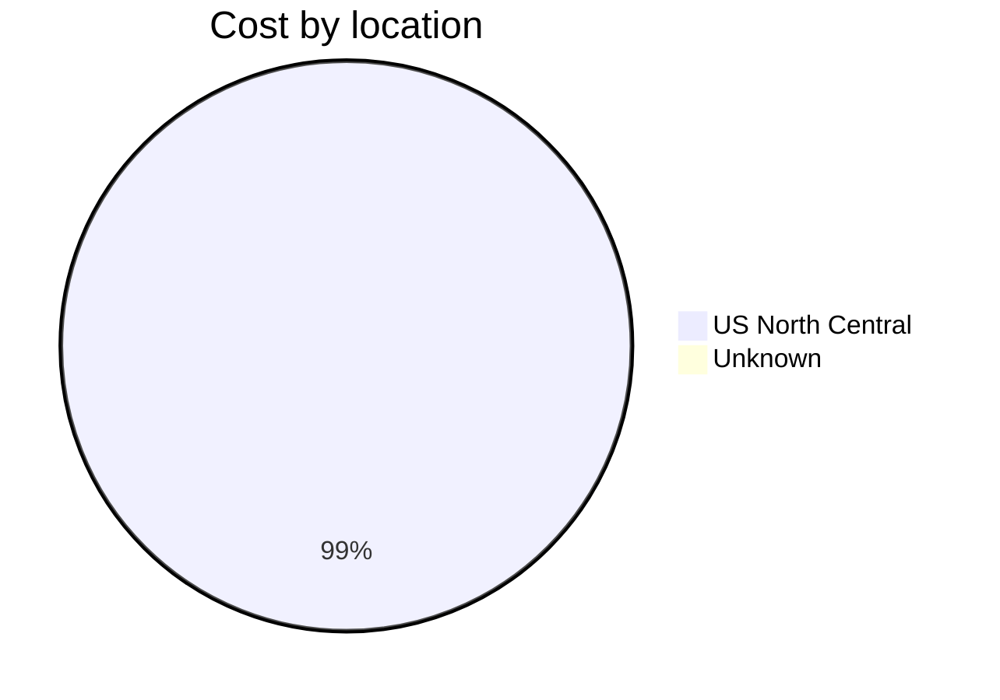
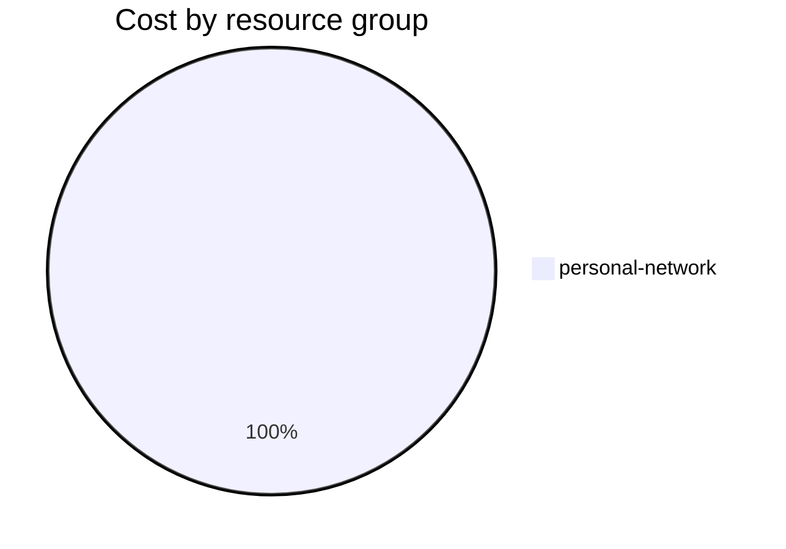

Fetching subscription details...
Fetching cost data...
Fetching forecasted cost data...
Fetching cost data by service name...
Fetching cost data by location...
Fetching cost data by resource group...
# Azure Cost Overview

> Accumulated cost for subscription id `JPF Pay-As-You-Go` from **01/01/2024** to **01/24/2024**

## Totals

|Period|Amount|
|---|---:|
|Today|0.10 USD|
|Yesterday|1.70 USD|
|Last 7 days|13.30 USD|
|Last 30 days|44.59 USD|

```mermaid
gantt
   title Accumulated cost
   dateFormat  X
   axisFormat %s
   section 01 Jan
   USD 2.01 :0, 201
   section 02 Jan
   USD 4.48 :0, 448
   section 03 Jan
   USD 6.29 :0, 629
   section 04 Jan
   USD 8.20 :0, 820
   section 05 Jan
   USD 10.14 :0, 1014
   section 06 Jan
   USD 12.40 :0, 1240
   section 07 Jan
   USD 14.14 :0, 1414
   section 08 Jan
   USD 16.56 :0, 1656
   section 09 Jan
   USD 18.50 :0, 1850
   section 10 Jan
   USD 20.11 :0, 2011
   section 11 Jan
   USD 21.89 :0, 2189
   section 12 Jan
   USD 23.69 :0, 2369
   section 13 Jan
   USD 25.82 :0, 2582
   section 14 Jan
   USD 27.34 :0, 2734
   section 15 Jan
   USD 28.94 :0, 2894
   section 16 Jan
   USD 31.29 :0, 3129
   section 17 Jan
   USD 33.20 :0, 3320
   section 18 Jan
   USD 35.03 :0, 3503
   section 19 Jan
   USD 36.89 :0, 3689
   section 20 Jan
   USD 39.06 :0, 3906
   section 21 Jan
   USD 40.92 :0, 4092
   section 22 Jan
   USD 42.78 :0, 4278
   section 23 Jan
   USD 44.48 :0, 4448
   section 24 Jan
   USD 44.59 :0, 4459
   section 25 Jan
   USD 46.46 : done, 0, 4646
   section 26 Jan
   USD 48.42 : done, 0, 4842
   section 27 Jan
   USD 50.71 : done, 0, 5071
   section 28 Jan
   USD 52.59 : done, 0, 5259
   section 29 Jan
   USD 54.54 : done, 0, 5454
   section 30 Jan
   USD 56.78 : done, 0, 5678
   section 31 Jan
   USD 58.58 : done, 0, 5858
```

## By Service Name

|Service|Amount|
|---|---:|
|Storage|19.69 USD|
|Virtual Machines|9.59 USD|
|Bandwidth|9.44 USD|
|Virtual Network|5.50 USD|
|Azure DNS|0.37 USD|

## By Location

|Location|Amount|
|---|---:|
|US North Central|44.22 USD|
|Unknown|0.37 USD|

## By Resource Group

|Resource Group|Amount|
|---|---:|
|personal-network|44.59 USD|

Generated at 2024-01-24 11:11:39 for subscription with id `4913be3f-a345-4652-9bba-767418dd25e3`
