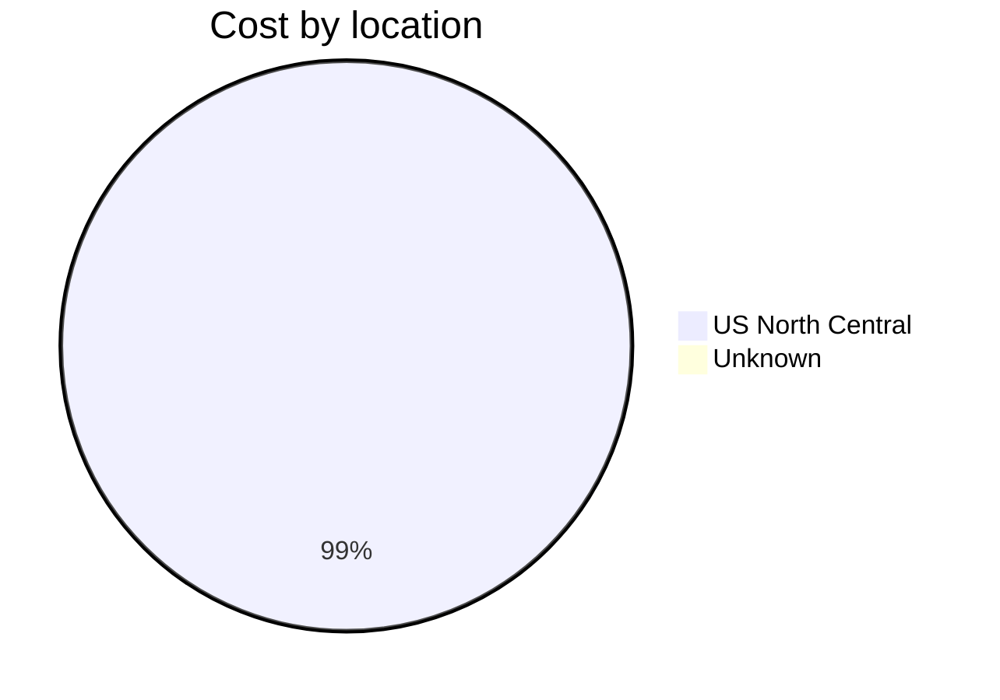
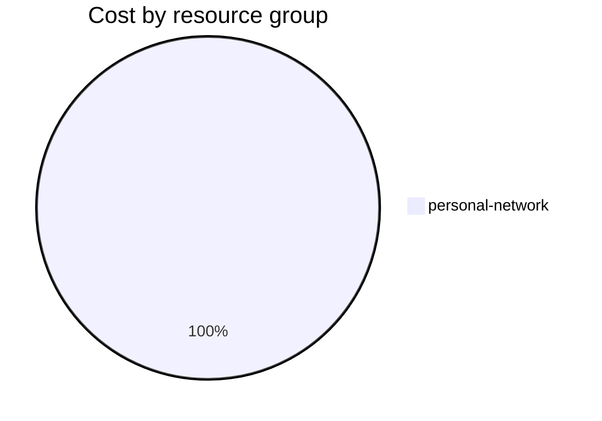

Fetching subscription details...
Fetching cost data...
Fetching forecasted cost data...
Fetching cost data by service name...
Fetching cost data by location...
Fetching cost data by resource group...
# Azure Cost Overview

> Accumulated cost for subscription id `JPF Pay-As-You-Go` from **01/01/2024** to **01/08/2024**

## Totals

|Period|Amount|
|---|---:|
|Today|0.10 USD|
|Yesterday|1.64 USD|
|Last 7 days|13.86 USD|
|Last 30 days|13.86 USD|

```mermaid
gantt
   title Accumulated cost
   dateFormat  X
   axisFormat %s
   section 01 Jan
   USD 1.97 :0, 197
   section 02 Jan
   USD 4.35 :0, 435
   section 03 Jan
   USD 6.14 :0, 614
   section 04 Jan
   USD 8.02 :0, 802
   section 05 Jan
   USD 9.93 :0, 993
   section 06 Jan
   USD 12.12 :0, 1212
   section 07 Jan
   USD 13.76 :0, 1376
   section 08 Jan
   USD 13.86 :0, 1386
   section 09 Jan
   USD 15.89 : done, 0, 1589
   section 10 Jan
   USD 17.62 : done, 0, 1762
   section 11 Jan
   USD 19.36 : done, 0, 1936
   section 12 Jan
   USD 21.14 : done, 0, 2114
   section 13 Jan
   USD 22.96 : done, 0, 2296
   section 14 Jan
   USD 24.83 : done, 0, 2483
   section 15 Jan
   USD 26.86 : done, 0, 2686
   section 16 Jan
   USD 28.89 : done, 0, 2889
   section 17 Jan
   USD 30.63 : done, 0, 3063
   section 18 Jan
   USD 32.37 : done, 0, 3237
   section 19 Jan
   USD 34.16 : done, 0, 3416
   section 20 Jan
   USD 35.98 : done, 0, 3598
   section 21 Jan
   USD 37.86 : done, 0, 3786
   section 22 Jan
   USD 39.89 : done, 0, 3989
   section 23 Jan
   USD 41.93 : done, 0, 4193
   section 24 Jan
   USD 43.67 : done, 0, 4367
   section 25 Jan
   USD 45.41 : done, 0, 4541
   section 26 Jan
   USD 47.20 : done, 0, 4720
   section 27 Jan
   USD 49.04 : done, 0, 4904
   section 28 Jan
   USD 50.92 : done, 0, 5092
   section 29 Jan
   USD 52.95 : done, 0, 5295
   section 30 Jan
   USD 54.99 : done, 0, 5499
   section 31 Jan
   USD 56.73 : done, 0, 5673
```

## By Service Name

|Service|Amount|
|---|---:|
|Storage|5.99 USD|
|Bandwidth|3.10 USD|
|Virtual Machines|2.99 USD|
|Virtual Network|1.66 USD|
|Azure DNS|0.11 USD|

## By Location

|Location|Amount|
|---|---:|
|US North Central|13.75 USD|
|Unknown|0.11 USD|

## By Resource Group

|Resource Group|Amount|
|---|---:|
|personal-network|13.86 USD|

Generated at 2024-01-08 11:07:56 for subscription with id `4913be3f-a345-4652-9bba-767418dd25e3`
