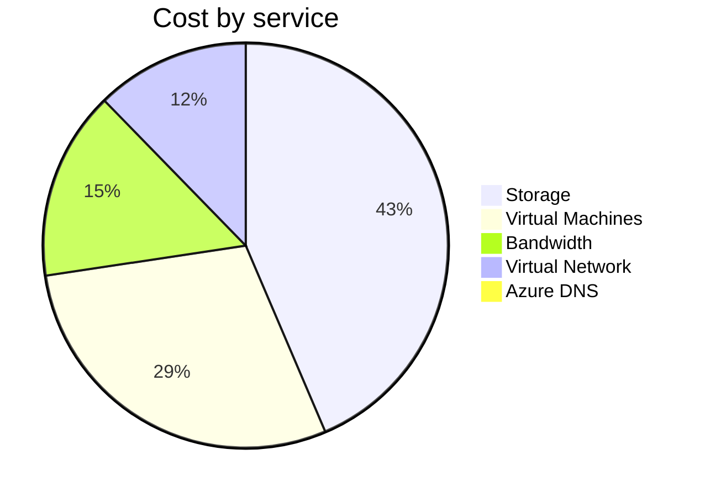
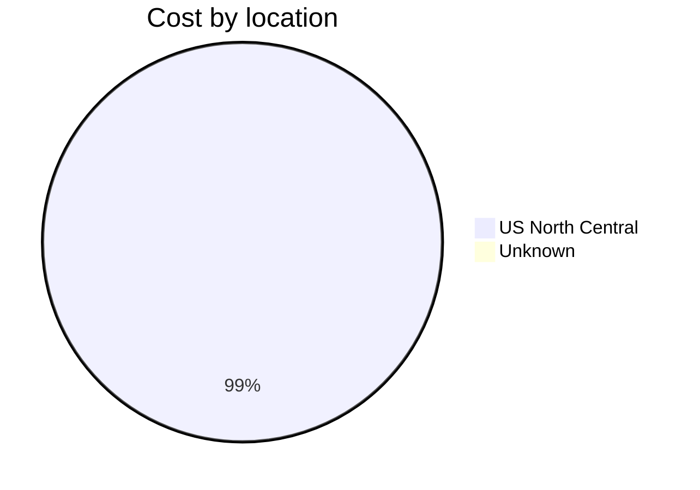
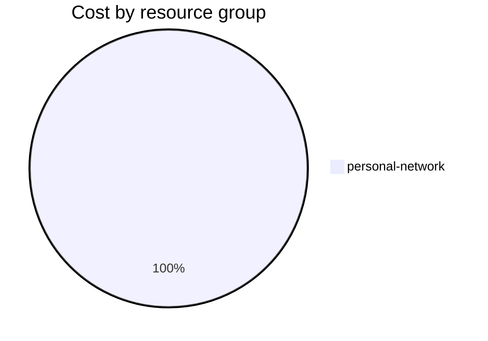

Fetching subscription details...
Fetching cost data...
Fetching forecasted cost data...
Fetching cost data by service name...
Fetching cost data by location...
Fetching cost data by resource group...
# Azure Cost Overview

> Accumulated cost for subscription id `JPF Pay-As-You-Go` from **01/01/2024** to **01/02/2024**

## Totals

|Period|Amount|
|---|---:|
|Today|0.10 USD|
|Yesterday|1.69 USD|
|Last 7 days|1.80 USD|
|Last 30 days|1.80 USD|

```mermaid
gantt
   title Accumulated cost
   dateFormat  X
   axisFormat %s
   section 01 Jan
   USD 1.69 :0, 169
   section 02 Jan
   USD 1.80 :0, 180
   section 03 Jan
   USD 3.32 : done, 0, 332
   section 04 Jan
   USD 4.87 : done, 0, 487
   section 05 Jan
   USD 6.30 : done, 0, 630
   section 06 Jan
   USD 7.93 : done, 0, 793
   section 07 Jan
   USD 9.53 : done, 0, 953
   section 08 Jan
   USD 11.09 : done, 0, 1109
   section 09 Jan
   USD 12.59 : done, 0, 1259
   section 10 Jan
   USD 14.05 : done, 0, 1405
   section 11 Jan
   USD 15.54 : done, 0, 1554
   section 12 Jan
   USD 16.91 : done, 0, 1691
   section 13 Jan
   USD 18.48 : done, 0, 1848
   section 14 Jan
   USD 20.02 : done, 0, 2002
   section 15 Jan
   USD 21.52 : done, 0, 2152
   section 16 Jan
   USD 22.96 : done, 0, 2296
   section 17 Jan
   USD 24.36 : done, 0, 2436
   section 18 Jan
   USD 25.79 : done, 0, 2579
   section 19 Jan
   USD 27.10 : done, 0, 2710
   section 20 Jan
   USD 28.62 : done, 0, 2862
   section 21 Jan
   USD 30.09 : done, 0, 3009
   section 22 Jan
   USD 31.54 : done, 0, 3154
   section 23 Jan
   USD 32.91 : done, 0, 3291
   section 24 Jan
   USD 34.26 : done, 0, 3426
   section 25 Jan
   USD 35.63 : done, 0, 3563
   section 26 Jan
   USD 36.88 : done, 0, 3688
   section 27 Jan
   USD 38.34 : done, 0, 3834
   section 28 Jan
   USD 39.75 : done, 0, 3975
   section 29 Jan
   USD 41.14 : done, 0, 4114
   section 30 Jan
   USD 42.46 : done, 0, 4246
   section 31 Jan
   USD 43.74 : done, 0, 4374
```

## By Service Name

|Service|Amount|
|---|---:|
|Storage|0.78 USD|
|Virtual Machines|0.52 USD|
|Bandwidth|0.27 USD|
|Virtual Network|0.22 USD|
|Azure DNS|0.01 USD|

## By Location

|Location|Amount|
|---|---:|
|US North Central|1.78 USD|
|Unknown|0.01 USD|

## By Resource Group

|Resource Group|Amount|
|---|---:|
|personal-network|1.80 USD|

Generated at 2024-01-02 11:03:02 for subscription with id `4913be3f-a345-4652-9bba-767418dd25e3`
