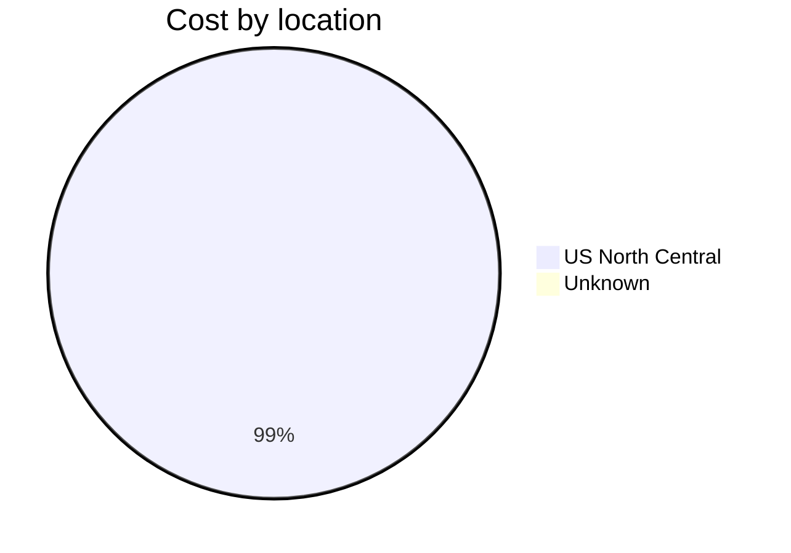
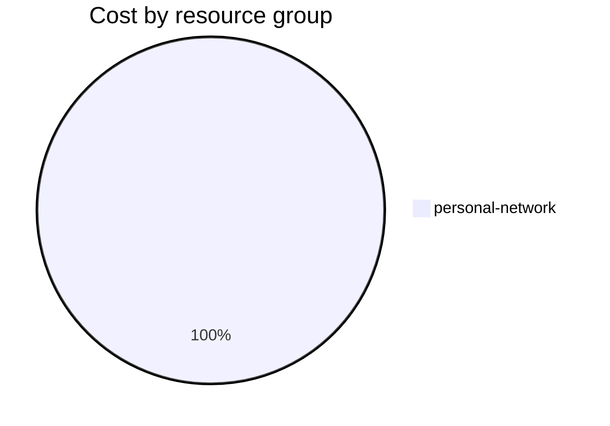

Fetching subscription details...
Fetching cost data...
Fetching forecasted cost data...
Fetching cost data by service name...
Fetching cost data by location...
Fetching cost data by resource group...
# Azure Cost Overview

> Accumulated cost for subscription id `JPF Pay-As-You-Go` from **03/01/2024** to **03/10/2024**

## Totals

|Period|Amount|
|---|---:|
|Today|0.10 USD|
|Yesterday|1.39 USD|
|Last 7 days|10.09 USD|
|Last 30 days|14.20 USD|

```mermaid
gantt
   title Accumulated cost
   dateFormat  X
   axisFormat %s
   section 01 Mar
   USD 2.68 :0, 268
   section 02 Mar
   USD 4.11 :0, 411
   section 03 Mar
   USD 5.54 :0, 554
   section 04 Mar
   USD 6.98 :0, 698
   section 05 Mar
   USD 8.41 :0, 841
   section 06 Mar
   USD 9.84 :0, 984
   section 07 Mar
   USD 11.28 :0, 1128
   section 08 Mar
   USD 12.71 :0, 1271
   section 09 Mar
   USD 14.10 :0, 1410
   section 10 Mar
   USD 14.20 :0, 1420
   section 11 Mar
   USD 15.41 : done, 0, 1541
   section 12 Mar
   USD 16.85 : done, 0, 1685
   section 13 Mar
   USD 18.18 : done, 0, 1818
   section 14 Mar
   USD 19.41 : done, 0, 1941
   section 15 Mar
   USD 21.18 : done, 0, 2118
   section 16 Mar
   USD 22.54 : done, 0, 2254
   section 17 Mar
   USD 23.84 : done, 0, 2384
   section 18 Mar
   USD 24.92 : done, 0, 2492
   section 19 Mar
   USD 26.24 : done, 0, 2624
   section 20 Mar
   USD 27.45 : done, 0, 2745
   section 21 Mar
   USD 28.55 : done, 0, 2855
   section 22 Mar
   USD 30.19 : done, 0, 3019
   section 23 Mar
   USD 31.43 : done, 0, 3143
   section 24 Mar
   USD 32.61 : done, 0, 3261
   section 25 Mar
   USD 33.57 : done, 0, 3357
   section 26 Mar
   USD 34.76 : done, 0, 3476
   section 27 Mar
   USD 35.85 : done, 0, 3585
   section 28 Mar
   USD 36.82 : done, 0, 3682
   section 29 Mar
   USD 38.34 : done, 0, 3834
   section 30 Mar
   USD 39.46 : done, 0, 3946
   section 31 Mar
   USD 40.50 : done, 0, 4050
```

## By Service Name

|Service|Amount|
|---|---:|
|Storage|7.46 USD|
|Virtual Machines|3.26 USD|
|Virtual Network|2.15 USD|
|Bandwidth|1.19 USD|
|Azure DNS|0.14 USD|

## By Location

|Location|Amount|
|---|---:|
|US North Central|14.05 USD|
|Unknown|0.14 USD|

## By Resource Group

|Resource Group|Amount|
|---|---:|
|personal-network|14.20 USD|

Generated at 2024-03-10 11:06:58 for subscription with id `4913be3f-a345-4652-9bba-767418dd25e3`
