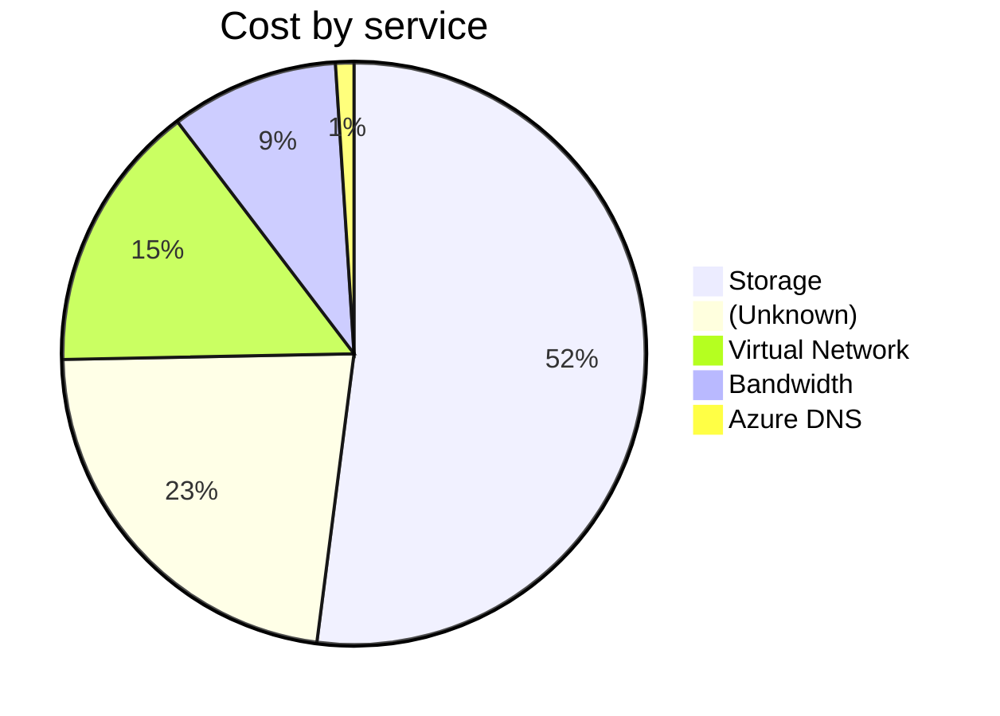
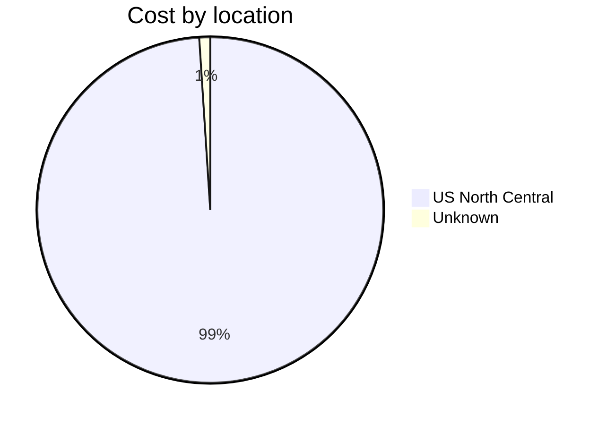
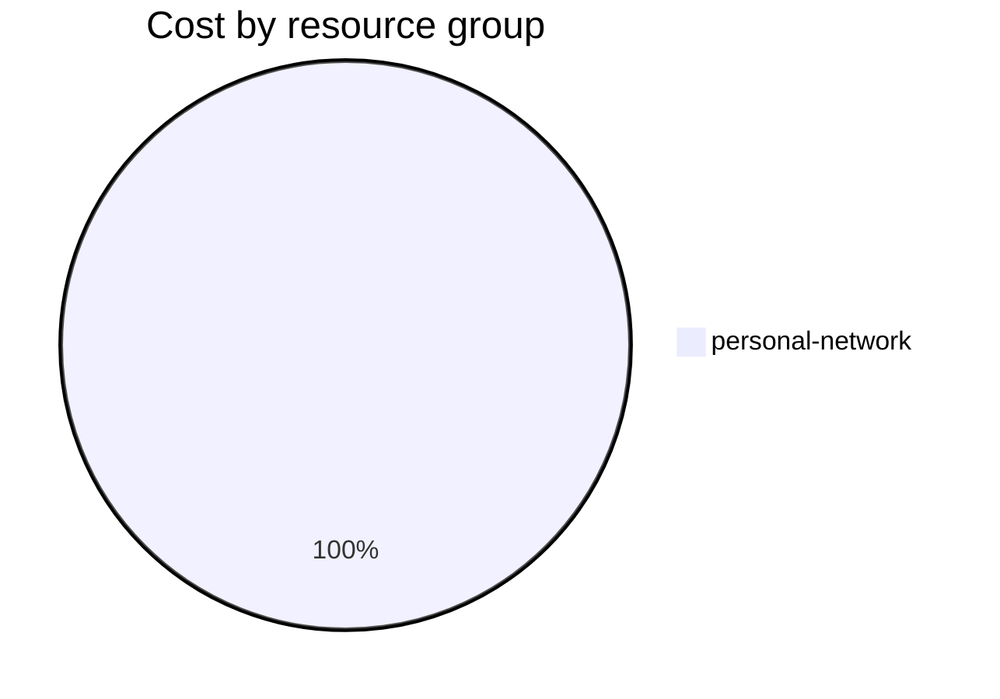

Fetching subscription details...
Fetching cost data...
Fetching forecasted cost data...
Fetching cost data by service name...
Fetching cost data by location...
Fetching cost data by resource group...
# Azure Cost Overview

> Accumulated cost for subscription id `JPF Pay-As-You-Go` from **03/01/2024** to **03/09/2024**

## Totals

|Period|Amount|
|---|---:|
|Today|0.09 USD|
|Yesterday|1.39 USD|
|Last 7 days|10.07 USD|
|Last 30 days|12.75 USD|

```mermaid
gantt
   title Accumulated cost
   dateFormat  X
   axisFormat %s
   section 01 Mar
   USD 2.68 :0, 268
   section 02 Mar
   USD 4.11 :0, 411
   section 03 Mar
   USD 5.54 :0, 554
   section 04 Mar
   USD 6.98 :0, 698
   section 05 Mar
   USD 8.41 :0, 841
   section 06 Mar
   USD 9.84 :0, 984
   section 07 Mar
   USD 11.28 :0, 1128
   section 08 Mar
   USD 12.66 :0, 1266
   section 09 Mar
   USD 12.75 :0, 1275
```

## By Service Name

|Service|Amount|
|---|---:|
|Storage|6.64 USD|
||2.89 USD|
|Virtual Network|1.91 USD|
|Bandwidth|1.19 USD|
|Azure DNS|0.13 USD|

## By Location

|Location|Amount|
|---|---:|
|US North Central|12.62 USD|
|Unknown|0.13 USD|

## By Resource Group

|Resource Group|Amount|
|---|---:|
|personal-network|12.75 USD|

Generated at 2024-03-09 11:08:52 for subscription with id `4913be3f-a345-4652-9bba-767418dd25e3`
