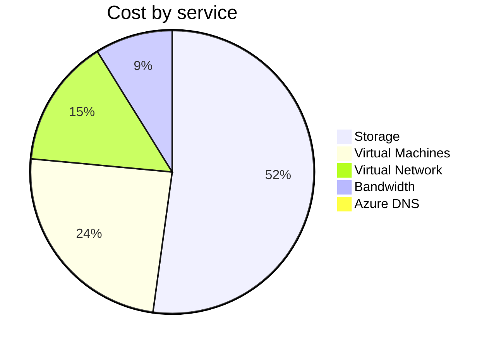
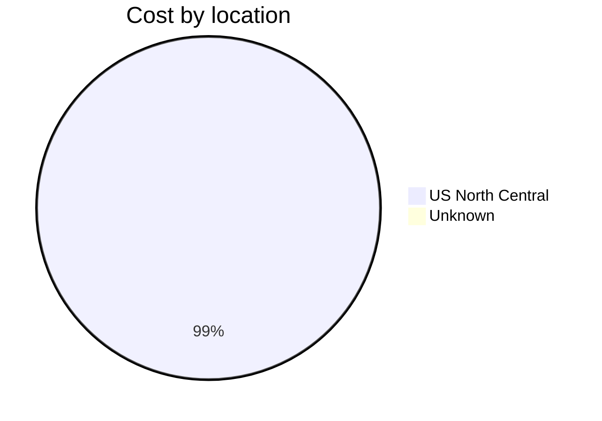
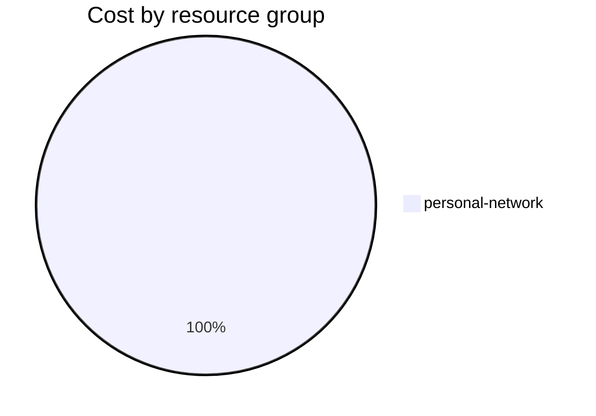

Fetching subscription details...
Fetching cost data...
Fetching forecasted cost data...
Fetching cost data by service name...
Fetching cost data by location...
Fetching cost data by resource group...
# Azure Cost Overview

> Accumulated cost for subscription id `JPF Pay-As-You-Go` from **12/01/2023** to **12/20/2023**

## Totals

|Period|Amount|
|---|---:|
|Today|0.10 USD|
|Yesterday|1.49 USD|
|Last 7 days|10.60 USD|
|Last 30 days|31.39 USD|

```mermaid
gantt
   title Accumulated cost
   dateFormat  X
   axisFormat %s
   section 01 Dec
   USD 1.75 :0, 175
   section 02 Dec
   USD 3.60 :0, 360
   section 03 Dec
   USD 5.81 :0, 581
   section 04 Dec
   USD 7.40 :0, 740
   section 05 Dec
   USD 8.97 :0, 897
   section 06 Dec
   USD 11.15 :0, 1115
   section 07 Dec
   USD 12.94 :0, 1294
   section 08 Dec
   USD 14.43 :0, 1443
   section 09 Dec
   USD 16.17 :0, 1617
   section 10 Dec
   USD 17.73 :0, 1773
   section 11 Dec
   USD 19.27 :0, 1927
   section 12 Dec
   USD 20.79 :0, 2079
   section 13 Dec
   USD 22.30 :0, 2230
   section 14 Dec
   USD 23.82 :0, 2382
   section 15 Dec
   USD 25.30 :0, 2530
   section 16 Dec
   USD 26.80 :0, 2680
   section 17 Dec
   USD 28.30 :0, 2830
   section 18 Dec
   USD 29.81 :0, 2981
   section 19 Dec
   USD 31.30 :0, 3130
   section 20 Dec
   USD 31.39 :0, 3139
   section 21 Dec
   USD 32.88 : done, 0, 3288
   section 22 Dec
   USD 34.25 : done, 0, 3425
   section 23 Dec
   USD 35.77 : done, 0, 3577
   section 24 Dec
   USD 37.09 : done, 0, 3709
   section 25 Dec
   USD 38.38 : done, 0, 3838
   section 26 Dec
   USD 39.95 : done, 0, 3995
   section 27 Dec
   USD 41.29 : done, 0, 4129
   section 28 Dec
   USD 42.67 : done, 0, 4267
   section 29 Dec
   USD 43.92 : done, 0, 4392
   section 30 Dec
   USD 45.34 : done, 0, 4534
   section 31 Dec
   USD 46.54 : done, 0, 4654
```

## By Service Name

|Service|Amount|
|---|---:|
|Storage|16.22 USD|
|Virtual Machines|7.56 USD|
|Virtual Network|4.56 USD|
|Bandwidth|2.75 USD|
|Azure DNS|0.30 USD|

## By Location

|Location|Amount|
|---|---:|
|US North Central|31.09 USD|
|Unknown|0.30 USD|

## By Resource Group

|Resource Group|Amount|
|---|---:|
|personal-network|31.39 USD|

Generated at 2023-12-20 11:05:13 for subscription with id `4913be3f-a345-4652-9bba-767418dd25e3`
