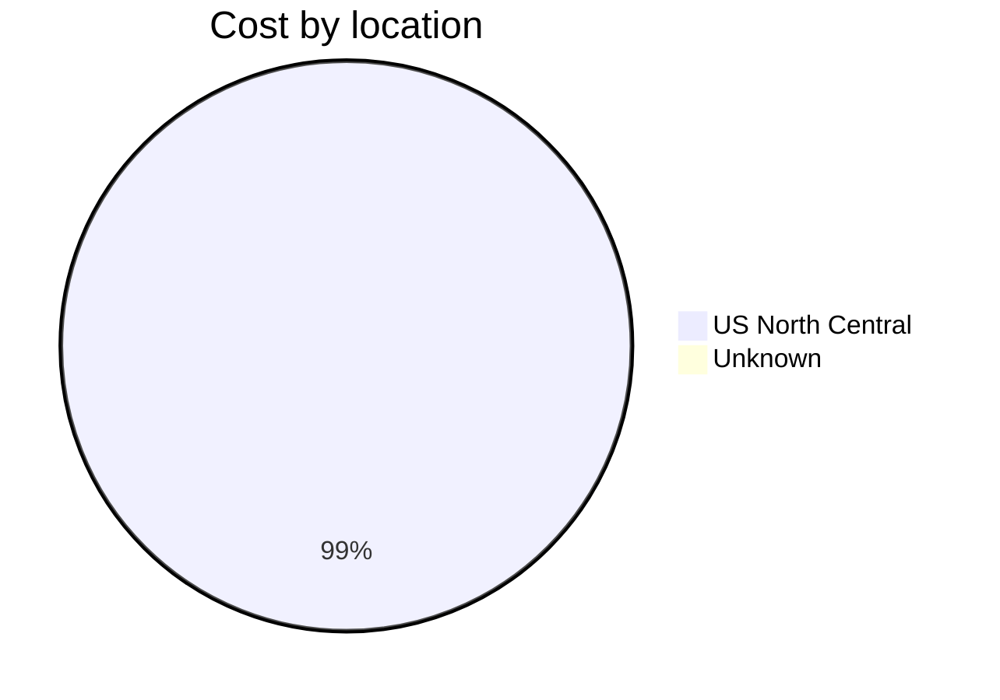
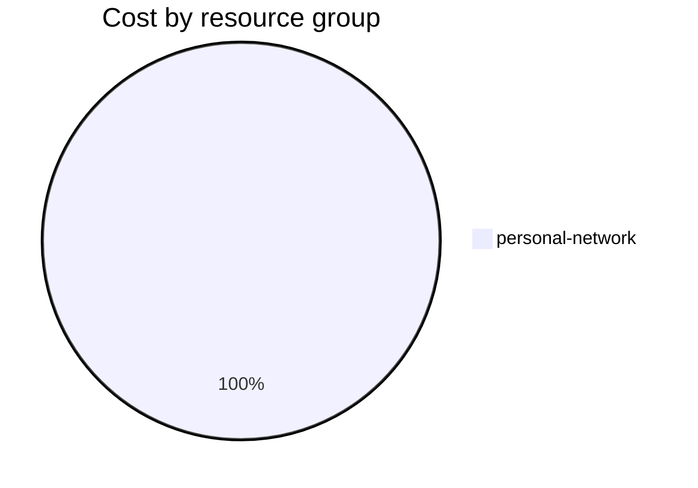

Fetching subscription details...
Fetching cost data...
Fetching forecasted cost data...
Fetching cost data by service name...
Fetching cost data by location...
Fetching cost data by resource group...
# Azure Cost Overview

> Accumulated cost for subscription id `JPF Pay-As-You-Go` from **01/01/2024** to **01/05/2024**

## Totals

|Period|Amount|
|---|---:|
|Today|0.10 USD|
|Yesterday|1.69 USD|
|Last 7 days|7.73 USD|
|Last 30 days|7.73 USD|

```mermaid
gantt
   title Accumulated cost
   dateFormat  X
   axisFormat %s
   section 01 Jan
   USD 1.91 :0, 191
   section 02 Jan
   USD 4.19 :0, 419
   section 03 Jan
   USD 5.94 :0, 594
   section 04 Jan
   USD 7.63 :0, 763
   section 05 Jan
   USD 7.73 :0, 773
   section 06 Jan
   USD 9.35 : done, 0, 935
   section 07 Jan
   USD 11.03 : done, 0, 1103
   section 08 Jan
   USD 12.84 : done, 0, 1284
   section 09 Jan
   USD 14.65 : done, 0, 1465
   section 10 Jan
   USD 16.28 : done, 0, 1628
   section 11 Jan
   USD 17.82 : done, 0, 1782
   section 12 Jan
   USD 19.22 : done, 0, 1922
   section 13 Jan
   USD 20.79 : done, 0, 2079
   section 14 Jan
   USD 22.42 : done, 0, 2242
   section 15 Jan
   USD 24.18 : done, 0, 2418
   section 16 Jan
   USD 25.93 : done, 0, 2593
   section 17 Jan
   USD 27.51 : done, 0, 2751
   section 18 Jan
   USD 29.00 : done, 0, 2900
   section 19 Jan
   USD 30.35 : done, 0, 3035
   section 20 Jan
   USD 31.87 : done, 0, 3187
   section 21 Jan
   USD 33.45 : done, 0, 3345
   section 22 Jan
   USD 35.15 : done, 0, 3515
   section 23 Jan
   USD 36.86 : done, 0, 3686
   section 24 Jan
   USD 38.38 : done, 0, 3838
   section 25 Jan
   USD 39.82 : done, 0, 3982
   section 26 Jan
   USD 41.12 : done, 0, 4112
   section 27 Jan
   USD 42.59 : done, 0, 4259
   section 28 Jan
   USD 44.11 : done, 0, 4411
   section 29 Jan
   USD 45.76 : done, 0, 4576
   section 30 Jan
   USD 47.41 : done, 0, 4741
   section 31 Jan
   USD 48.89 : done, 0, 4889
```

## By Service Name

|Service|Amount|
|---|---:|
|Storage|3.35 USD|
|Virtual Machines|1.75 USD|
|Bandwidth|1.63 USD|
|Virtual Network|0.94 USD|
|Azure DNS|0.06 USD|

## By Location

|Location|Amount|
|---|---:|
|US North Central|7.67 USD|
|Unknown|0.06 USD|

## By Resource Group

|Resource Group|Amount|
|---|---:|
|personal-network|7.73 USD|

Generated at 2024-01-05 11:06:06 for subscription with id `4913be3f-a345-4652-9bba-767418dd25e3`
