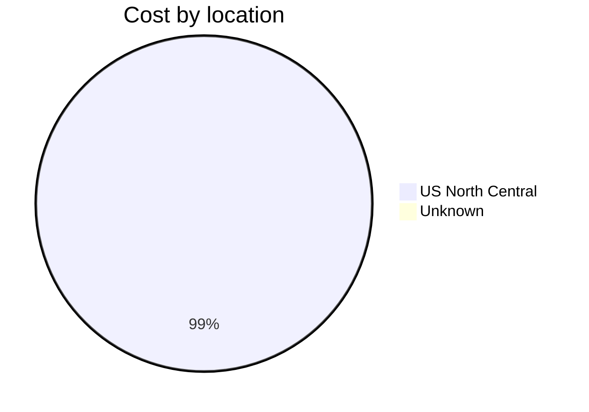
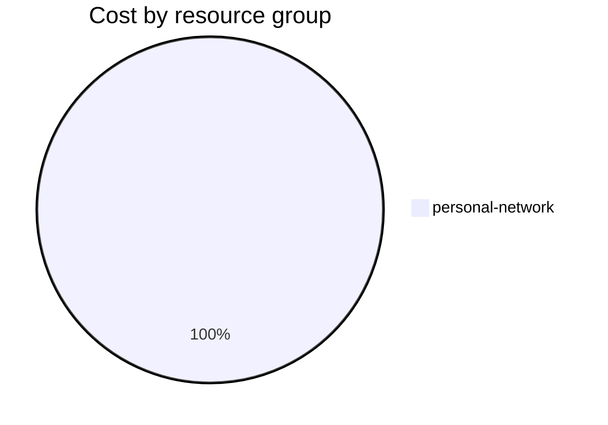

Fetching subscription details...
Fetching cost data...
Fetching forecasted cost data...
Fetching cost data by service name...
Fetching cost data by location...
Fetching cost data by resource group...
# Azure Cost Overview

> Accumulated cost for subscription id `JPF Pay-As-You-Go` from **12/01/2023** to **12/05/2023**

## Totals

|Period|Amount|
|---|---:|
|Today|0.10 USD|
|Yesterday|1.42 USD|
|Last 7 days|7.10 USD|
|Last 30 days|7.10 USD|

```mermaid
gantt
   title Accumulated cost
   dateFormat  X
   axisFormat %s
   section 01 Dec
   USD 1.71 :0, 171
   section 02 Dec
   USD 3.50 :0, 350
   section 03 Dec
   USD 5.57 :0, 557
   section 04 Dec
   USD 7.00 :0, 700
   section 05 Dec
   USD 7.10 :0, 710
   section 06 Dec
   USD 8.88 : done, 0, 888
   section 07 Dec
   USD 10.68 : done, 0, 1068
   section 08 Dec
   USD 12.46 : done, 0, 1246
   section 09 Dec
   USD 14.25 : done, 0, 1425
   section 10 Dec
   USD 16.03 : done, 0, 1603
   section 11 Dec
   USD 17.90 : done, 0, 1790
   section 12 Dec
   USD 19.88 : done, 0, 1988
   section 13 Dec
   USD 21.68 : done, 0, 2168
   section 14 Dec
   USD 23.50 : done, 0, 2350
   section 15 Dec
   USD 25.30 : done, 0, 2530
   section 16 Dec
   USD 27.12 : done, 0, 2712
   section 17 Dec
   USD 28.92 : done, 0, 2892
   section 18 Dec
   USD 30.81 : done, 0, 3081
   section 19 Dec
   USD 32.81 : done, 0, 3281
   section 20 Dec
   USD 34.63 : done, 0, 3463
   section 21 Dec
   USD 36.47 : done, 0, 3647
   section 22 Dec
   USD 38.30 : done, 0, 3830
   section 23 Dec
   USD 40.14 : done, 0, 4014
   section 24 Dec
   USD 41.96 : done, 0, 4196
   section 25 Dec
   USD 43.87 : done, 0, 4387
   section 26 Dec
   USD 45.89 : done, 0, 4589
   section 27 Dec
   USD 47.74 : done, 0, 4774
   section 28 Dec
   USD 49.60 : done, 0, 4960
   section 29 Dec
   USD 51.44 : done, 0, 5144
   section 30 Dec
   USD 53.30 : done, 0, 5330
   section 31 Dec
   USD 55.15 : done, 0, 5515
```

## By Service Name

|Service|Amount|
|---|---:|
|Storage|3.31 USD|
|Virtual Machines|1.67 USD|
|Bandwidth|1.11 USD|
|Virtual Network|0.95 USD|
|Azure DNS|0.06 USD|

## By Location

|Location|Amount|
|---|---:|
|US North Central|7.03 USD|
|Unknown|0.06 USD|

## By Resource Group

|Resource Group|Amount|
|---|---:|
|personal-network|7.10 USD|

Generated at 2023-12-05 11:07:21 for subscription with id `4913be3f-a345-4652-9bba-767418dd25e3`
