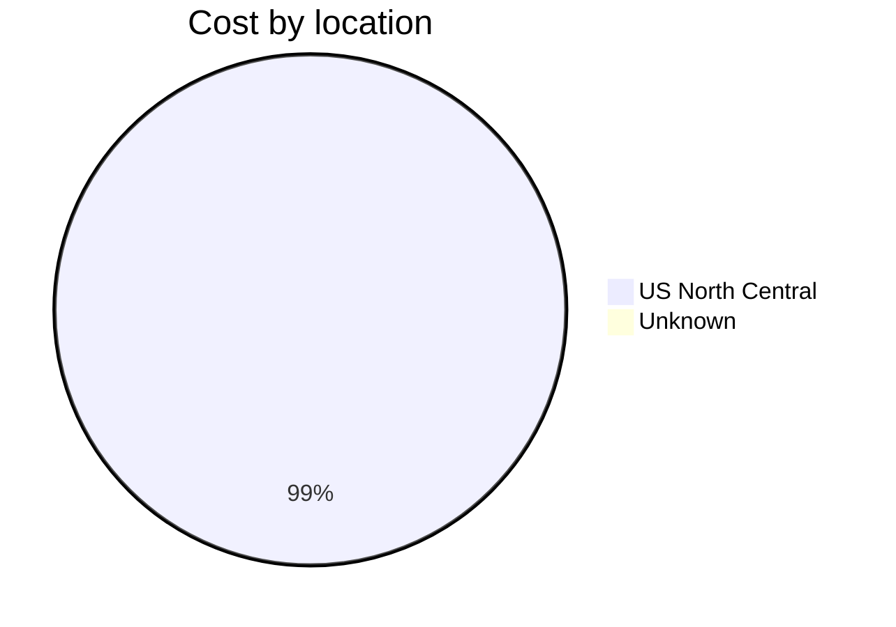
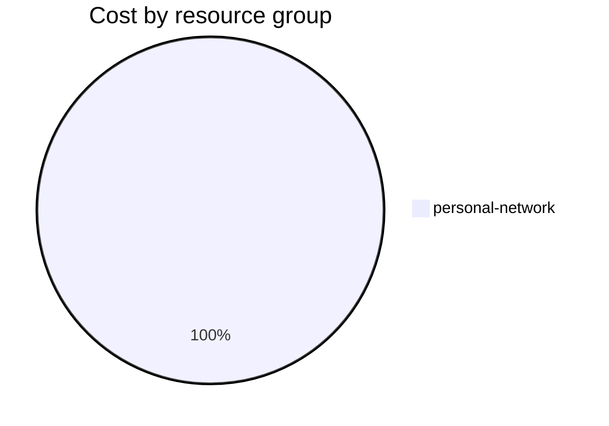

Fetching subscription details...
Fetching cost data...
Fetching forecasted cost data...
Fetching cost data by service name...
Fetching cost data by location...
Fetching cost data by resource group...
# Azure Cost Overview

> Accumulated cost for subscription id `JPF Pay-As-You-Go` from **01/01/2024** to **01/30/2024**

## Totals

|Period|Amount|
|---|---:|
|Today|0.11 USD|
|Yesterday|1.49 USD|
|Last 7 days|14.73 USD|
|Last 30 days|60.14 USD|

```mermaid
gantt
   title Accumulated cost
   dateFormat  X
   axisFormat %s
   section 01 Jan
   USD 2.01 :0, 201
   section 02 Jan
   USD 4.48 :0, 448
   section 03 Jan
   USD 6.29 :0, 629
   section 04 Jan
   USD 8.20 :0, 820
   section 05 Jan
   USD 10.14 :0, 1014
   section 06 Jan
   USD 12.40 :0, 1240
   section 07 Jan
   USD 14.14 :0, 1414
   section 08 Jan
   USD 16.56 :0, 1656
   section 09 Jan
   USD 18.53 :0, 1853
   section 10 Jan
   USD 20.19 :0, 2019
   section 11 Jan
   USD 22.12 :0, 2212
   section 12 Jan
   USD 24.09 :0, 2409
   section 13 Jan
   USD 26.57 :0, 2657
   section 14 Jan
   USD 28.10 :0, 2810
   section 15 Jan
   USD 29.75 :0, 2975
   section 16 Jan
   USD 32.57 :0, 3257
   section 17 Jan
   USD 34.70 :0, 3470
   section 18 Jan
   USD 36.71 :0, 3671
   section 19 Jan
   USD 38.77 :0, 3877
   section 20 Jan
   USD 41.30 :0, 4130
   section 21 Jan
   USD 43.35 :0, 4335
   section 22 Jan
   USD 45.41 :0, 4541
   section 23 Jan
   USD 47.41 :0, 4741
   section 24 Jan
   USD 49.18 :0, 4918
   section 25 Jan
   USD 51.01 :0, 5101
   section 26 Jan
   USD 53.29 :0, 5329
   section 27 Jan
   USD 56.51 :0, 5651
   section 28 Jan
   USD 58.53 :0, 5853
   section 29 Jan
   USD 60.03 :0, 6003
   section 30 Jan
   USD 60.14 :0, 6014
   section 31 Jan
   USD 62.09 : done, 0, 6209
```

## By Service Name

|Service|Amount|
|---|---:|
|Storage|24.87 USD|
|Bandwidth|15.78 USD|
|Virtual Machines|12.07 USD|
|Virtual Network|6.95 USD|
|Azure DNS|0.47 USD|

## By Location

|Location|Amount|
|---|---:|
|US North Central|59.67 USD|
|Unknown|0.47 USD|

## By Resource Group

|Resource Group|Amount|
|---|---:|
|personal-network|60.14 USD|

Generated at 2024-01-30 11:12:16 for subscription with id `4913be3f-a345-4652-9bba-767418dd25e3`
