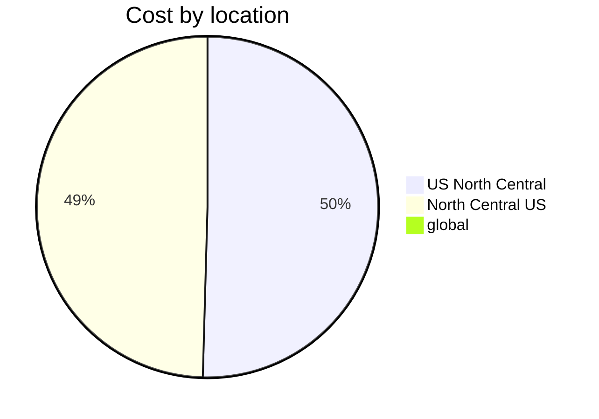
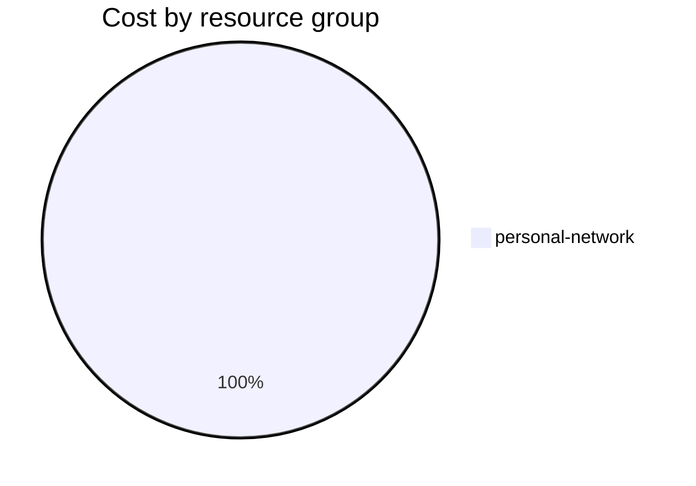

Fetching subscription details...
Fetching cost data...
Fetching forecasted cost data...
Fetching cost data by service name...
Fetching cost data by location...
Fetching cost data by resource group...
# Azure Cost Overview

> Accumulated cost for subscription id `JPF Pay-As-You-Go` from **10/01/2023** to **10/30/2023**

## Totals

|Period|Amount|
|---|---:|
|Today|0.09 USD|
|Yesterday|1.34 USD|
|Last 7 days|10.88 USD|
|Last 30 days|50.52 USD|

```mermaid
gantt
   title Accumulated cost
   dateFormat  X
   axisFormat %s
   section 01 Oct
   USD 3.16 :0, 316
   section 02 Oct
   USD 5.72 :0, 572
   section 03 Oct
   USD 7.55 :0, 755
   section 04 Oct
   USD 9.41 :0, 941
   section 05 Oct
   USD 11.15 :0, 1115
   section 06 Oct
   USD 13.05 :0, 1305
   section 07 Oct
   USD 14.85 :0, 1485
   section 08 Oct
   USD 16.35 :0, 1635
   section 09 Oct
   USD 17.97 :0, 1797
   section 10 Oct
   USD 19.55 :0, 1955
   section 11 Oct
   USD 21.15 :0, 2115
   section 12 Oct
   USD 22.81 :0, 2281
   section 13 Oct
   USD 24.42 :0, 2442
   section 14 Oct
   USD 25.86 :0, 2586
   section 15 Oct
   USD 27.34 :0, 2734
   section 16 Oct
   USD 29.06 :0, 2906
   section 17 Oct
   USD 30.88 :0, 3088
   section 18 Oct
   USD 32.72 :0, 3272
   section 19 Oct
   USD 34.53 :0, 3453
   section 20 Oct
   USD 36.40 :0, 3640
   section 21 Oct
   USD 38.13 :0, 3813
   section 22 Oct
   USD 39.64 :0, 3964
   section 23 Oct
   USD 41.21 :0, 4121
   section 24 Oct
   USD 42.82 :0, 4282
   section 25 Oct
   USD 44.42 :0, 4442
   section 26 Oct
   USD 45.97 :0, 4597
   section 27 Oct
   USD 47.59 :0, 4759
   section 28 Oct
   USD 49.10 :0, 4910
   section 29 Oct
   USD 50.44 :0, 5044
   section 30 Oct
   USD 50.52 :0, 5052
   section 31 Oct
   USD 51.83 : done, 0, 5183
```

## By Service Name

|Service|Amount|
|---|---:|
|Storage|26.40 USD|
|Virtual Machines|10.42 USD|
|Virtual Network|6.93 USD|
|Bandwidth|6.30 USD|
|Azure DNS|0.47 USD|

## By Location

|Location|Amount|
|---|---:|
|US North Central|25.25 USD|
|North Central US|24.81 USD|
|global|0.47 USD|

## By Resource Group

|Resource Group|Amount|
|---|---:|
|personal-network|50.52 USD|

Generated at 2023-10-30 11:09:05 for subscription with id `4913be3f-a345-4652-9bba-767418dd25e3`
